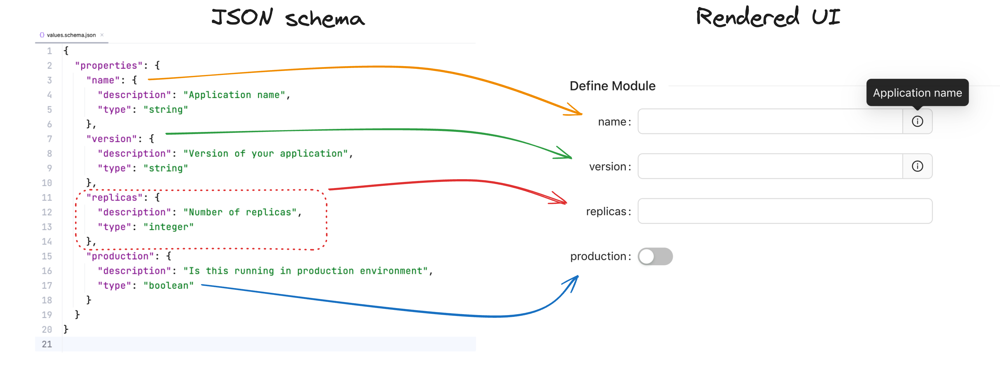
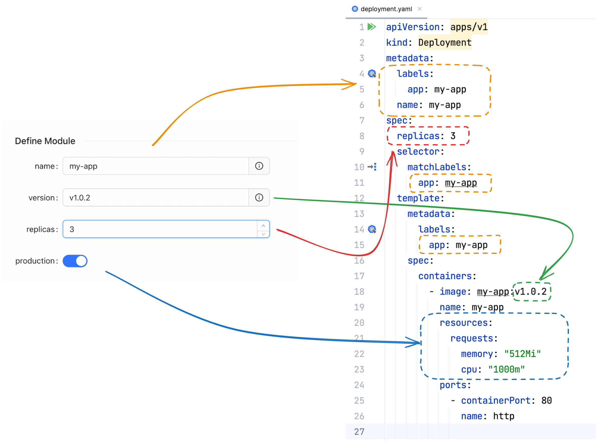

Cyclops turns complicated YAML manifests into simple and structured UIs where developers can click away their Kubernetes application configuration.
”Great! But how does it know how to render this UI? Should I implement a UI form each time I need a new set of fields to configure? I don’t know React! I don’t know frontend!“

This blog post should cure your anxiety about implementing a UI for each type of application and explain how Cyclops knows what to render so you can deploy to your K8s cluster carefree.

To better understand how Cyclops renders the UI, we will scratch the surface of Helm, which Cyclops uses as its templating engine.

## A bit about Helm

Helm is a Kubernetes package manager that helps deploy and manage Kubernetes resources by packing them into charts. It also has a templating engine that allows developers to configure their apps depending on the specific values injected into the helm template.

The usual Helm chart structure is as follows:

```bash
├── Chart.yaml
├── templates
│   ├── deployment.yaml
│   └── service.yaml
├── values.schema.json
└── values.yaml
```

> A few other Helm chart parts are left out on purpose since they are not tangible to the rest of the blog. You can read more about each of those in [Helm’s official documentation](https://helm.sh/docs/topics/charts/)

- `Chart.yaml` - A YAML file containing information about the chart (like name, version…)
- `templates` - A directory of templates that, when combined with values, will generate valid Kubernetes manifest files.
- `values.yaml` - The default configuration values for this chart
- `values.schema.json` - A JSON Schema for imposing a structure on the `values.yaml` file

When using Helm, you can change your `values.yaml` however you see fit for your application. The problem is that you can change them *however* you like, which allows you to misconfigure some parts of your application because you misspelled a field or messed up indentation in the `values.yaml`.

Here is where JSON schema from the values.schema.json comes in. It is represented as https://json-schema.org. It will define which fields you should set and even to which values (e.g., you can specify that a field called replicas can’t be set to lower than 0). Helm won’t let you render a Kubernetes manifest with values that don’t comply with the schema. There is an example of such schema later in the blog, but you can also check it out on [Helms official docs](https://helm.sh/docs/topics/charts/#schema-files)

## Helm values schema and Cyclops UI

Now that we have concluded the schema's purpose in a Helm chart, we can understand how Cyclops uses it.

Since the primary purpose of the values schema is to describe what the Helm chart needs to render all the Kubernetes resources, we naturally decided to use it for rendering the UI. On the first iterations of Cyclops, we implemented a solution where users can define those fields in the UI, but why reinvent the wheel when Helm already provided a way to specify this?

Cyclops controller reads the Helm chart and values schema. Then, it recursively traverses through all the fields in the schema and renders the field based on the field specification. It knows how to render a field based on the field type (`string`, `boolean`, `object`, `array`...), description of the field, field rules (e.g., minimum or maximum value), and many more.



Now that we have a rendered UI, a user of Cyclops can click through the form and fill in those fields. Thanks to the schema, values entered by a developer will now always conform to the schema since the UI won’t let you specify any fields (e.g., allow you typos in field names) or set the number of replicas to `three`. This is an exaggerated example, but you can probably see the point. UI will take care of validating your input, and you will have clear guidelines on how to configure your service.

Once values are entered and saved in the UI, they are passed to the Helm templating engine, along with the templates from the `/templates` folder, resulting in all Kubernetes resources configured for the needs of each team/developer without getting into specific implementation details of each resource.



## Final thoughts

Hope this blog post helped you understand how the rendering part of Cyclops works and demystified the whole project. We briefly touched on [Helm](https://helm.sh/docs/) and [JSON schema](https://json-schema.org/), but both are larger pieces of software than we can describe in such a short blog post, so we encourage you to check their documentation.
