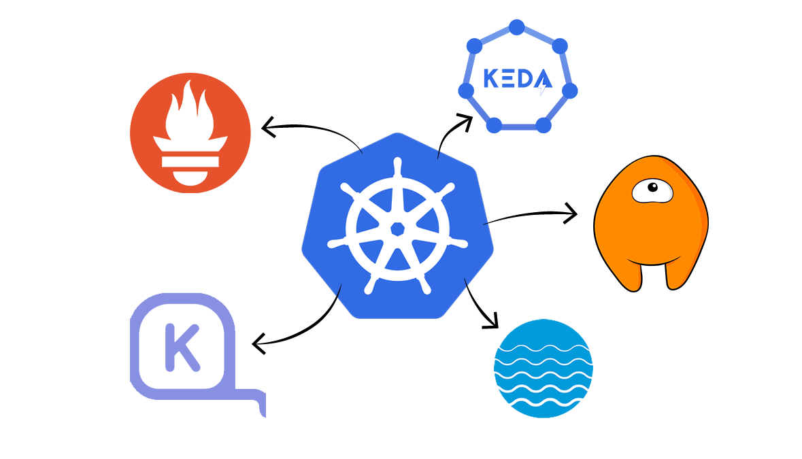
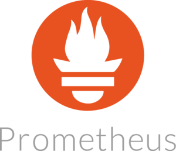
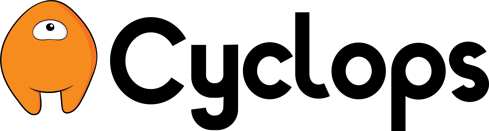
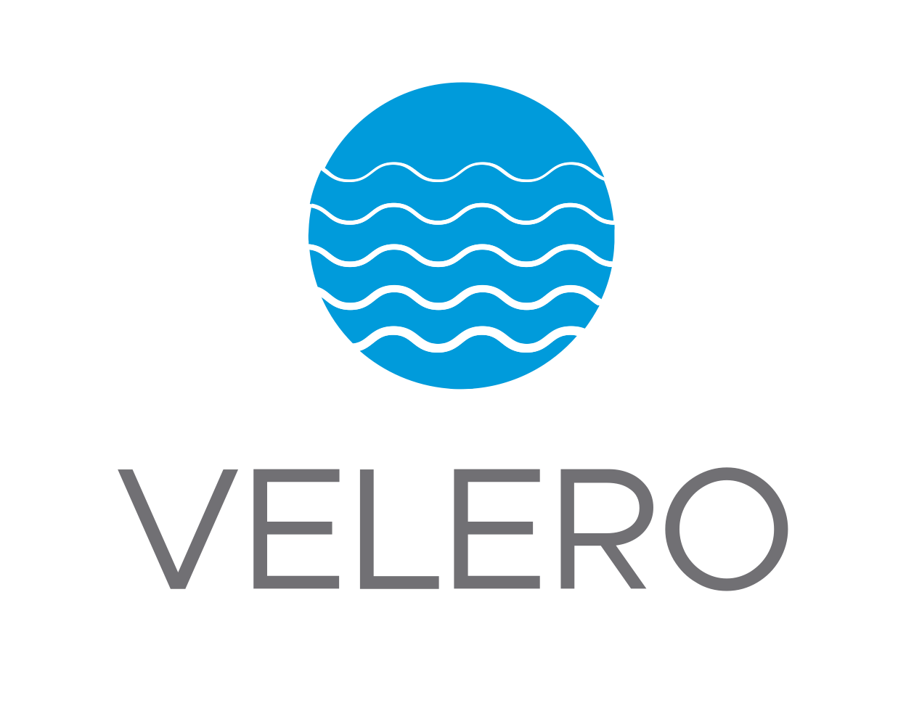

Kubernetes has become the go-to platform for managing containerized applications, offering scalability, flexibility, and robustness. However, the complexity of Kubernetes can be daunting, requiring developers and DevOps teams to navigate through intricate configuration files and command-line interactions. 

Several powerful development tools have emerged to simplify the management of Kubernetes clusters and streamline the deployment process. In this article, we will explore five Kubernetes development tools: 

1. [**1. Prometheus**](https://prometheus.io/)
2. [**2. Cyclops**](https://cyclops-ui.com/)
3. [**3. Keda**](https://keda.sh/)
4. [**4. Karpenter**](https://karpenter.sh/)
5. [**5. Velero**](https://velero.io/)

These tools offer intuitive user interfaces, automated scaling capabilities, disaster recovery solutions, and improved efficiency in managing Kubernetes clusters.

### Show us your support 🙏🏻

Before we start, we would love it if you starred our repository and helped us get our 
tool in front of other developers. Our GitHub repo is here: https://github.com/cyclops-ui/cyclops ⭐

## 1. Prometheus: Monitoring and Alerting for Kubernetes

**Prometheus** is an open-source monitoring and alerting toolkit designed specifically for microservices and containers. It offers flexible querying, real-time notifications, and visibility into containerized workloads, APIs, and distributed services. 

One of the features of Prometheus is its ability to assist with cloud-native security by detecting irregular traffic or activity that could potentially escalate into an attack.

It uses a pull-based system, sending HTTP requests called "scrapes", to collect metrics from applications and services. These metrics are stored in memory and on local disk, allowing for easy retrieval and analysis.

Prometheus can access data directly from client libraries or through exporters, which are software located adjacent to the application. Exporters accept HTTP requests from Prometheus, ensure the data format compatibility, and serve the requested data to the Prometheus server.

Prometheus provides four main types of metrics: Counter, Gauge, Histogram, and Summary. These metrics offer flexibility in measuring various aspects of applications and services, such as event start counts, memory usage, data aggregation, and quantile ranges.

To discover targets for monitoring, Prometheus utilizes service discovery in Kubernetes clusters. It can access machine-level metrics separately from application information, allowing for comprehensive monitoring.

Once the data collection is complete, Prometheus provides a query language called PromQL, which enables users to access and export monitoring data to graphical interfaces like Grafana or send alerts using Alertmanager.

## 2. Cyclops: Deploying applications with just a couple of clicks

**Cyclops** is a tool that simplifies the management of applications running in Kubernetes clusters. It abstracts complex configuration files into form-based UIs, eliminating the need for manual configuration and command-line interactions. This makes the deployment process more accessible to individuals with varying levels of technical expertise.

With Cyclops, you're not boxed into a one-size-fits-all approach. You can customize modules to suit your unique needs, giving you the freedom to create templates with input validation for seamless collaboration with your team. 

This not only speeds up your work but also empowers each team member to work independently, promoting a smoother and more efficient workflow.

In Cyclops, every module lays out a detailed list of resources it uses—deployments, services, pods, and others, all in plain view. You can easily track their status, helping you quickly spot and fix any hiccups in your application. It's like having a clear roadmap to navigate and troubleshoot any issues that pop up.

Within the architecture of Cyclops, a central component is the [Helm](https://helm.sh/) engine, which allows the dynamic generation of configurations. This engine serves as a key mechanism for efficiently managing settings and parameters in the Cyclops framework.

As Kubernetes-based systems commonly employ Helm as their package manager, seamlessly integrating Cyclops is a straightforward process.

Cyclops promotes consistency and standardization in deployment practices. By providing predefined templates or configuration presets, Cyclops ensures that deployments adhere to established best practices and guidelines. This consistency not only improves the reliability and stability of deployments but also facilitates collaboration.

## 3. Keda: Event-Driven Autoscaling for Kubernetes Workloads

Kubernetes Horizontal Pod Autoscaling (HPA) and Vertical Pod Autoscaling (VPA) are widely used for autoscaling Kubernetes clusters based on CPU and memory usage. 

However, they have limitations, such as the inability to scale pods to zero or scale based on metrics other than resource utilization. This is where **Keda** (Kubernetes Event-Driven Autoscaling) comes into play.

Keda is an open-source container autoscaler that extends the capabilities of native Kubernetes autoscaling solutions by scaling pods based on external events or triggers.

Monitoring event sources like AWS SQS, Kafka, and RabbitMQ, Keda efficiently triggers or halts deployments based on predefined rules. This adaptable solution also allows for custom metrics, facilitating effective autoscaling tailored for message-driven microservices, ensuring optimal performance and resource utilization.

The components of Keda include event sources, scalers, metrics adapters, and controllers. Event sources provide the external events that trigger scaling, while scalers monitor these events and fetch metrics. Metrics adapters translate the metrics for the controller, which then scales the deployments accordingly.

By leveraging Keda, DevOps teams can free up resources and reduce cloud costs by scaling down when there are no events to process. Keda also offers interoperability with various DevOps toolchains, supporting both built-in and external scalers. 

With Keda, autoscaling becomes more flexible and efficient, empowering teams to optimize resource utilization and adapt to changing workload requirements.

## 4. Karpenter: Automated Node Provisioning for Kubernetes

Kubernetes clusters often face the challenge of scheduling pods on available nodes. **Karpenter** is an open-source cluster auto scaler that automatically provisions new nodes in response to un-schedulable pods. It evaluates the aggregate resource requirements of pending pods and selects the optimal instance type to accommodate them. 

Karpenter also supports a consolidation feature, actively moving pods and replacing nodes with cheaper versions to reduce cluster costs.

A standout feature is the introduction of "Node Pools," allowing users to categorize nodes based on various criteria. This customization ensures a tailored approach to resource allocation, with Karpenter dynamically provisioning nodes into the most fitting pools.

At its core, Karpenter is designed to automate the scaling of Kubernetes clusters seamlessly. Leveraging Custom Resource Definitions (CRDs) within Kubernetes, Karpenter integrates seamlessly with existing tools and APIs, providing a familiar experience for users. 

The flexibility of Karpenter extends beyond the confines of AWS, making it a versatile solution for both cloud and on-premises environments.

Karpenter's adaptability shines through its support for user-defined strategies and policies through Kubernetes resources. This flexibility enables organizations to align Karpenter with their unique application and workload requirements, enabling better automated and optimized Kubernetes scalability.

## 5. Velero: Disaster Recovery and Backup for Kubernetes

**Velero** is a powerful tool that provides disaster recovery and backup solutions for Kubernetes clusters. It enables users to easily backup, restore, and migrate applications and their persistent volumes.

Velero takes snapshots of cluster resources and data, storing them in object storage providers like AWS S3, Google Cloud Storage, or Azure Blob Storage.

With Velero, users can create backup schedules, ensuring regular snapshots of critical cluster resources. This allows for efficient disaster recovery in case of data loss or cluster failures. Velero also supports cluster migration, simplifying the process of moving applications and data between Kubernetes clusters.

The tool offers resource filtering capabilities, allowing users to selectively backup and restore specific resources.

This flexibility ensures that only relevant data is included in the backup, saving storage space and reducing backup and restore times. Velero integrates with CSI (Container Storage Interface), providing support for backing up volumes and restoring them to their original state.

In addition to disaster recovery and backup, Velero provides features like running in any namespace, extending functionality with hooks, and supporting custom plugins for enhanced customization. It offers troubleshooting guides for diagnosing and resolving common issues, ensuring a smooth experience in managing Kubernetes clusters.

## Conclusion

These five Kubernetes development tools - Prometheus, Cyclops, Keda, Karpenter, and Velero - play pivotal roles in simplifying the complexities of Kubernetes cluster management.

From monitoring and alerting with Prometheus to event-driven autoscaling using Keda, and automated node provisioning through Karpenter, each tool addresses specific challenges, contributing to more efficient and resilient Kubernetes environments.

Cyclops stands out for its user-friendly approach, abstracting complex configurations into intuitive UIs, while Velero provides crucial disaster recovery and backup solutions for safeguarding critical data and applications.

As Kubernetes continues to be a cornerstone in modern application deployment, these tools empower developers and DevOps teams to navigate the intricacies of containerized environments with greater ease.

By integrating these tools into your Kubernetes workflows, you can enhance scalability, streamline deployment processes, and ensure the robustness of your applications in today's dynamic and demanding computing landscape.
