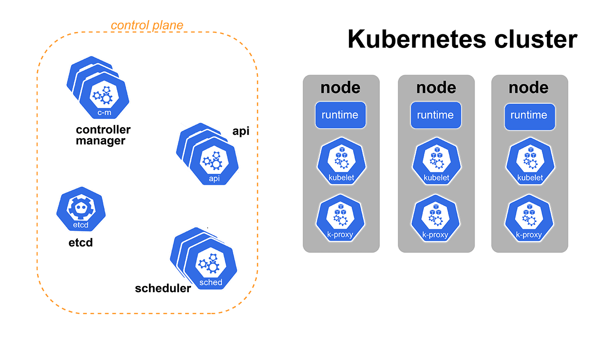

# Intro

A couple of days ago, I held a talk about Kubernetes and its components at the college I used to go to. My mom said she liked the talk, so I turned it into a blog post.

Many software engineers tend to look away from anything related to Kubernetes, even though they might use it daily. At first glance, it seems complex and like a whole new world to dive into. And yeah, it is, but in this blog post, I will go over all of the main components of a Kubernetes cluster and explain what they do in an example.

By the end of the blog post, you won't be a Kubernetes expert, but you will probably get a good idea of what to look for and how to structure the chaos that Kubernetes seems to be at first.

### **Show us your support 🙏🏻**

Before we start, we would love it if you starred our repository and helped us get our tool in front of other developers. Our GitHub repo is here: https://github.com/cyclops-ui/cyclops ⭐

# Components

First of all, we can divide a Kubernetes cluster into two parts: **control plane** and **worker nodes**. The control plane takes care of the whole operation and controls the state of our cluster. We’ll get into what that means shortly. On the other side, our worker nodes are essentially just computers listening to what the control plane tells them to do. They are the computing power of our cluster. Any application we run in the cluster will run on those nodes.

Let’s decompose that further.

## Control plane

As we said, the control plane is making sure our cluster is running as expected. It does that by communicating with the cluster user, scheduling workloads, managing cluster state and so on.

The control plane is made of four crucial components. Simple by themselves, but together, they create a complex system. These components are: 

1. **1. API**
2. **2. ETCD**
3. **3. Scheduler**
4. **4. Controller Manager**

Control plane components can be run on any machine in the cluster, but are usually run on a separate set of machines, often called **master nodes**. Those machines are not used to run any other container or application and are reserved for the Kubernetes control plane.

### API

The Kubernetes API acts as the cluster's front-end interface, allowing users to interact with the cluster, define desired states, and perform operations such as creating, updating, and deleting resources.

It is the **only point of contact** we have with the cluster. Also, no other components are talking directly to each other, but all communication is happening **through** the API.

### ETCD

ETCD is the API’s **database**; it's as simple as that. When you tell Kubernetes to create a deployment, it gets stored in the ETCD alongside all the other created resources.

One characteristic of ETCD is that its key-value storage is organized as a filesystem. Another great feature of ETCD is that users can **subscribe** to events and get notified about changes. For example, *let me know when a new pod gets created*.

### Scheduler

As the name suggests, the scheduler **decides which node a pod will run on**. It does that by a set of rules you can read in the [Kubernetes documentation](https://kubernetes.io/docs/home/). *This is what I meant when I said you won't be an expert, but you will know what to google :)*  

The Scheduler **subscribes** to all newly created pods saved in ETCD, but it can **only** talk with the API to get this update.

When it catches that a pod has been created, it calculates which worker node to run it on. Once it's made up its mind, **the scheduler doesn't run anything on any machine**; it just tells the API to run the pod on a particular node.

### Controller Manager

The last component from the control plane is the controller manager. We can take it as a thermostat for our cluster. Its job is to shift the current state of the cluster to the desired state.

This means that it will **create all the needed resources** under the hood to satisfy our needs and get our applications up and running.

It runs multiple controller processes subscribed to changes on the ETCD, compiled into the same binary for easier deployment. Controller managers’ roles and what those controllers do will be defined more closely later in the blog.

## Worker nodes

Now that we have concluded what manages the whole cluster, let's dive into where our containers are running and how that is achieved.

There are 3 components running on each node in a Kubernetes cluster. Of course, you can have multiple nodes in a cluster, but each needs these three components to host your applications.

Those being:

1. **1. container runtime**
2. **2. kubelet**
3. **3. kube proxy**

### Container runtime

The component that allows Kubernetes to run containers and manages the lifecycle of a container on a node is the container runtime.

Multiple container runtimes are supported, like [conatinerd](https://containerd.io/), [cri-o](https://cri-o.io/), or other [CRI compliant runtimes](https://github.com/kubernetes/community/blob/master/contributors/devel/sig-node/container-runtime-interface.md).

### Kubelet

Another component subscribed to pod events is Kubelet. Each time a pod is scheduled on a node, the Kubelet running on that node will hear that and start all defined containers. On top of that, Kubelet also performs health checks to ensure everything is running as expected.

### Kube proxy

KubeProxy in Kubernetes manages network connectivity between pods across the cluster, handling tasks like load balancing and network routing. It ensures seamless communication among pods by maintaining network rules and translating service abstractions into actionable network policies.

# From a deployment to a running container

Now that we have listed all of the components and their role in a Kubernetes cluster, let's tell a story on how a Kubernetes Deployment becomes a set of containers running on various machines across the cluster.

## Pods, Replicasets and Deployments

Just a quick reminder on the relation of these three: Pods, Replicasets, and Deployments.

The smallest unit we can deploy in a Kubernetes cluster is a **pod**. With it, we are going to define our containers.

Most likely, we will need a couple of instances of the same application, and we can define how to replicate our pods with a **Replicaset**. It will ensure that we have the desired number of pods running by starting and terminating them.

Cool, now we have our application replicated, but we would like to roll out a new version of our application. We have to tear down existing Pods/Replicaset and create new ones. A Deployment will automate this process, allowing us to roll out our feature safely.

## The Prestige

Now that we have all our terminology and touched on all Kubernetes components and their role, let's see what happens when we “apply” a Deployment to a Kubernetes cluster.

Let's say that we have created a `deployment.yaml` file defining our application (you can see how to do that [here](https://imgur.com/7qKp189)) and ran `kubectl apply -f deployment.yaml`. `kubectl` will now submit our deployment definition to our cluster's **only point of contact** - the Kubernetes API.

Our simple API will store our deployment in the ETCD database. Each time a Deployment object is saved into ETCD, it will let the API know that there was a change on Deployments and that it should let **everybody who is subscribed** to such an event know about it.

And there is a component in the control plane that would like to know when a new Deployment spawns, and that's the **Controller Manager**. When it hears about a new Deployment, it will create a new Replicaset based on the Deployment configuration. To make this Replicaset, it will call the API with a create request.

Creating a Replicaset is much like creating a Deployment. API will receive a Replicaset to create and store into ETCD. This will make ETCD tell the API that somebody created a Replicaset and pass that information to all subscribed components, which is **again** the Controller Manager.

When the Controller Manager hears about the new Replicaset, it will create all the Pods defined with the Replicaset by, you guessed it, calling the API, which will store all those Pods into ETCD.

 *As we said, a lot of things happened, so we decided to create a GIF that might help you understand the whole process under the hood.*

Here, we include the Scheduler, which is subscribed to the Pod creation event. Each time it hears about a new Pod, it decides on which node it should be run. The Scheduler is not running the Pod but **only telling the API** which node it chose for it. The API will then save that information.

Another component listening to Pod events is the Kubelet, a component running on each worker node in the Kubernetes cluster. Each time the API tells the Kubelet that the Scheduler decided to run the Pod on its node, the Kubelet **will start all the containers** defined by the Pod.

Finally, we turned our configuration into an application running on a machine! It is a lengthy process with many moving parts, but this may be my favorite part.

Each component takes just a tiny bit of the responsibility of deploying an application, but they solve a pretty complex problem together.

# Final thoughts

Hope this article helped you get a grasp on Kubernetes components and helped you demystify the most popular orchestrator out there. We encourage you to dig around yourself because we enjoyed learning about this.

One book we recommend to learn about Kubernetes is “Kubernetes in action” by Marko Lukša. It is pretty popular and gives an excellent overview of what is going on under the hood of Kubernetes and how to use it.

