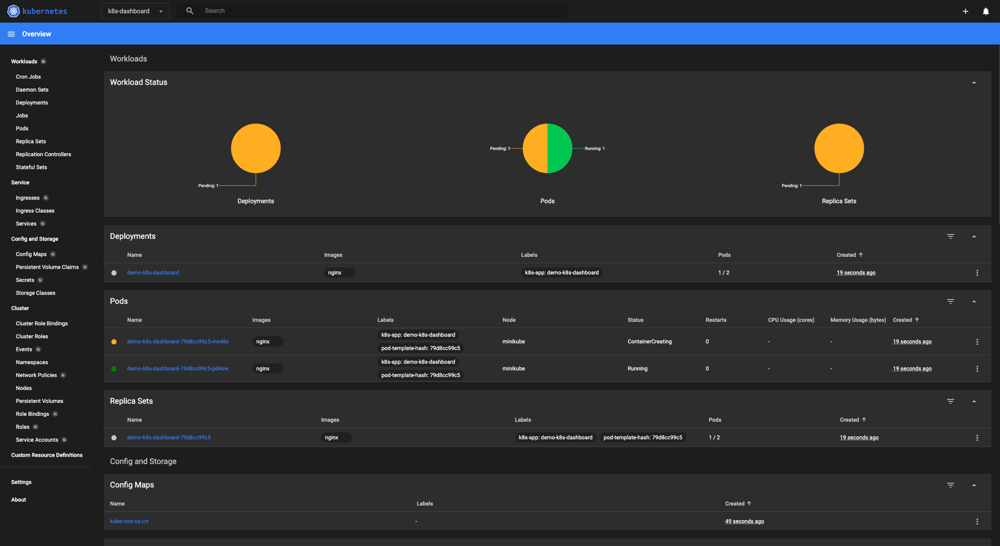
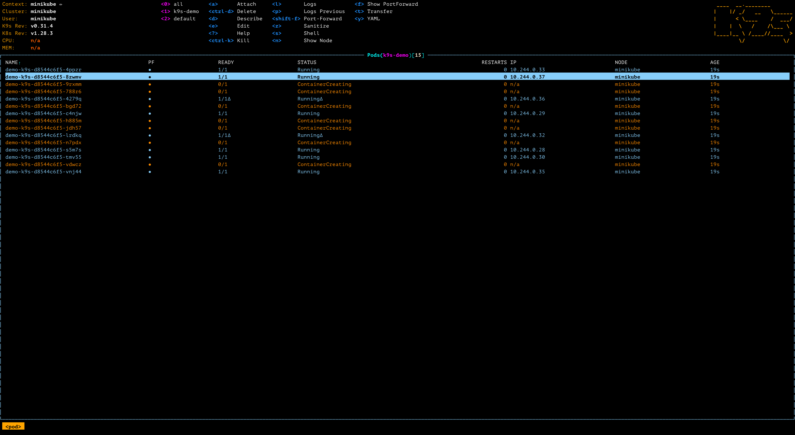
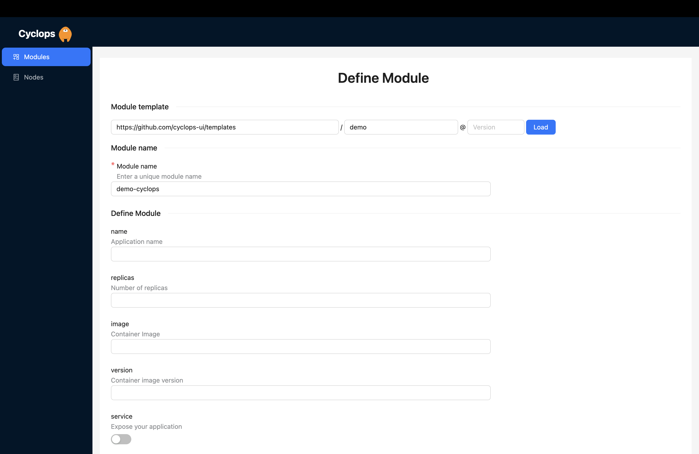
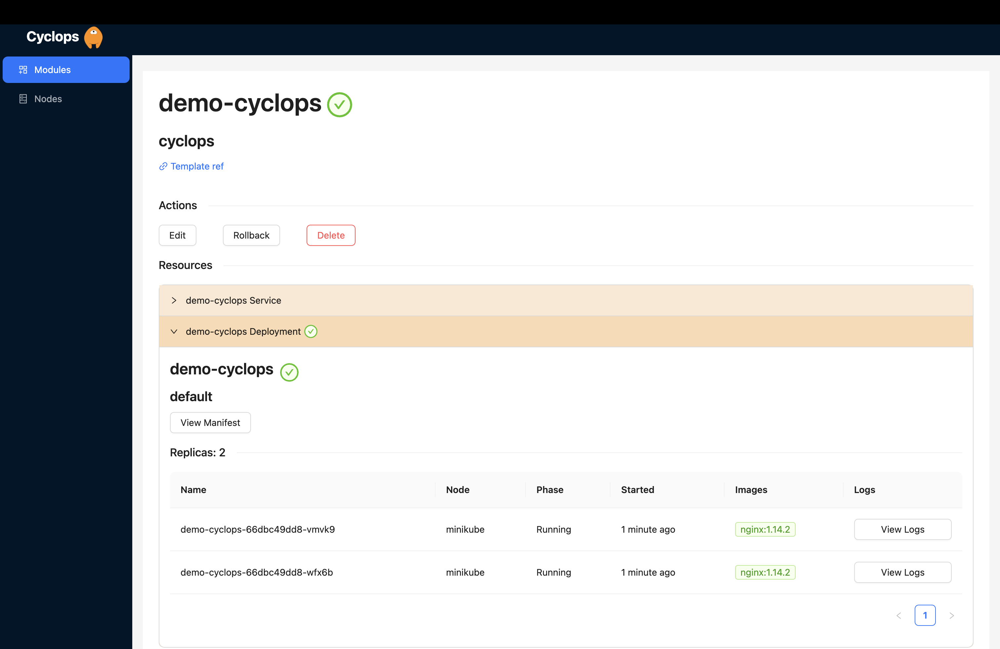
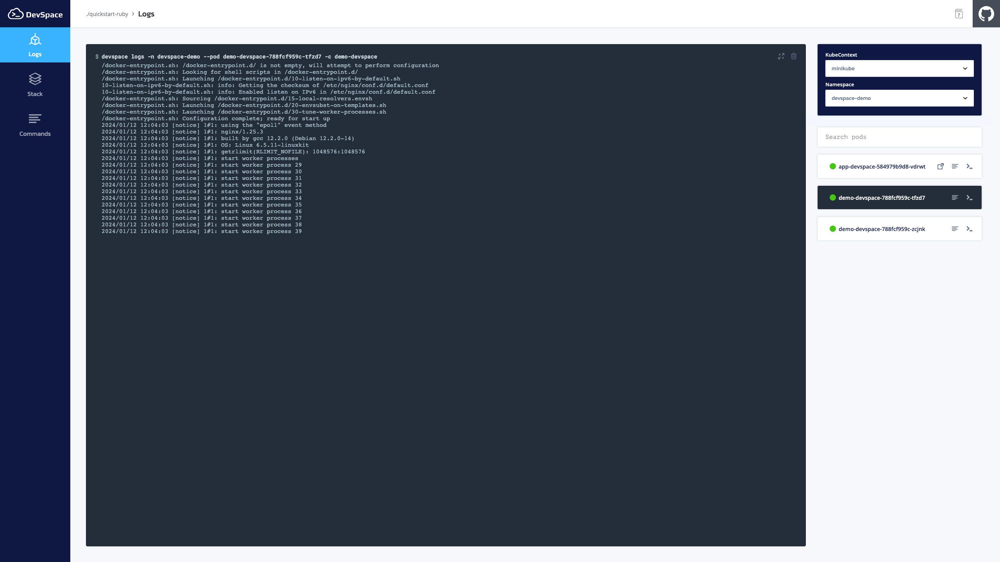
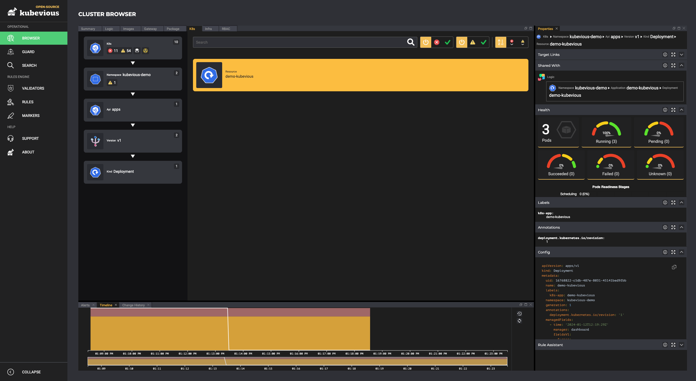

For the uninitiated, **K8s stands for Kubernetes**, with the number 8 representing the eight letters between **K** and 
**s.** Kubernetes has become pretty much unavoidable in the current tech landscape but remains uninviting because of its 
complexity and steep learning curve.

The terminal-based interaction has a part to play in this story. If you ever had the privilege of watching a seasoned 
DevOps work his way with a Kubernetes cluster, you might look at him like you would a seasoned martial artist showcasing 
his fighting skills. That is because everything that is done through a terminal always looks more frightening and seems 
like it requires years and years of training. 🥋

Now the question stands: how can we make such a complex issue (one that even had its name beautified) more enjoyable? 
Well, in the same way we make everything more enjoyable → make it easier and make it prettier! 🎀 And how would you do 
that, you might ask. With a **graphical user interface,** or GUI for short! Let’s take a look at **five tools** that 
provide you with a user interface when dealing with Kubernetes.

### Show us your support 🙏🏻

Before we start, we want to mention that we scheduled our 
[first release on Product Hunt](https://www.producthunt.com/products/cyclops)! Click the notify me button to be alerted 
when we are out and ready to receive your feedback 🔔

And we would love it if you starred our [repository](https://github.com/cyclops-ui/cyclops ) and helped us get our tool 
in front of other developers ⭐

## Kubernetes Dashboard

Let's dive into the **quintessential tool for Kubernetes management** – 
[**the Kubernetes Dashboard**](https://kubernetes.io/docs/tasks/access-application-cluster/web-ui-dashboard/). Automatically bundled with 
your cluster, it delivers a graphical overview of your Kubernetes environment. You can use it to get an overview of 
applications running on a cluster, deploy containerized applications to a Kubernetes cluster, and manage cluster 
resources.

The Kubernetes Dashboard not only offers an overview but also helps with troubleshooting. It provides insights into the
 health of Kubernetes resources, spotlighting any operational errors.

Through it, you can deploy applications as well. You can do it with a manifest that you wrote or through a form that you 
just fill in. However, it's worth noting that the form, while user-friendly, lacks the flexibility for customization 
beyond basic examples.

While the K8s dashboard is a **jack-of-all-trades**, many find it to be a generalist, lacking in-depth features. This 
limitation encourages us to explore more tools, each designed for specific purposes, and so we embark on our journey 
through the list of tools we’ve explored.

## K9s

[**K9s**](https://k9scli.io/) is your best friend (get it? 🐶) when exploring your cluster via the terminal. It shares commonality with Vim 
for its interaction style using shortcuts and starting commands with`:` but don’t let that discourage you. K9s keeps a 
vigilant eye on Kubernetes activities, providing **real-time** information and intuitive commands for resource 
interaction.

It can almost replace the standard `kubectl` and doesn’t require you to have a “cheat sheet” next to you when 
interacting with Kubernetes. You traverse through your resources just by selecting them and drilling down to the lowest 
level. This allows for easy log extraction and access to its shell.

K9s gives you the ability to see the manifest of each of your resources and the ability to edit and apply changes. As I 
mentioned, it **almost** replaces the `kubectl`. One of the differentiators is that you **cannot** deploy new resources 
via the K9s.

K9s comes with the ability to filter out your resources and search them with the `/` command, making it easier to locate 
the ones you are looking for in the sea of resources or filter through the logs of a specific pod.

A nice touch is the list of commands and shortcuts available to you at any given moment at the top of the screen, and 
its customization with skins and plugins gives you room for additional utility.

## Cyclops

If you are having difficulties fighting with manifest files,[**Cyclops**](https://cyclops-ui.com/) is the tool for you! 
Cyclops removes the clutter and complexity when dealing with manifests by transforming them into a structured web-based 
form, eliminating the need for manual configuration and command-line interactions.

This makes the deployment process **more accessible** to individuals with varying levels of technical expertise.

Within the architecture of Cyclops, a central component is the [Helm](https://helm.sh/) engine. Helm is very 
popular within the Kubernetes community; chances are you have already run into it. The popularity of Helm plays to 
Cyclops's strength because of its straightforward integration.

With Cyclops, you're not boxed into a one-size-fits-all approach. **You can customize the form to suit your unique 
needs.** For instance, a team member can generate a Helm chart, allowing others to define necessary values using 
Cyclops for painless application deployment.

Once you have declared the wanted state of your application, deploying it is as straightforward as clicking a button. 
Furthermore, once you deploy your application, the wanted state is also easily changeable through Cyclops.

In Cyclops, every application lays out a detailed list of resources it uses - deployments, services, pods, and others, 
all in plain view. You can easily track their status, helping you quickly spot and fix any hiccups in your application. 
It's like having a clear roadmap to navigate and troubleshoot any issues that pop up.

## DevSpace

Consider the convenience and time saving of your local server refreshing automatically with every code save, providing 
real-time visualization of your code changes.

Imagine taking this smooth experience a step further into Kubernetes clusters; [**DevSpace**](https://www.devspace.sh/) 
makes that possible. With DevSpace, you can **deploy applications in real time** during the coding process, facilitating 
swift iteration.

DevSpace streamlines the process by automatically applying changes to your K8s cluster without needing the entire image 
building and deployment pipeline. It builds the image locally without pushing it to a registry, although the option to 
automatically push images is available for those who require it during development.

Moreover, DevSpace features a user interface that, while somewhat limited, offers a quick overview of all pods in your 
cluster. It allows you to **easily access pod logs and even execute commands** directly within them, enhancing your 
development workflow.

Although I have focused on local development, DevSpace is used for creating workflows as well. All your workflows are 
saved in one file, making it easy to reproduce environments on any machine with a single `devspace deploy` command.

## Kubevious

Unlike the other tools mentioned in this post, [**Kubevious**](https://kubevious.io/) has no way of changing the cluster 
state. It is intended solely as an observability tool, focusing on potential issues in your cluster. It highlights 
potential threats and risks for every resource you may run.

The graphical views offer insights into containers, networking, exposure, RBAC, and Helm charts for intuitive 
troubleshooting.

Kubevious has a **rule engine** that helps with the detection and prevention of misconfigurations. It comes with rules 
out of the box, but it allows you to create custom rules as well (for example, “don’t allow images to be on the 
*latest* tag”).

It also comes with the cool **time machine** feature that allows users to travel back in time, audit applications, root 
cause outages, and recover manifests, ensuring a complete understanding of cluster history.

And I have to mention the **full-text** search it provides! You can search for any resource without knowing the specific 
name of it. One great example is searching for any resources that use a specific port by just typing in “*port 3000*,” 
and Kubevious will find your resource.

## Final thoughts

In our quest to enhance the Kubernetes experience, we've unwrapped five delightful tools, each offering its unique charm 
 to make your journey smoother and more enjoyable.

These are not the only tools that provide a UI for Kubernetes, but we wanted to shine a spotlight on some, maybe 
lesser-known ones.

All of these tools are open-source, so give them a go; they're free!

I want to end this post with a question directed to you, the reader: What are your thoughts on graphical representations 
of Kubernetes? Is it needed, or does `kubectl` reign supreme?