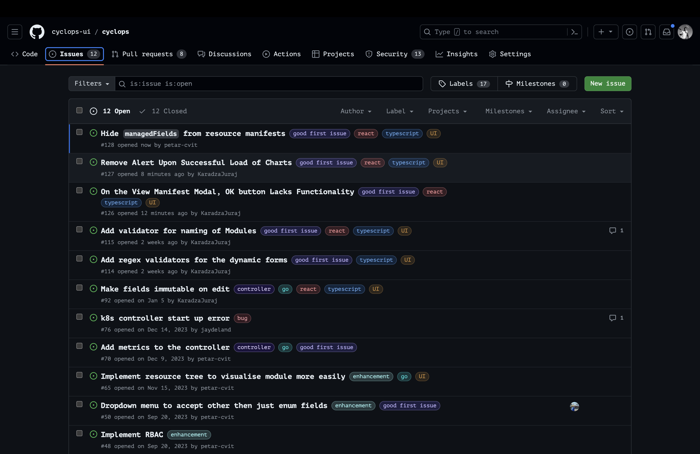
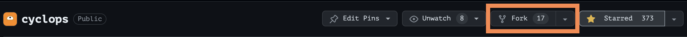
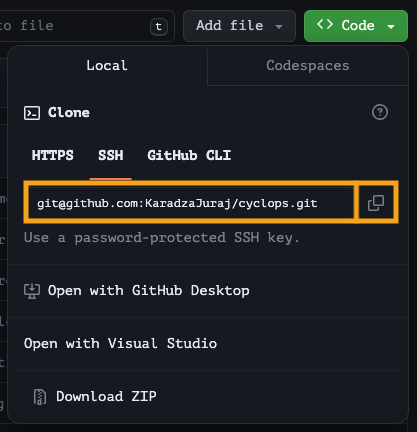
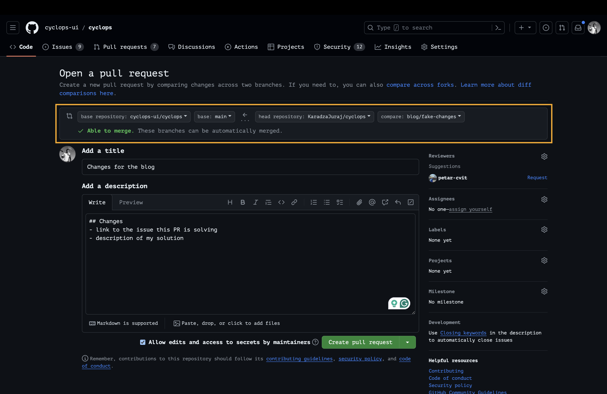

Have you ever thought of contributing to open source? If you are here, you probably did 😄

For a beginner, it might seem confusing, and I can relate - I've been there myself. However, you found the willpower to push onwards and learn more about this process and I hope this article will show you that it is not as complicated as it may seem.

Most repositories that are accepting contributions usually have a **CONTRIBUTING.MD** file that you should look out for. Since not all repositories are the same, this file will tell you more about the process of contributing to that specific repository.

However, some general rules can be applied to most repositories, and we will go over them in this article.

### Support us 🙏🏻


Before we start, we would love it if you starred our [open-source repository](https://github.com/cyclops-ui/cyclops) and helped us get our
tool in front of other developers ⭐

## Where to contribute?

The first question that comes to mind is: Where to contribute?

Well, you should start with the projects **you are already using**. Maybe some library needs updating, or some tool has a bug?

You may want to contribute to some project within your **domain of expertise** or a project that uses the **tech stack** you are comfortable with.

These are great contenders, and you should look into them.

If you don't know any projects but still want to contribute, browse on GitHub or go to sites like [Quine](https://quine.sh/contribute), where many open-source repositories are looking for contributors.

For this article, we will use our open-source repository - [**Cyclops**](https://github.com/cyclops-ui/cyclops).

## How to know what needs improving?

Whether you are looking for something to do or already know of a bug that needs fixing, all contributions start in the same place - **the Issues tab**.



If you are new to the project, you can look for the “**_good first issue”_** label that most repositories have. As the name suggests, they are a good entry point to get involved in a project. All of the issues should have a description of the problem.

If you know of a problem or bug that is not listed here or you want to see a new feature get introduced, open a new issue! Once you open the issue, the maintainers will decide what to do next, and you should **wait for their response before you start coding**.

**Pro Tip**: If you are opening a bug issue, be sure to write down the steps on how to reproduce the bug!

## How to contribute?

Okay, we found a repo, an issue we want to work on, talked with the maintainers, and were given the green light to work on the issue. Let's finally start coding!

### 1. Fork the repo

The first step is **forking** the repository. This will make a **copy of the project** and add it to your GitHub account.



### 2. Clone the repo

Now go to your repositories and find the forked repo. Click on the **< > Code** button and select one of the options (HTTPS / SSH / GitHub CLI).



**Copy the content in the box**. Now open your terminal and position yourself where you want to save the project locally. Once you have positioned yourself, type the following command in your terminal:

```bash
git clone <paste the copied content>
```

After a few moments, you should have the project locally on your PC!

### 3. Create a new branch

Now, go to your local folder and create a new branch. Be sure to check out the **CONTRIBUTE.md** of the project to see if the maintainers want you to follow some rules for the **naming of branches**!

### 4. Commit and push your changes

Once you have your branch ready, you can start changing the codebase. After you finish, commit your changes and push them to your forked repository. Be sure to follow the **commit message conventions** if the repository has them in place (check the **CONTRIBUTING.md**).

### 5. Open a pull request

Now that you have pushed your changes and want to merge them to the main repository, it is time to create a pull request! Once again, you should check the **CONTRIBUTING.md** rules to see if the maintainers would like you to stick to a **naming convention when creating PRs** and what they like to see in the description.



❗Be sure to set the `base repository` to the original repository you forked from❗

## I created a PR, now what?

You are satisfied with your changes and successfully created a pull request to the main repository. What now? Now, you **wait**.

Depending on the urgency of the problem your PR is fixing and the schedule of the maintainers, you will have to wait for somebody to **review** your pull request. Be prepared to explain why and what you did (if you didn't do a good job in the PR description) and to **make changes** if necessary.

Don't take any requests for changes personally. All of you are here for the betterment of the project and nobody is ill-willed. **If you disagree** with the opinions of the reviewers, **tell them**! A healthy discussion has never been a bad thing.

## Why fork? 🍴

You are probably wondering why we had to fork the repository at all. Why not just clone the original and work on a separate branch? Basically, remove the #1 step and isn't the rest the same?

Well, you could try, but once you push your changes, you will realize you **don't have the authorization** to do so! By forking the repo, you become the owner of the copied repository with the **rights to change the codebase**. This is a neat system to ensure only the changes approved by the original maintainers go through.

## Go contribute!

Now that you are armed with this information, you are ready to go and make your mark in the open-source world! Go help the myriad of projects you have and haven't heard of, and join this growing community. Your help will be greatly appreciated, I'm sure of it 😉
