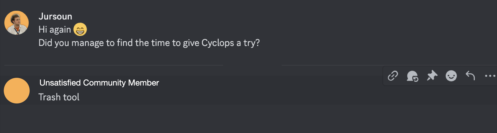
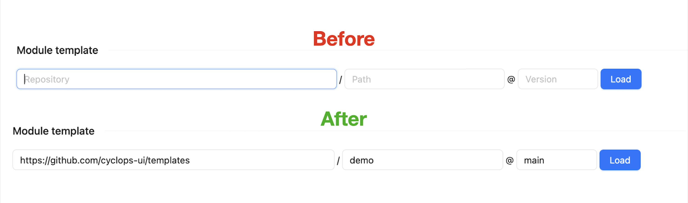
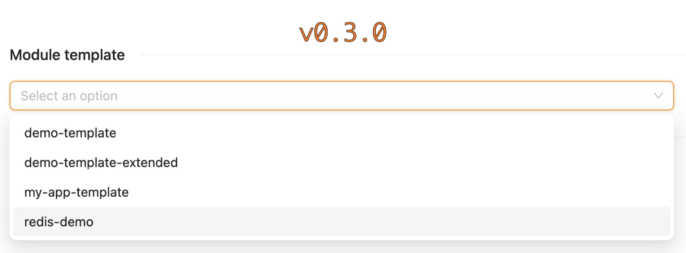

What started as a frustration with not being able to get in touch with our users, quickly developed into a redesign of the flow of our platform.

My team and I are developing an open-source platform that helps developers deploy and manage their applications in Kubernetes. We have been working hard to expand our user base, and the efforts were starting to show results.

The rising number of installations was satisfying to see. However, that was the only thing we were able to observe. We wanted to know more. We wanted to know what users are doing with our platform and what they are struggling with.

The following short story could be considered a #building-in-public entry of our startup, but I just found it interesting and wanted to share it with you.

### Support us 🙏

We know that Kubernetes can be difficult. That is why we created Cyclops, a **truly** developer-oriented Kubernetes platform. Abstract the complexities of Kubernetes, and deploy and manage your applications through a UI. Because of its platform nature, the UI itself is highly customizable - you can change it to fit your needs.

We're developing Cyclops as an open-source project. If you're keen to give it a try, here's a quick start guide available on our [repository](https://github.com/cyclops-ui/cyclops). If you like what you see, consider showing your support by giving us a star ⭐

## User Feedback 🗣️

Since the beginning, we have been trying to talk to our users and gather as much feedback as we can. However, that turned out to be sort of a problem. We knew that people were downloading Cyclops; on our DockerHub, we could see the number of pulled images getting larger by the day.

The problem was that we had no way of contacting our users. **We could only see the number of pulls, not who pulled them.**

In an attempt to get in touch with our users, we created a [Discord server](https://discord.com/invite/8ErnK3qDb3). Discord is a great way to keep your community close to you, and because of it, we have a way of getting to know our users.

So we started talking to them. The feedback wasn’t always constructive…

… but most of it was really positive. However, there is a caveat; a lot of the positive feedback we were getting was from 1-on-1 meetings with our users. In these meetings, we could demonstrate Cyclops's capabilities better than users could on their own. This turned out to be a bigger issue than we thought.

Recently, we implemented telemetry to better understand how our users utilize Cyclops. As soon as the statistics started to come in, boy, were we surprised.

## The Problem ❗

We were really pleased with the number of installations of Cyclops. As it turns out, we were correct in thinking that Cyclops is pretty simple and straightforward to install. But when it came to starting to use it, more than 60% of our users got lost.

So what was the problem?

The thing is, when you want to deploy an application to your Kubernetes cluster, you must provide a template in the form of a Helm chart. We have created a few examples of such charts and published them on our [open repository](https://github.com/cyclops-ui/templates). In all our documentation and blogs, we pointed people toward that repository when starting out with Cyclops. However, it seems that it didn’t catch on. **The number of deployed applications was still much lower than the number of started instances of Cyclops.**

## A Theory 🧑‍🔬

Here is a fun fact for you, dear reader: the majority of online readers spend less than 15 seconds on a web page ([source](https://time.com/12933/what-you-think-you-know-about-the-web-is-wrong/)). Knowing this, could it be that most of our users skimmed over the blogs and documentation and missed out on the reference to our template repository?

We wanted to test this theory. In our last [blog](https://cyclops-ui.com/blog/2024/03/26/devs-perspective), we did another tutorial on Cyclops showcasing its benefits. However, for this specific article, we created a special version of Cyclops. What was so special about this version? **We added a default value for the template when creating new modules.**

After gathering statistics for some time, the results were in.

## The Results 📊

With a simple change, we saw an **improvement** in our users' behavior, they no longer got lost at the very first step of using our platform! However, it wasn’t as big of an improvement as we initially hoped for but it was certainly in the right direction. We asked ourselves how to further improve on this issue. And we think we got it 🙌

Since our most recent version (v0.3.0), we have reworked the platform's flow. Choosing a template is no longer an **input field** but a **dropdown**. Every instance of Cyclops comes with a couple of premade templates (stored in our [templates repository](https://github.com/cyclops-ui/templates)), which you are free to use and abuse. We feel like this will go a long way in showcasing the customizable nature of Cyclops to our users.

But an important part of Cyclops is its **ability to use your own templates**, and we weren’t ready to compromise on that! That is why we added a new `Templates` tab where you can add new templates and manage the existing ones. Once added, your new templates will be shown in the dropdown the next time you find yourself deploying an application.

## Credits 🦔

We released v0.3.0 earlier this week, so it is still too early to say how much of an impact it had on our users, but we have high expectations! We might share the statistics once enough time passes, so make sure to follow us to find out!

It would be a shame not to mention [PostHog](https://posthog.com/) as the telemetry provider we are using, since it turned out to be extremely useful. Because it is hard to find people who will talk with you about your product, gathering statistics gave us a much greater insight into our users.

If you are one of the few readers who gave this article more than the previously mentioned 15 seconds, I hope you found it amusing at least 😁

If you are interested in contributing to our project, whether through coding or providing feedback, join our [Discord community](https://discord.com/invite/8ErnK3qDb3) and come talk to us!
