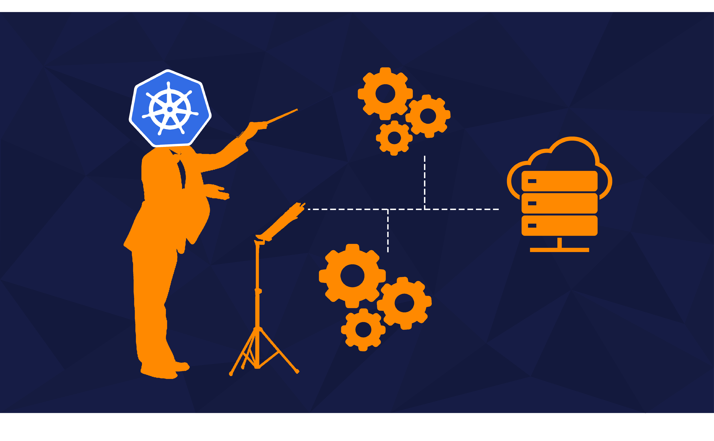
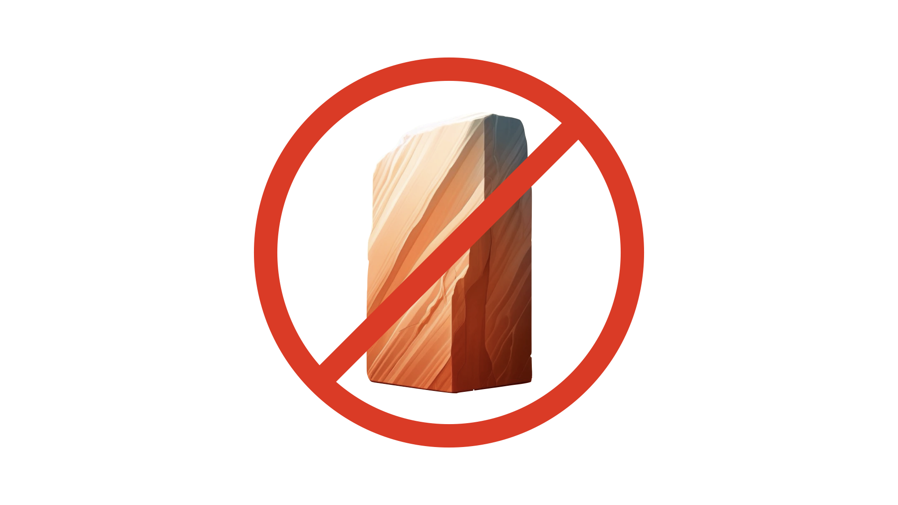

Kubernetes has risen to fame over the past couple of years, transforming from a geeky buzzword into a cornerstone of modern software development.

Yet, with its rise to fame, Kubernetes has also become shrouded in myths and misconceptions, which can often deter potential users - “_Kubernetes is only for large companies_” or “_I need microservices for Kubernetes_”…

While most of these misconceptions can be said about other container orchestrators, in this article, I focused on Kubernetes as it is the most popular and the first one that comes to mind when people think of container orchestration.

That being said, let’s dive into five of the most common misconceptions about Kubernetes and set the record straight!

### Support us 🙏

We know that Kubernetes can be difficult. That is why we created Cyclops, a **truly** developer-oriented Kubernetes platform. Abstract the complexities of Kubernetes, and deploy and manage your applications through a UI. Because of its platform nature, the UI itself is highly customizable - you can change it to fit your needs.

We're developing Cyclops as an open-source project. If you're keen to give it a try, here's a quick start guide available on our [repository](https://github.com/cyclops-ui/cyclops). If you like what you see, consider showing your support by giving us a star ⭐

### 1. Kubernetes is Only for Large Enterprises

💨 **Misconception**: _Kubernetes is too complex and resource-intensive for small to medium-sized businesses and is only practical for large enterprises._

🔍  **Reality**: Kubernetes is highly scalable and can be used by organizations of any size. With managed services like EKS, GKE, and AKS, even small teams can set up and manage Kubernetes clusters. These services take care of much of the heavy lifting, so smaller organizations can easily benefit from the features Kubernetes provides without needing a ton of infrastructure or a big DevOps team.

For example, a startup can easily set up a Kubernetes cluster on AWS using EKS. This takes advantage of AWS’s infrastructure and managed services, making it simpler and more cost-effective to manage.

### 2. Kubernetes Replaces Docker

💨 **Misconception**: _Kubernetes is a replacement for Docker._

🔍  **Reality**: Kubernetes and Docker serve different, yet complementary, purposes. Docker is a platform for containerizing applications, while Kubernetes is an orchestration system for managing those containers across multiple hosts/servers. Docker handles the creation and running of containers, but Kubernetes takes on the orchestration tasks, such as scaling, load balancing, and self-healing.

In practice, Docker containers are often used as the building blocks that Kubernetes orchestrates. For instance, developers use Docker to create container images, which are then deployed and managed by Kubernetes.

### 3. Kubernetes Manages Everything Automatically

💨 **Misconception**: _Kubernetes fully automates all aspects of container management without the need for manual intervention._

🔍 **Reality**: Kubernetes takes care of many tasks like container deployment, scaling, and failover, but it still needs proper setup and ongoing management. You’ll have to configure things like network policies, resource limits, and storage. Plus, keeping an eye on the cluster with regular monitoring and updates is crucial for its health and security.

For example, deploying applications requires configuration files in which you describe declaratively what you want Kubernetes to do with your application. Tools like [Cyclops](https://cyclops-ui.com/) help manage these configurations by providing a user-friendly interface.

### 4. Kubernetes is Only for Microservices

💨 **Misconception**: _Kubernetes is not suitable for monolithic applications_.

🔍  **Reality**: While Kubernetes excels at managing microservices, it is equally capable of handling monolithic applications. Kubernetes provides features like horizontal pod autoscaling (HPA), which can be utilized by both microservices and monolithic applications. HPA allows applications to scale based on the load automatically, ensuring your application will not crash under high pressure.

For example, a monolithic application can be containerized and deployed in a Kubernetes cluster. With proper configuration, Kubernetes can manage the application's scaling, deployment, and monitoring just as effectively as it does with microservices.

### 5. Kubernetes is Too Complex to Learn and Implement

💨 **Misconception**: _Kubernetes is too complicated for individuals and small teams to learn and implement._

🔍  **Reality**: While Kubernetes does have a steep learning curve, there are numerous tools, tutorials, and resources available to simplify the learning and implementation process. Platforms like [Minikube](https://minikube.sigs.k8s.io/docs/) allow developers to run Kubernetes locally, providing a sandbox environment to experiment and learn.

Online courses, documentation, and community support also significantly contribute to making Kubernetes more accessible. With the right tools, even small teams can effectively use Kubernetes for their projects.

### Thanks for reading 🙌

I hope this article clarified some common myths about Kubernetes. If you enjoyed the read, consider supporting us by giving us a star on our [repo](https://github.com/cyclops-ui/cyclops)!
