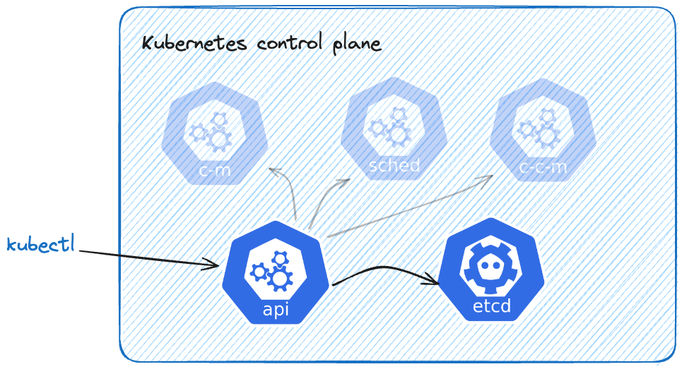

When you touch on containerized apps today, Kubernetes usually comes up as their orchestrator. Sure, Kubernetes is great for managing your containers on a fleet of servers and ensuring those are running over time. But today, Kubernetes is more than that.

Kubernetes allows you to extend its functionality with your logic. You can build upon existing mechanisms baked into Kubernetes and build dev tooling like never before - enter Custom Resource Definitions (CRDs).

## Support us 🙏

We know that Kubernetes can be difficult. That is why we created Cyclops, a **truly** developer-oriented Kubernetes platform. Abstract the complexities of Kubernetes, and deploy and manage your applications through a UI. Because of its platform nature, the UI itself is highly customizable - you can change it to fit your needs.

We're developing Cyclops as an open-source project. If you're keen to give it a try, here's a quick start guide available on our [repository](https://github.com/cyclops-ui/cyclops). If you like what you see, consider showing your support by giving us a star ⭐


## Kubernetes components

Before diving into CRDs, let's take a step back and look at Kubernetes control plane components, specifically Kubernetes API and its ETCD database. We made a [blog](https://dev.to/cyclops-ui/complexity-by-simplicity-a-deep-dive-into-kubernetes-components-4l59) on each one of those components previously, so feel free to check it out for more details.

You will likely talk to your Kubernetes cluster using the command-line tool `[kubectl](https://kubernetes.io/docs/reference/kubectl/)`. This tool allows you to create, read, and delete resources in your Kubernetes clusters. When I say “talk” to a Kubernetes cluster, I mean making requests against the API. Kubernetes API is the only component we, as users, ever interact with.

Each time we create or update a K8s resource, the Kubernetes API stores it in its database—`etcd`. [etcd](https://etcd.io/) is a distributed key-value store used to store all of your resource configurations, such as deployments, services, and so on. A neat feature of `etcd` is that you can subscribe to changes in some keys in the database, which is used by other Kubernetes mechanisms.



What happens when we create a new K8s resource? Let's go through the flow by creating a service. To create it, we need a file called `service.yaml`

```yaml
# service.yaml

apiVersion: v1
kind: Service
metadata:
  name: my-service
spec:
  selector:
    app.kubernetes.io/name: MyApp
  ports:
    - protocol: TCP
      port: 80
      targetPort: 9376
```

and apply it to the cluster using `kubectl`:

```bash
**kubectl apply -f service.yaml**

service/my-service created
```

`kubectl` read our file and created a request against the Kubernetes API. API then makes sure our service configuration is valid (e.g., all the necessary fields were there, fields were of the correct types, …) and stores it to etcd. Now `etcd` can utilize its `watch` feature mentioned previously and notify controllers about a newly created service.

## CRDs and how to create one

With the basic flow covered, we can now extend it. We can apply the same process of validating, storing, and watching resources to custom objects. To define those objects, we will use Kubernetes’ Custom Resource Definitions (CRD).

CRD can be a YAML file containing the schema of our new object - which fields does our custom object have, and how do we validate them. It will instruct the Kubernetes API on how to handle a new type of resource.

Let’s say your company is in the fruit business, and you are trusted with the task of automating the deployment of apples to your Kubernetes cluster. The example, of course, has nothing to do with a real-life scenario to show that you can extend the Kubernetes API however you see fit.

Apples have a color that can be either `green`, `red`, or `yellow`, and each apple has its weight. Let’s create a YAML to reflect that on our Kubernetes API:

```yaml
# apple-crd.yaml

apiVersion: apiextensions.k8s.io/v1
kind: CustomResourceDefinition
metadata:
  name: apples.my-fruit.com
spec:
  group: my-fruit.com
  names:
    kind: Apple
    listKind: ApplesList
    plural: apples
    singular: apple
  scope: Namespaced
  versions:
    - name: v1alpha1
      schema:
        openAPIV3Schema:
          properties:
            apiVersion:
              type: string
            kind:
              type: string
            metadata:
              type: object
            spec:
              properties:
                color:
                  enum:
                    - green
                    - red
                    - yellow
                  type: string
                weightInGrams:
                  type: integer
              type: object
          type: object
      served: true
      storage: true
```

We defined two properties for version `v1alpha1` under `.properties.spec`:

- `color` (which can take one of the values in the `enum`)
- `weightInGrams`

To tell the Kubernetes API, there is a new type of object, we can just apply the previous file to the cluster:

```bash
**kubectl apply -f apple-crd.yaml**

customresourcedefinition.apiextensions.k8s.io/apples.my-fruit.com created
```

Kubernetes API is now ready to receive `Apples`, validate them, and store them to `etcd`.

Don’t take my word for it, you can create a Kubernetes object that satisfies the schema from the CRD above:

```yaml
# green-apple.yaml

apiVersion: my-fruit.com/v1alpha1
kind: Apple
metadata:
  name: green-apple
spec:
  color: green
  weightInGrams: 200
```

and apply it to the cluster:

```bash
**kubectl apply -f green-apple.yaml**

apple.my-fruit.com/green-apple created
```

Now, your cluster can handle one more type of resource, and you can store and handle your custom data inside the same Kubernetes cluster. This is now a completely valid command:

```bash
**kubectl get apples**

NAME          AGE
green-apple   6s
```

## Can I then use Kubernetes as a database?

Now that we know we can store any type of object in our Kubernetes database and manage it through the K8s API, we should probably draw a line on how far we want to abuse this concept.

Obviously, your application data (like fruits in the example) would fall into the **misuse** category when talking about CRDs. You should develop stand-alone APIs with separate databases for such cases.

CRDs are a great fit if you need your objects to be accessible through `kubectl` and the API to the object is [declarative](https://kubernetes.io/docs/concepts/extend-kubernetes/api-extension/custom-resources/#declarative-apis). Also, another great use case for extending the Kubernetes API is when you are implementing the [Kubernetes Operator patter](https://kubernetes.io/docs/concepts/extend-kubernetes/operator/)n, but more on that in future blog posts 😄

On the other hand, if you decide to go the CRD route, you are very much dependent on how K8s API works with resources, and you can get restricted because of its API groups and namespaces.

Kubernetes CRDs are a powerful tool and can help you build new developer platforms and tools. We at Cyclops develop on top of our CRDs so feel free to check them out on our repository https://github.com/cyclops-ui/cyclops