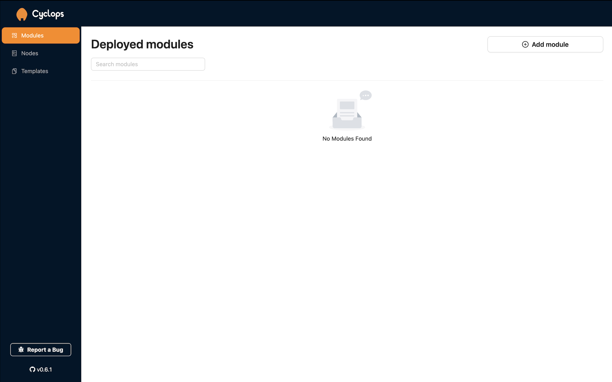
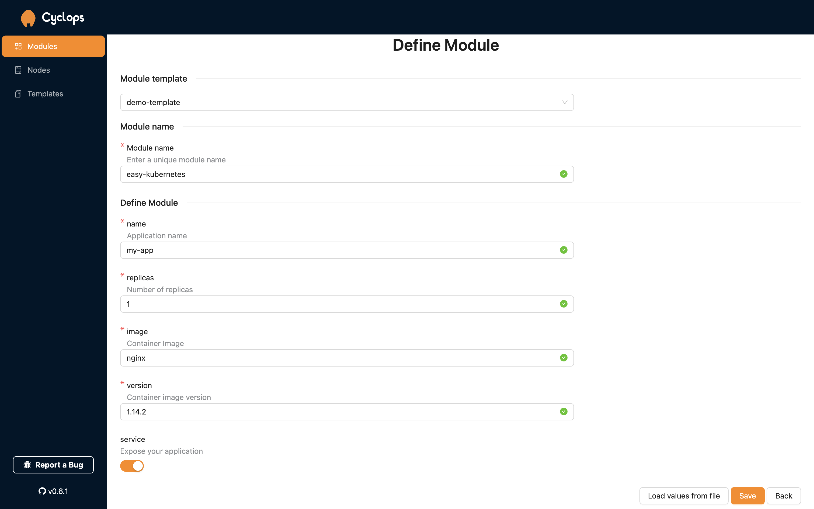
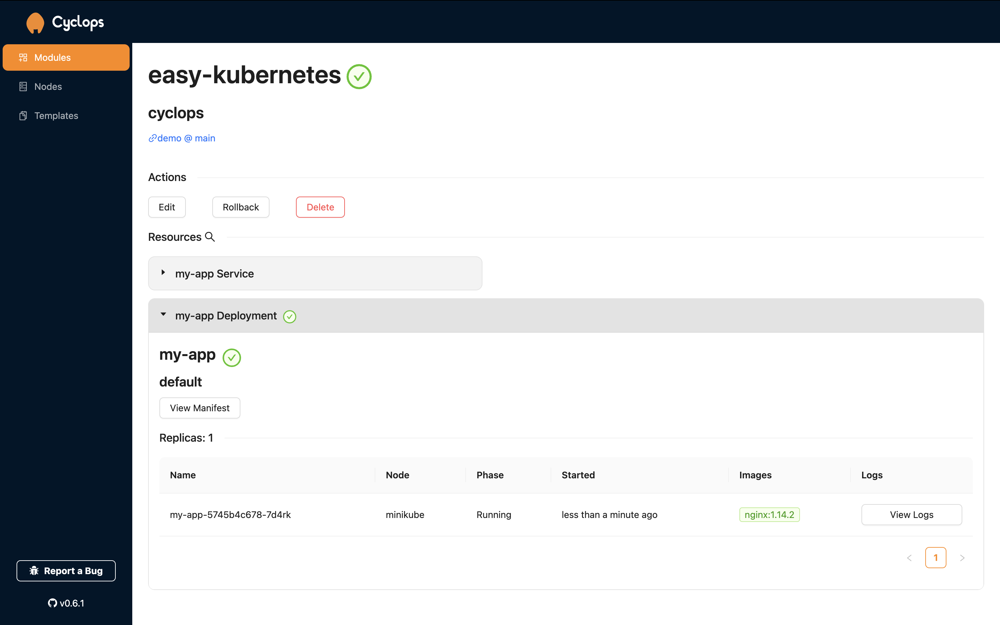

They say the first step is always the hardest. And when that step is in the direction of Kubernetes, it can feel even more intimidating. You can sometimes feel "paralyzed" by the sheer number of things you don't understand. Or better said, you don’t understand **yet**.

But once the first step is conquered, the rest feels more attainable. So, let’s take the first step together. Oh, and we'll be using a couple of tools to help us out. After all, we are trying to make this as simple as possible 😉

### Support us 🙏

We know that Kubernetes can be difficult. That is why we created Cyclops, a **truly** developer-oriented Kubernetes platform. Abstract the complexities of Kubernetes, and deploy and manage your applications through a UI. Because of its platform nature, the UI itself is highly customizable - you can change it to fit your needs.

We're developing Cyclops as an open-source project. If you're keen to give it a try, here's a quick start guide available on our [repository](https://github.com/cyclops-ui/cyclops). If you like what you see, consider showing your support by giving us a star ⭐


## A Cluster 🌐

The first thing you need to get started with Kubernetes is a cluster. Typically, a cluster represents the pool of servers on which you run your apps. But for now, you don’t need a pool of servers. Let’s start with something simple: a local playground that will help us get the hang of it.

One of the easiest ways to quickly get a cluster running is with Minikube. Minikube is a tool that sets up a local Kubernetes cluster on your computer. It’s perfect for development and testing purposes. To get started, you need to:

1. **Install Docker**: docker will allow us to run Minikube in an isolated environment, you can find out how to download it [here](https://docs.docker.com/engine/install/)
2. **Install Minikube**: Follow the instructions on the [Minikube site](https://minikube.sigs.k8s.io/docs/) to install it on your machine.
3. **Start Minikube**: Once installed, you can start your local cluster with the command:

```bash
minikube start
```

This will set up a single-node (single-server) Kubernetes cluster on your machine.

## The Configuration 🗄️

This is usually the trickiest part of working with Kubernetes. For Kubernetes to run your application, you must create a configuration file that tells Kubernetes how to handle your application. These files are traditionally written in YAML and follow their own syntax and rules.

But here’s the good news: **Cyclops lets you skip this process entirely.**[Cyclops](https://github.com/cyclops-ui/cyclops) is an open-source tool that provides a user-friendly interface for configuring your applications to run in Kubernetes.

The UI that Cyclops provides is highly customizable when it comes to defining your configurations through its templates feature. It also comes with a couple of predefined templates to get you started on your journey.

Cyclops is simple to set up and requires just two commands:

```bash
kubectl apply -f https://raw.githubusercontent.com/cyclops-ui/cyclops/v0.6.2/install/cyclops-install.yaml &&
kubectl apply -f https://raw.githubusercontent.com/cyclops-ui/cyclops/v0.6.2/install/demo-templates.yaml
```

and secondly:

```bash
kubectl port-forward svc/cyclops-ui 3000:3000 -n cyclops
```

Just wait a few seconds between these commands to let your Kubernetes cluster start Cyclops.

Now, head over to [localhost:3000](<[http://localhost:3000](http://localhost:3000/modules)>), and you should be all set!



## Running your App inside the Cluster 🏃

Once inside Cyclops, you’ll be greeted with a screen that says “No Modules Found.” Modules are Cyclops’s way of saying applications. The next step is running your application (module) in the Kubernetes cluster, or in Kubernetes terms, “deploying your application.”

Start by clicking on the **`Add module`** button at the top right. This will take you to a new screen **where the configuration file from the last step will be generated.**

Cyclops uses templates to generate the configuration file (find more about it [here](https://cyclops-ui.com/docs/templates)). You can create your own, but Cyclops comes with a few predefined templates that are perfect for getting started.

At the top of the screen, choose the **`demo-template`**. You’ll notice the screen changes, and new fields appear! Switching to another template will change the fields on the screen, but let’s stick to the **`demo-template`** for now.

You can leave the inputs in the fields as they are or change them to your liking, but you must give your module a name!

If you have a Docker image of an application that you created and want to run in Kubernetes, you can do that too! Just put the name of your image in the **`image`** field and its version in the **`version`** field.



Once you’re satisfied with these fields, click **`Save`** at the bottom, and _voilà,_ **your application is deployed!**

## Anatomy of an App 🫀

One of the challenges with Kubernetes is the variety of resources it uses. However, Cyclops makes it easy by **displaying all the resources** your modules have created. This visual representation really helps you understand the anatomy of your applications.

With our `demo-template` and the inputs we entered, we created a simple Kubernetes configuration consisting of a service and deployment, as shown on the screen. These are the two most common resources you will encounter and are a good entry point into the whole system.



The Cyclops interface displays all these components in a clear, organized manner, making it easy to understand how your application is structured and how the different pieces fit together.

For instance, you can see that the application named "my-app" is running on Minikube, with one replica of the Nginx container (version 1.14.2). You can view logs or modify settings right from this interface.

This visual approach helps bridge the gap between developers and Kubernetes' underlying infrastructure, making it easier to manage and understand your applications.

## Next steps 👣

Now that you’ve broken the ice, Kubernetes feels a lot less scary. I suggest you play around with the other templates Cyclops provides and see how different templates create different resources.

The journey to mastering Kubernetes is long and can be tedious. However, you don’t have to walk that path alone! Join our [Discord community](https://discord.com/invite/8ErnK3qDb3) and connect with others who can help you if you ever feel lost!

If you enjoyed this post, remember to support us by giving us a star on our [repo](https://github.com/cyclops-ui/cyclops) ⭐
