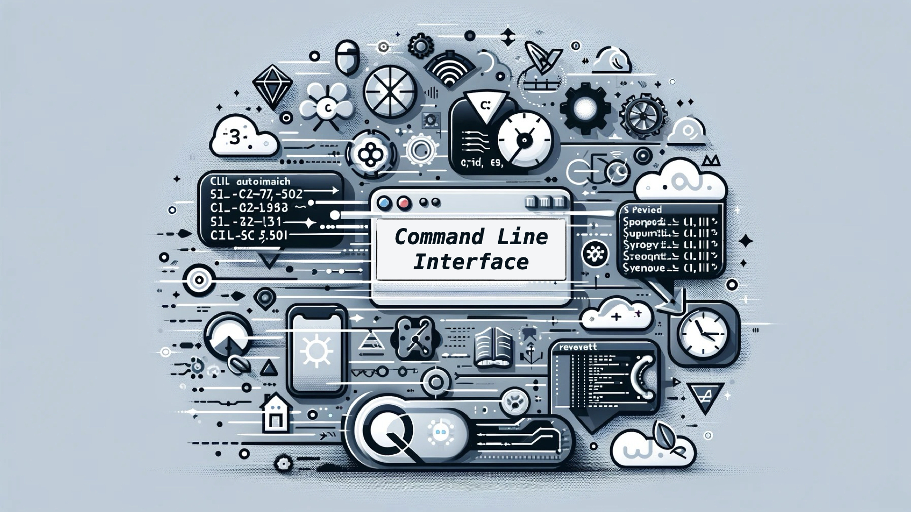
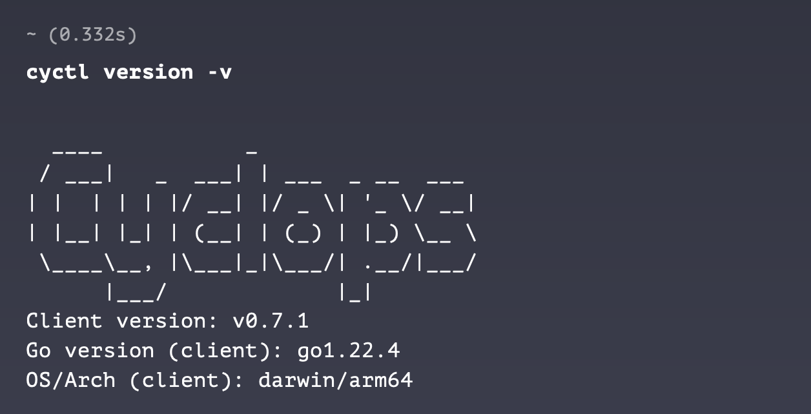

Command Line Interfaces (CLIs) seem old-fashioned in the age of graphical user interfaces (GUIs) and touchscreens, but they remain essential tools for developers. You may not realize it, but they are used far more often than you might think. For example, if you use `git` commands over the terminal, you're likely engaging with a CLI on a daily basis.

To give you some background, I work on Cyclops, a tool that provides a graphical user interface for developers to configure and deploy their applications in Kubernetes. Given my employment, why would I, of all people, emphasize the importance of command-line interfaces?

### Support us 🙏

We know that Kubernetes can be difficult. That is why we created Cyclops, a **truly** developer-oriented Kubernetes platform. Abstract the complexities of Kubernetes, and deploy and manage your applications through a UI. Because of its platform nature, the UI itself is highly customizable - you can change it to fit your needs.

We're developing Cyclops as an open-source project. If you're keen to give it a try, here's a quick start guide available on our [repository](https://github.com/cyclops-ui/cyclops). If you like what you see, consider showing your support by giving us a star ⭐

## Why CLIs 🤔

Command-line interfaces (CLIs) are **incredibly fast** for getting things done. They let you perform actions with simple, direct commands, which is especially useful for repetitive tasks. For example, you can search for files or oversee the various programs and services running on your computer with just a few commands. However, this speed is only accessible to those who know the necessary commands.

CLIs also enable fast **remote access** to machines and servers. Using tools like SSH, you can connect to remote systems from anywhere, allowing you to maintain servers that aren’t physically nearby. Plus, because CLIs are lightweight, they use minimal bandwidth, making remote operations more efficient and reliable.

These are great benefits of having a CLI, but why would Cyclops be interested in developing one? The answer is automation.

### Automation and CI/CD ⚙️

When I talk about automation, I mean writing scripts to handle repetitive tasks, ensuring they are done the same way every time, saving a lot of time. You can automate everything from simple file operations to complex deployments. Automations boost efficiency and reduce the chance of human error since the scripts perform tasks consistently every time they run.

Automation is a standard practice in the software development lifecycle (just think of GitHub actions). **If Cyclops had a CLI, it would allow it to integrate into larger systems for deploying applications, like CI/CD pipelines.**

You could use Cyclops’s UI to make it easier for developers to configure and deploy their applications in Kubernetes clusters, and a CLI would allow you to automate any part of that process.

For example, once you create a template and publish it on GitHub, GitHub actions could automatically connect the template to your Cyclops instance using our CLI. This would **allow your developers instant access to each new template or even any update the template receives**. More on automation in future blog posts… 😉

## Cyclops CLI - `cyctl` 🔅

We didn't want to miss out on the advantages of a CLI, but initially, we struggled to find the time to develop it. However, our community has grown significantly over the past few months, and since we are an open-source project, we began opening issues to kickstart the development of our CLI.

Thanks to our amazing community, we realized that our CLI was closer to realization than we had thought. And just a couple of days ago, [Homebrew](https://formulae.brew.sh/formula/cyctl#default) received a new package - our very own `cyctl`!

## Open Source Magic ✨

We are very proud to say that `cyctl` is a **community-driven project**. While the Cyclops team has been overseeing every change and reviewing every PR, most of the features have been developed by our contributors!

If you're excited about making Kubernetes easier for developers and want to contribute to our CLI or any other part of our project, we’d love to have you on board. Come join us on [Discord](https://discord.com/invite/8ErnK3qDb3) to connect, collaborate, and be a part of something great!

And if you enjoyed this post, we would be grateful if you could star our [repo](https://github.com/cyclops-ui/cyclops) ⭐ 😊
