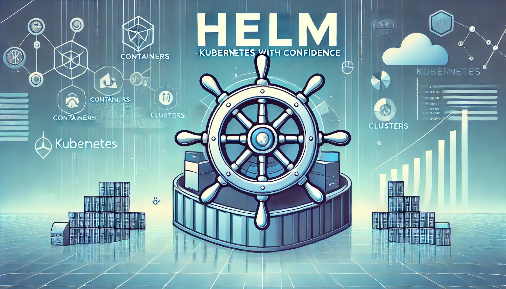
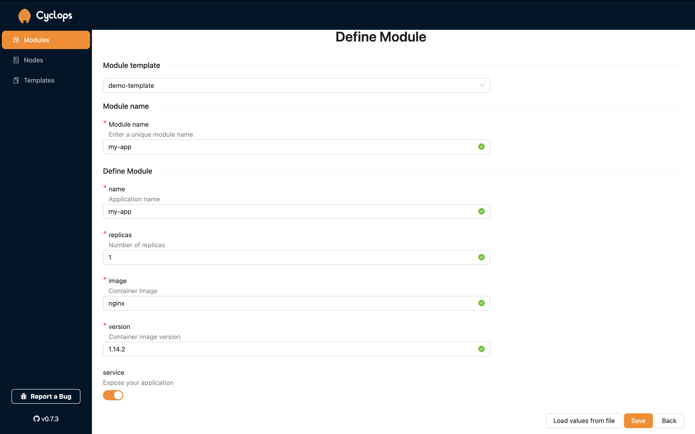

Kubernetes applications rarely (if ever) consist of a single resource. In a basic example, you have a deployment running your app and a service to expose its functionality. This requires you to either have one manifest containing the definitions of both the deployment and service or two separate manifests (one for each resource).

Now, imagine you have multiple apps that require multiple manifests to run. To make managing them easier, you will want to group them together in logical units (or packages).

Further, when running microservices, many of these manifests will look very similar, often differing only by a couple of values or lines. As you can imagine, this can quickly become cumbersome to manage.

This is where Helm steps in. While Helm is not new to the scene, in this article, I will show you its benefits and how to improve the Kubernetes experience even further with something a bit newer…

### Support us 🙏

We know that Kubernetes can be difficult. That is why we created Cyclops, a **truly** developer-oriented Kubernetes platform. Abstract the complexities of Kubernetes, and deploy and manage your applications through a UI. Because of its platform nature, the UI itself is highly customizable - you can change it to fit your needs.

We're developing Cyclops as an open-source project. If you're keen to give it a try, here's a quick start guide available on our [repository 🔗](https://github.com/cyclops-ui/cyclops). If you like what you see, consider showing your support by giving us a star ⭐


## What the Helm ?!

> _Helm helps you manage Kubernetes applications — Helm Charts help you define, install, and upgrade even the most complex Kubernetes application._

This is a quote directly from the [Helm website 🔗](https://helm.sh/), let’s “_unpack_” what it means…

### Package manager

Helm is often called the package manager for Kubernetes because it allows you to group multiple connected manifests that create an application into a Chart (package), making them easier to maintain.

A chart’s structure looks something like this:

```bash
my-chart
├── Chart.yaml
├── values.yaml
├── values.schema.json
└── templates
    ├── deployment.yaml
    └── service.yaml
```

A chart can contain additional files, but these are the essential ones (for example, a `README.md` perfectly aligns with Helm's definition of a chart).

The `Chart.yaml` file could be considered “metadata” of the package, containing some basic information like name, version, maintainers…

In the `/templates` directory, you will find all the resources that make up your application. All the manifests are grouped here (in this example, it's just a deployment and service).

Instead of using `kubectl` and applying these resources separately, charts allow you to package them together and install them into your cluster with a single command.

One of the big things that made Helm so popular was the public charts repositories(like [ArtifactHub 🔗](https://artifacthub.io/) or [Bitnami 🔗](https://github.com/bitnami/charts)). This allowed people to use complex configurations others made. Many companies publish and maintain helm charts of their own software so people can easily install them in their clusters.

### Templating engine

The second big feature of Helm is the templating engine. In the structure above, you probably noticed the `values.yaml` file. To understand why it's here, let’s actually look at our `deployment.yaml`. It can look something like this:

```yaml
apiVersion: apps/v1
kind: Deployment
metadata:
  labels:
    app: {{ .Values.image }}
  name: {{ .Values.name }}
spec:
  replicas: {{ .Values.replicas }}
  selector:
    matchLabels:
      app: {{ .Values.name }}
  template:
    metadata:
      labels:
        app: {{ .Values.name }}
    spec:
      containers:
      - image: {{ .Values.image -}}:{{ .Values.version }}
        name: {{ .Values.name }}
        ports:
        - containerPort: 80
          name: http
```

You will notice it looks a bit different than your normal deployment manifest (like the one you can find on the [Kubernetes documentation 🔗](https://kubernetes.io/docs/concepts/workloads/controllers/deployment/)).

This is actually a blueprint. Helm allows you to create blueprints with placeholders - `{{.Values.image}}`. The values for these placeholders are defined in the `values.yaml` file.

For example, `values.yaml` might contain:

```yaml
name: my-app
image: nginx
version: 1.14.2
replicas: 1
service: true
```

Imagine you have multiple microservices that all use \*almost\*\*\* the same YAML manifest, apart from a couple of lines or values. For example, they differ only in the image. Helms' templating engine allows you to use the same blueprint for all your microservices and customize the specific details using the `values.yaml` file.

So, if you have several microservices, you don’t need to write separate YAML files for each one. Just create a template and adjust the `values.yaml` for each microservice as needed.

## The Developer Experience

While packages and blueprints help when dealing with large manifest files, changing values in such a structure can still be an issue for inexperienced developers. If you look again at the `values.yaml` file from above, you can easily see how someone can mistakenly type the string `“true”` instead of boolean `true`, or even integer `1`. It's an honest mistake, but it can cost you hours and hours of debugging time.

That is where `values.schema.json` comes into play. In this file, Helm lets you define the type of values and their limitations - essentially providing validations for the `values.yaml`. This makes it harder for developers to make mistakes similar to the ones mentioned above.

But the `values.yaml` from above is a pretty simple example. You will usually find _much_ larger files with _many_ more values (finding your way [here 🔗](https://github.com/bitnami/charts/blob/main/bitnami/mysql/values.yaml) will take some time 😅).

And this is where [Cyclops 🔗](https://github.com/cyclops-ui/cyclops) lets you take the developer experience even further. Cyclops lets you define a UI that hides the complexities of large templates and allows you to define which fields your developers are exposed to.



The screenshot shows the Helm chart I used as an example before but now rendered in Cyclops. You can mold this screen to fit your needs, with many more (or fewer 😊) fields, allowing inexperienced devs to feel confident when deploying their applications in Kubernetes.

And the validations haven’t been lost with Cyclops, far from it → now they are shown instantly.

The great thing about Cyclops is that if you are already familiar with Helm, creating a UI for your use case is quick and simple because Cyclops renders the UI based on the `values.schema.json`.

To clarify, **you can import your own (already existing) Helm charts to be rendered in Cyclops! I**f you are storing your charts on a private repo, check the [documentation 🔗](https://cyclops-ui.com/docs/templates/private_templates) to see how to connect it securely.

Cyclops is **open-source**, so give it a go!

## Open Source Fiesta

Helm is one of the most popular ways of handling Kubernetes configurations. It is a graduated project in the [CNCF 🔗](https://www.cncf.io/), maintained by the [Helm community 🔗](https://github.com/helm/community). The project is open-source, and its GitHub [repo 🔗](https://github.com/helm/helm) has more than 26K stars and around 670 contributors - a testament to the size of the community around it. e

While Cyclops is a relatively new project compared to Helm, it is following in its footsteps. Cyclops has already been accepted into the CNCF landscape and has a fast-growing community around it.

### Hope it helps 🙌

Thanks for reading the article. I hope you found it useful. If you wish to be a part of the Cyclops community, to contribute with code, content, or even critique, be sure to join our [Discord community 🔗](https://discord.com/invite/8ErnK3qDb3) and leave a star on the [repo 🔗](https://github.com/cyclops-ui/cyclops) ⭐
