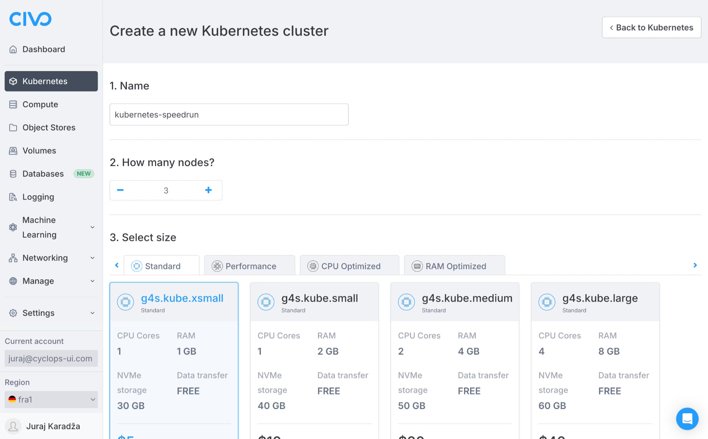
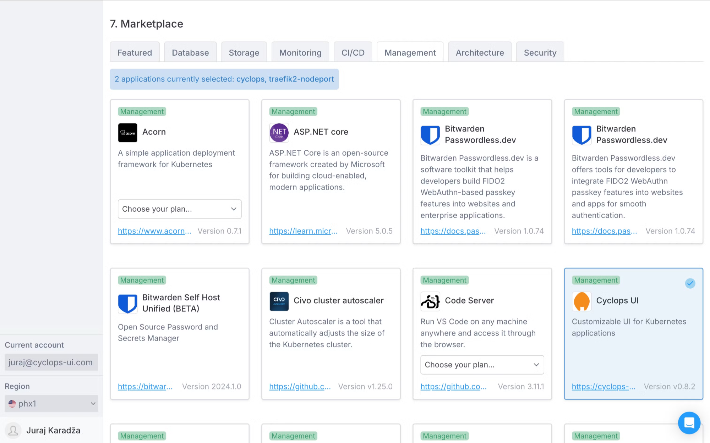
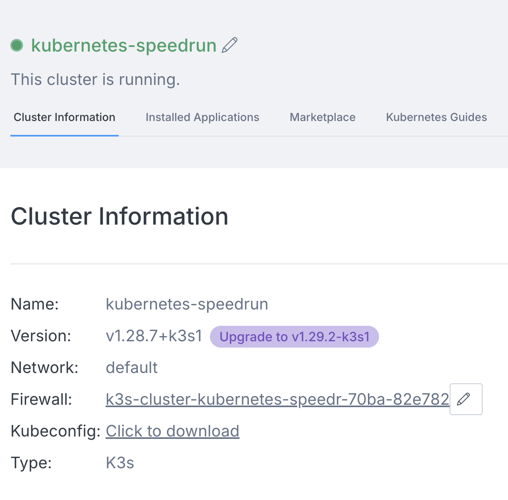
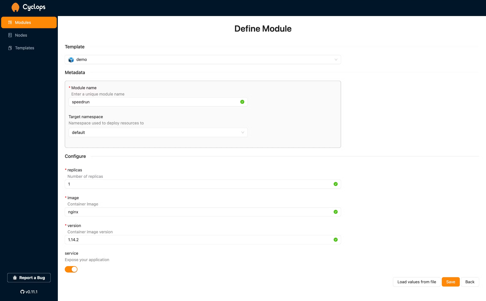
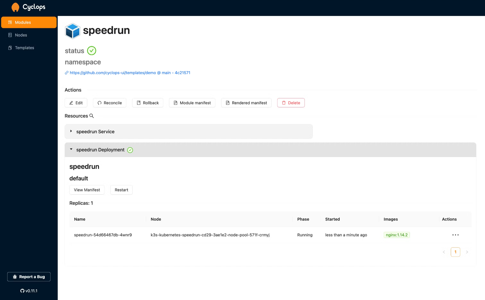

Whether you are new to Kubernetes or maybe you're part of a startup that's always short on time, this guide is for you. Kubernetes is an incredibly powerful tool for managing containerized applications, but it's also notorious for its complexity and steep learning curve.

And if you're running a startup, you probably don't have the luxury of spending days (or weeks) wrestling with configuration files and cloud infrastructure. Setting up a Kubernetes cluster can feel like a daunting task, but it doesn't have to be.

This article will show you how to quickly spin up a Kubernetes cluster in the cloud and deploy your applications in just minutes. And we're making it a speedrun! In less than 10 minutes, you'll have everything up and running, including your own software.

**Start your timers! ⏳**

### Support us 🙏

*We know that Kubernetes can be difficult. That is why we created Cyclops, a **truly** developer-oriented Kubernetes platform. Abstract the complexities of Kubernetes, and deploy and manage your applications through a customizable UI that you can fit to your needs.*

*We're developing Cyclops as an open-source project. If you're keen to give it a try, here's a quick start guide available on our [repository](https://github.com/cyclops-ui/cyclops). If you like what you see, consider showing your support by giving us a star ⭐*


# What is Civo?

[Civo](https://www.civo.com/) is a cloud service provider that allows you to quickly spin up Kubernetes clusters - it takes about **90 seconds** to get it up and running! If you have ever tried spinning up a cluster on other cloud service providers (AWS, I'm looking at you 👈), it will be a refreshing experience to see how easy and fast it is with Civo.

Although Kubernetes is not Civo's only service, this article will mainly focus on it as it is the fastest setup I've encountered (apart from local setups).

## How to spin up a Kubernetes cluster with Civo?

The first step is to create an account on Civo (obviously 🫴). If it's your first time trying out Civo, they will provide you with $250 worth of credits! You can follow along for free and work with a real Kubernetes cluster running in the cloud. Even if you do not have the credits anymore, Civo will tell you the monthly cost of running your cluster, so you do not have to dread receiving the bill at the end of the month 😅

Once you have created your account, you should be greeted with the Civo dashboard. To set up your cluster, click the "Launch a new cluster" button or go to the Kubernetes tab, where you will find a similar button.

You will be taken to a screen that lets you customize the specifics of your cluster. Here, you can choose how many nodes you want, what sort of nodes (Standard, Performance, CPU Optimized, or RAM Optimized), firewall configuration, cluster type…

In the spirit of a speedrun, I'll leave it all on the default values (except the name, which I wanted to fit the theme 😁).



But before launching your cluster, let's stop at the Civo **Marketplace** (on the same screen). The Marketplace has lots of tools that can help you in various ways, and they will be deployed to the cluster upon its creation so you can use them instantly.

Under the **Management** tab, you can find **Cyclops UI**. Cyclops will allow you to deploy your apps to the cluster without any extra configuration. It only requires you to have a docker image of your apps. And Cyclops is open-source, so it won't impact your Civo bill!

You can select to install Cyclops just by clicking on it, and it should have the blue checkmark as it does on the image below.



Now that we have configured our cluster and included Cyclops, let's launch it! Click the "Create cluster" button on the bottom of the screen, and let's go!

## How to access your Kubernetes cluster?

After less than 2 minutes ⏳ (you can see the countdown when the cluster is being created), you will have your cluster up and running. You will talk to the Kubernetes API in that cluster to access it. For this, we will be using the terminal, but only a couple of commands will be needed before we can start deploying our applications.

The first thing is to install `kubectl` (you can find how to install it [here](https://kubernetes.io/docs/tasks/tools/)). `kubectl` is the Kubernetes command-line tool used to interact with your cluster.

Once you installed `kubectl`, download the Kubeconfig file of your cluster. You can find it in the Cluster Information section.



Once downloaded, which takes about a second or two ⏳,  go to your terminal and type in the following command:

```bash
export KUBECONFIG=<insert-path-to-the-downloaded-kubeconfig-file>
```

To check if we set the Kubeconfig correctly, run any `kubectl` command and see if it's interacting with the right cluster. For example:

```bash
kubectl get pods

NAME                                 READY   STATUS      RESTARTS   AGE
install-traefik2-nodeport-ku-4b5zn   0/1     Completed   0          1m
install-cyclops-kubernetes-s-md5mz   0/1     Completed   0          1m
```

Our Kubernetes cluster is up and running, but now we want to use it and deploy our applications to it, and for that, we will be using Cyclops.

# What is Cyclops?

[Cyclops](https://github.com/cyclops-ui/cyclops) is an open-source tool that allows you to deploy your applications through a UI, hiding all of the complexity of Kubernetes.

The UI is highly customizable and is generated from Helm charts (read more about it [here](https://cyclops-ui.com/blog/2024/07/05/what-the-helm)). You can use any of your existing Helm charts, import them into Cyclops as templates, and get a UI made for your specific use.

For now, we will be using the default templates that all Cyclops instances get out of the box (it is a speedrun, after all ⏳)

## Deploying Applications to Kubernetes

We selected Cyclops in the Marketplace when creating the cluster, so it should already be installed. To access it, run the following command from the same terminal as before:

```bash
kubectl port-forward svc/cyclops-ui 3000:3000 -n cyclops
```

> *⚠️ It is important to run this command from the same terminal as before because, with the first command, we set the context of the terminal to be able to access our Kubernetes cluster in the Civo cloud.⚠️*
> 

If you have configured the Kubenconfig correctly, the port-forward command will allow us to access Cyclops's UI from our browser.

To access it, go to https://localhost:3000, and you will be greeted with an empty dashboard. To deploy your application to the cluster, click the "Add module" button in the top right corner.
You should be taken to a screen where the first step is to choose a template. 

Feel free to use the existing templates or you can import your own (read more about it [here](https://cyclops-ui.com/docs/templates/)). I will use the demo template for this guide as it is the simplest. I name my new module (in the theme of the article) and use the default values for the rest of them. If you want to deploy your own application, use your docker image (with the correct version underneath) in the `image` field.



To deploy your application, click "Save"!

Cyclops will use the values you specified on the previous screen and, based on the template you used, will create all the necessary resources your application needs. You never had to even look at configuration files!
After a couple of seconds ⏳ (depending on the docker image you used in the `image` field), your application should be up and running.



**Now you can access your app with a `port-forward` command (in a similar way that we access Cyclops), and that’s it ⌛**

```bash
kubectl port-forward svc/speedrun 3001:80
```

# Time’s Up ⌛

If you followed along, you should have been able to deploy your application to a Kubernetes cluster running in the Civo cloud - **in under 10 minutes!**

We used the default setup for Civo and for Cyclops. This setup can be vastly improved by using more powerful nodes or adding more of them - all of this can be configured when creating the cluster in the Civo dashboard!

And the demo template that I used in Cyclops is just a simple example of what it can do for you. Play around with other templates and try to make your own. Cyclops was made to quickly and easily create developer platforms that hide the complexities of Kubernetes from developers. It brings the developer experience of big tech to companies of any size.

If you enjoyed this guide, show us your support by starring our [repo](https://github.com/cyclops-ui/cyclops) ⭐ 