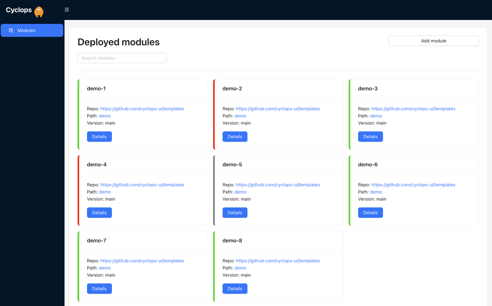
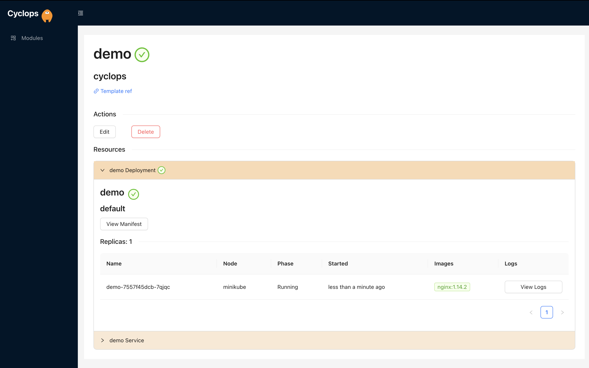
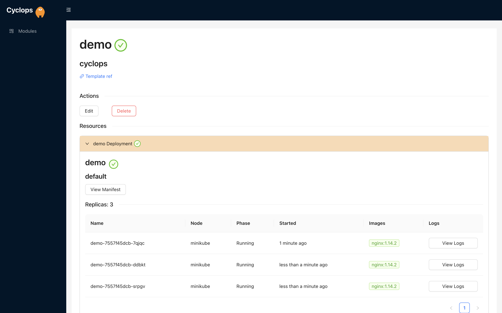
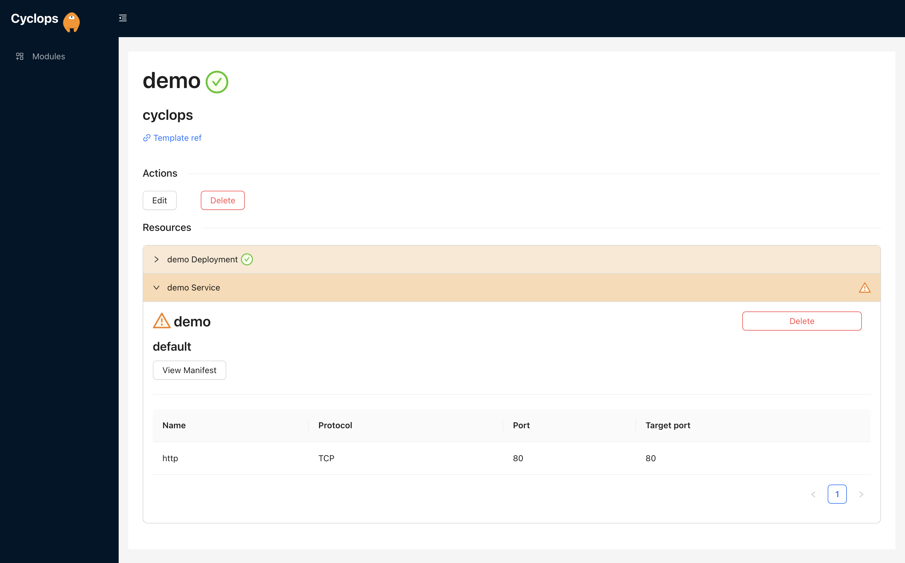

If you are a developer, the chances are you have heard about Kubernetes. You heard that it is an amazing tool to help 
you scale your applications and manage your micro-services. But, you probably also heard that it is **VERY** complex. 
It is so complex that you were probably scared off. And I don’t blame you; that is the first reaction I got as well.

If you search the top posts with the Kubernetes tags on this website, you will find a myriad of tutorials and people 
explaining Kubernetes. These posts are the most trending because people **WANT** to understand Kubernetes because we 
feel like, in today's software development world, Kubernetes is unavoidable. And this is true, to an extent…

Software developers are often required to understand and work with Kubernetes; if you have ever looked for jobs in this 
sector, you know this already. But what if there was a tool to minimize your touching points with Kubernetes? A tool 
that simplifies the process and gives you guidance when trying to deploy applications into Kubernetes clusters. A tool 
that is highly customizable and lets someone in your organization (who understands Kubernetes, commonly known as a 
DevOps) create a user interface for you!

Yep, you guessed it, it’s Cyclops! 😄

And just to clarify, Cyclops is not used to create and manage Kubernetes clusters and other infrastructure; rather, 
Cyclops is used for deploying and managing applications INSIDE the cluster.

### Show us your support 🙏🏻


We are building Cyclops to be **open-source**, and your support would mean the world to us. Consider giving us a star 
on [GitHub](https://github.com/cyclops-ui/cyclops) and following us on [ProductHunt](https://www.producthunt.com/products/cyclops), where we scheduled our very 
first release!

## Before we start

In order to test out Cyclops, you are going to need a few things. If this is not your first time using Kubernetes, the 
chances are you already have everything ready, but we will still describe each of the components for the newcomers to 
the Kubernetes space. These tools are not only used for Cyclops, and you can use them for anything Kubernetes-related.

The main thing you are going to need to test out Cyclops is a Kubernetes cluster. If you have one that you can use to 
play with, great; if not, we will show you how to spin up a cluster on your own computer. So, the three prerequisites 
for doing this are:

1. [**1. Docker**](https://www.docker.com/products/docker-desktop/)
2. [**2. Minikube**](https://minikube.sigs.k8s.io/docs/)
3. [**3. kubectl**](https://kubernetes.io/docs/tasks/tools/)

Docker is the most popular containerization tool, and we will use it to download and spin up a Minikube image. 
Downloading Docker is straightforward: go to their webpage and download the Docker Desktop application.

Minikube plays the role of a Kubernetes cluster on your local machine. It is a great tool for developing and 
testing out your Kubernetes applications, and it is perfect for this scenario. You can find a guide on how to install 
it [here](https://minikube.sigs.k8s.io/docs/start/).

The final thing missing is a way of communicating with your Kubernetes cluster, and this is done through the Kubernetes 
command line tool called `kubectl`. It can be used to deploy applications, inspect and manage cluster resources, and 
view logs. In this tutorial, we will use it to install Cyclops into our cluster on Minikube and expose its 
functionality outside the cluster.

## Installing Cyclops

Once you have your Kubernetes cluster ready (check the *Before We Start* section), installing Cyclops is a 
straightforward process. Using `kubectl`, run the following command in your terminal:

```
kubectl apply -f https://raw.githubusercontent.com/cyclops-ui/cyclops/v0.0.1-alpha.5/install/cyclops-install.yaml
```

It will create a new namespace called `cyclops` and deploy everything you need for your Cyclops instance to run.

Now, all that is left is to expose the Cyclops server outside the cluster. You will need to expose both the backend and 
frontend with the commands below.

Expose frontend through:

```
kubectl port-forward svc/cyclops-ui 3000:3000 -n cyclops
```

And the backend through:

```
kubectl port-forward svc/cyclops-ctrl 8080:8080 -n cyclops
```

And that's it! You can now access Cyclops in your browser at [http://localhost:3000](http://localhost:3000/).
If you are having trouble with the `port-forward` commands, you probably just need to wait a few of seconds after 
installing Cyclops into your cluster, it can take a while to start all it’s resources.

## It’s Demo Time 💥

Now that you have your Cyclops instance up and running, it’s time to see what it’s capable of.

You should be greeted with an almost empty screen with no deployed modules showing. *Module* is Cyclops’s slang for 
application 😎. So, let’s start by creating our first module!

By clicking on the *Add module* button in the top right corner, you should be taken to a new screen. Here, Cyclops asks 
us which Helm chart do we want to deploy.

Not to go too deep, but [Helm](https://helm.sh/) is a very popular open-source package manager for Kubernetes. It helps 
you create configuration files that are needed for applications running in Kubernetes. These charts let Kubernetes know 
how to handle your application in the cluster.

Don’t worry; to showcase the basics of Cyclops, we created a simple Helm chart so that anyone can follow along. You can 
find what it looks like in our [GitHub repository](https://github.com/cyclops-ui/templates/tree/main/demo), along with 
a couple of more examples of Helm charts that you can use!


As you can see, once you enter the repository of your chart, Cyclops will render a user interface.  *If you want to 
find out the magic behind the rendering, check out our previous 
[blog](https://dev.to/cyclops-ui/how-cyclops-utilizes-json-schema-to-deliver-dynamical-ui-49e).*

You can fill out the fields as you wish, but be mindful of 
[the Kubernetes naming conventions](https://kubernetes.io/docs/concepts/overview/working-with-objects/names/)!

If you want to follow along, my input is as follows:

```
name: demo
replicas: 1
image: nginx
version: 1.14.2
service: true
```

We will set the module name to `demo` as well. Click save, and Cyclops will show you the details of your new module.



This screen shows you all the resources your application is using at the moment. It will list all the deployments, 
services, pods, or any other resource. Here, we can see that Cyclops deployed one pod into your cluster, as we specified 
in the replicas field. If you want to make sure that it really is running in your cluster, you can check it out by using 
the following `kubectl` command:

```
kubectl get pods
```

But what if all of a sudden, there was a need to scale up your application or any other resource? Well, don't worry; 
with Cyclops, it’s really easy!

By clicking the *Edit* button, you can change the values of your application’s resources. Let’s try to scale our 
application up to 3 replicas and see what happens.



You should now see two more pods in the *Deployment* tab; hurray! 🎉

Of course, this works for any other change you might want to make to your application. Like, the service, perhaps? What 
if we realized we don't really need it anymore? Well, with Cyclops, it's really easy to shut it down if need be.

Click again on the *Edit* button, and this time, turn off the service toggle.



Cyclops won't delete it automatically but will warn you (via the warning triangle sign) that you shut it down, and it is 
not in function anymore. This means you can safely delete it!

And if you are sick and tired of your application, you can delete the whole thing as well 🗑️

Click on the Delete button and fill in the name of the module to safely delete it. You can, again, check if it really 
was deleted with `kubectl`:

```
kubectl get pods
```

## Finish

And that’s all there really is to it! Cyclops allows people with varying knowledge of Kubernetes to leverage its power. 
If you followed this tutorial, you should have deployed your very first application using Cyclops; congratz! 🎉 On our 
[webpage](https://cyclops-ui.com/), you can find one more tutorial showcasing more features and a more complicated use 
case, as well as our contact and community info.

If you have any sort of feedback or ideas on how to make Cyclops better, you can fill out our short 
[Google form](https://forms.gle/jrwcBHRtpwmK91v47)!