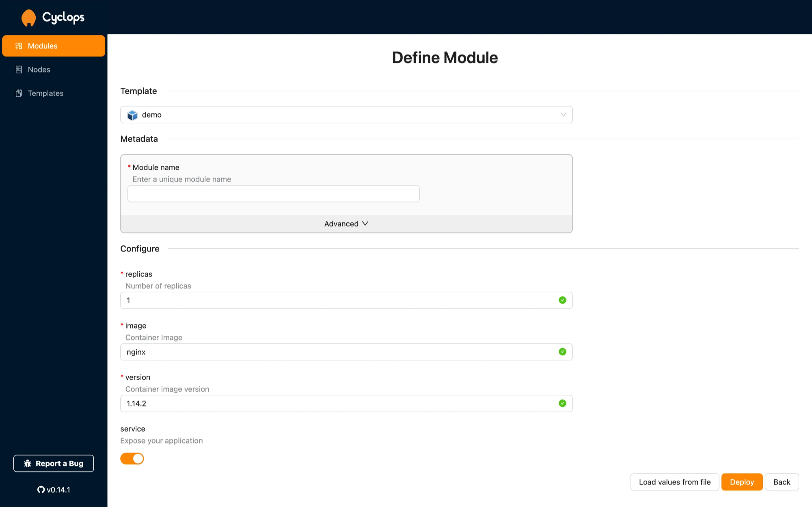
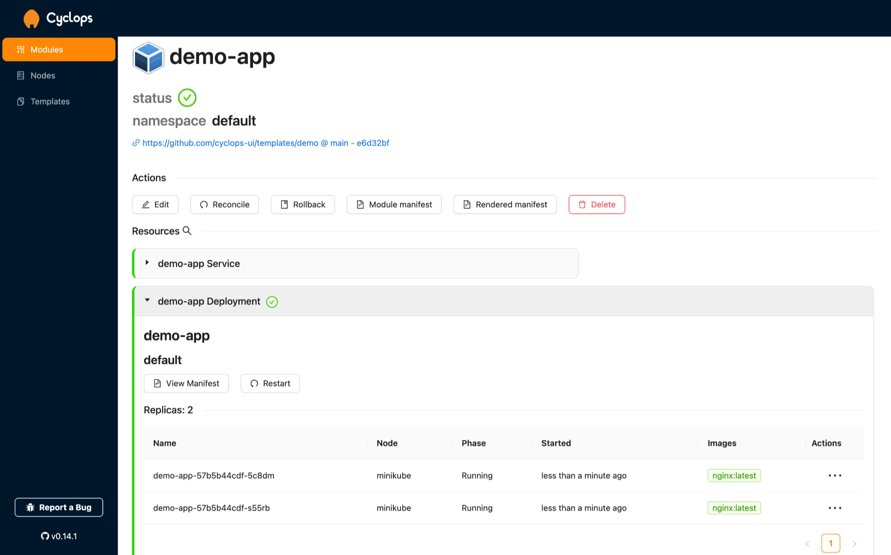

Modern software engineering is becoming more and more complicated, especially in cloud-native environments like Kubernetes. There are countless moving parts and pieces and no two applications are built the same.

The larger the company, the more moving parts there are. With more moving parts, development cycles become stretched, onboarding developers takes longer, and the chances of mistakes increase. Because of this, companies stagnate and become slower to innovate and push new products and features.

The modern answer to this problem is **Platform Engineering** and, according to [Gartner](https://www.gartner.com/en/information-technology/insights/top-technology-trends), **80%** of software engineering organizations will **establish platform teams** by 2026.

In this blog we will discuss what platform engineering is and what can you do to stay ahead of the curve…

### Support us 🙏

*We know that Kubernetes can be difficult. That is why we created Cyclops, a **truly** developer-oriented Kubernetes platform. Abstract the complexities of Kubernetes, and deploy and manage your applications through a customizable UI that you can fit to your needs.*

*We're developing Cyclops as an open-source project. If you're keen to give it a try, here's a quick start guide available on our [repository](https://github.com/cyclops-ui/cyclops). If you like what you see, consider showing your support by giving us a star ⭐*

## What is platform engineering?

Platform engineering acts like an internal product team, but instead of serving external customers, its primary users are the company's own developers and internal teams.

The job of platform engineers is designing and building toolsets, infrastructure, and workflows that make it easier for developers to build, test, deploy, and manage software. The goal is to create a unified platform, often called an **Internal Developer Platform (IDP)**, which provides developers with self-service access to everything they need without depending on other teams, like operations or DevOps.

## Why platform engineering?

> *“The goal of Platform Engineering is to allow as much speed as possible, with as much safety as possible” ~ Jason Warner, CEO @ poolside, former CTO @ GitHub ([source](https://www.youtube.com/watch?v=4fHjAYZIxwQ))*
>

Platform engineering creates an abstraction layer that simplifies infrastructure management for developers. Instead of dealing with the complexities of infrastructure, developers can focus on writing code, leading to **quicker onboarding** and **faster time to market**.

A good IDP enables **separation of concerns**. Most of the time your DevOps teams and Product teams do not need to talk to each other and they can move independently. It also provides **guard-rails** and ensure standard and secure practices across the organization.

Fun fact: when Spotify built its own Internal Developer Platform (now known as Backstage) they realized that their developers were [**5% more likely to stay at the company**](https://backstage.spotify.com/discover/blog/how-spotify-measures-backstage-roi/) one year later. Developer experience matters!

## Internal Developer Platforms (IDPs)

When it comes to Internal Developer Platforms (IDPs), you typically have **two options**: build one yourself or buy an off-the-shelf solution.

**Building your own** may seem like the ideal choice. You can tailor it perfectly to your specific needs, ensuring it integrates with your existing tech stack, workflows, and infrastructure. However, building an IDP from scratch is both time-consuming and expensive, it’s essentially a full product in itself. For this reason, custom-built platforms are typically reserved for larger organizations with the resources to invest in such an undertaking.

On the other hand, **off-the-shelf platforms** offer a quicker, more affordable alternative. These platforms are designed to cater to a wide range of users and needs, which can be both a blessing and a drawback. You may end up with features you don’t need or find key functionality missing. In the latter case, you’re dependent on the vendor’s roadmap, which may not prioritize your needs. While they provide immediate value and are a solid starting point, you have to keep in mind that your organization will eventually outgrow them as your requirements evolve.

But, at Cyclops, we are building something in between…

## Cyclops

[**Cyclops**](https://github.com/cyclops-ui/cyclops) is an **open-source** tool that bridges the gap between fully custom-built Internal Developer Platforms (IDPs) and off-the-shelf solutions. It enables you to **build** **IDPs for Kubernetes** in **hours instead of months**, providing the flexibility to tailor the platform to your specific needs without the high cost and time investment of building from scratch.

Cyclops enables your Platform teams to build custom user interfaces for configuring and deploying applications and services to Kubernetes clusters. It leverages Helm charts (learn more [here](https://cyclops-ui.com/blog/2024/07/05/what-the-helm)) to generate these UIs. You can easily import any of your existing Helm charts into Cyclops as templates and create a user-friendly interface tailored to your specific needs.

The fields shown above are entirely customizable along with the validations. Cyclops allows you to define how much of configuration you want to expose to your developers, while the validations you put in place prevent them from making mistakes.

After a developer has configured the application, with a click of a button it is deployed to the cluster. Cyclops then displays all resources related to the application, offering easy access to relevant information, including logs, health checks, and status updates.

> In a nutshell, Cyclops lets you provide the guard rails for your developers to safely deploy their application to Kubernetes and then overview the status of their apps.
>

## Looking for more?

Thanks for reading! In future blogs you can expect us going more in depth on Cyclops and how you can create some pretty fun stuff with it. If you enjoyed this article and are looking forward to more, remember to show your support by starring our [repo](https://github.com/cyclops-ui/cyclops) ⭐🙏
