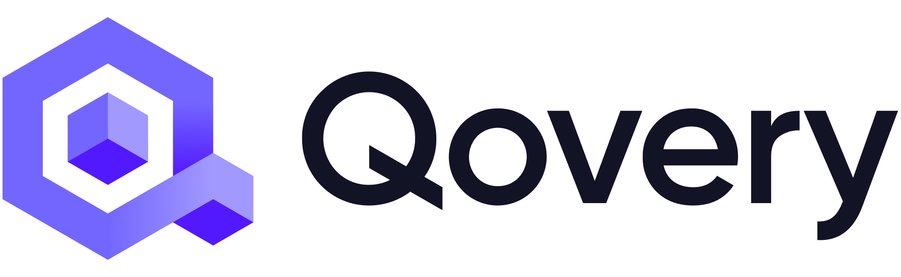
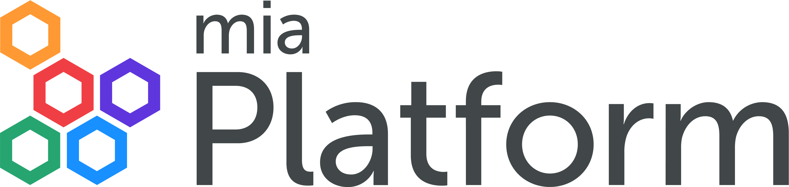

Gartner predicts that by 2026, 80% of software companies will have established platform engineering teams ([source](https://www.gartner.com/en/information-technology/insights/top-technology-trends)). As companies grow, so do the challenges of keeping things running smoothly, and developers want tools that make their work easier and more intuitive.

The main responsibility of platform engineering teams is to create and maintain internal developer platforms (or IDPs for short). In our last [post](https://cyclops-ui.com/blog/2024/10/17/platform-engineering), we gave a more in-depth look into platform engineering and IDPs, exploring how this new trend emerged and its benefits.

But when considering IDPs, you have two options: building one yourself or getting an off-the-shelf solution. Building one yourself is often too time-consuming and expensive for most companies, and that's why off-the-shelf platforms are an attractive alternative. There are a lot of such solutions available, and we will not cover all of them in this post, but let's look into five internal developer platforms you need to know about…

## Cyclops

> ***Developer-Friendly Kubernetes***

[**Cyclops**](https://github.com/cyclops-ui/cyclops) is an **open-source** tool that simplifies Kubernetes for development teams by hiding its complexity behind a customizable user interface.

Cyclops allows DevOps teams to quickly create custom UIs for their development teams and empowers them to create validations on developer actions to establish guardrails that reduce the risk of misconfigurations reaching production.

After a developer deploys their app, Cyclops provides an intuitive overview of the application running in your cluster. This allows developers to quickly spot and fix errors and easily access their app logs without ever having to onboard on Kubernetes.

Cyclops is cloud agnostic; as long as you are running a Kubernetes cluster, you can set it up with a single command from your terminal. It has a couple of predefined templates to showcase its customizability and enable you to quickly deploy your apps to K8s.

**What makes it special:** Cyclops' customizable UI allows DevOps teams to easily create user-friendly interfaces that match their organization's needs, giving developers the right level of abstraction over their underlying infrastructure. Because Cyclops dynamically creates UIs based on Helm charts, you can plug your existing Helm charts into it and have a **fully functioning UI** for your developers **in** **minutes!**

## Humanitec

> ***Build a Platform That Drives Change***

[**Humanitec**](https://humanitec.com/) is a modular platform designed to help organizations build scalable, enterprise-grade internal developer platforms.

The product philosophy at Humanitec emphasizes flexibility and a code-first approach. Their tools are modular, ensuring there is no vendor lock-in while being enterprise-grade. This approach means there's no "black box" feeling.

Humanitec's product suite includes **The Portal**, which provides developers with an easy-to-use UI for configuring applications, checking container logs, and debugging errors. Additionally, **Score** allows developers to define their workload requirements in code, promoting consistency across teams.

**The Platform Orchestrator** is at the core of Humanitec's offerings. It is an engine that enables platform teams to define templates and establish golden paths for their developers. **Resource Definitions** serve as open-source building blocks that tell the Platform Orchestrator how to create/update infrastructure in a particular environment. ****

**What makes it special:** Humanitec's platform is highly modular, allowing organizations to build IDPs using its products as a whole or as building blocks in a larger platform. It easily integrates with existing infrastructure-as-code (IaC) setups, making Humanitec great for large teams looking to scale their operations efficiently.

## Qovery

> ***DevOps on Autopilot***

[**Qovery**](https://www.qovery.com/) is a DevOps automation platform designed to eliminate the need for dedicated DevOps hires by providing a comprehensive self-service infrastructure for developers.

It streamlines the entire process of infrastructure provisioning, transforming what is usually a time-consuming and manual task into an automated workflow. It can provision infrastructure assets into ready-to-run environments, whether for development, QA, or anything else.

In addition to simplifying infrastructure management, Qovery is designed to help organizations **optimize their cloud spending**. The platform offers various strategies for cost reduction (like automatically shutting down unused environments) and detailed insight into resource usage.

Qovery is built to **integrate** with your existing **toolset** **and** **cloud accounts**. It supports integration with a wide range of monitoring, CI/CD pipelines, and security solutions, allowing teams to continue using their preferred tools while leveraging Qovery's automation and management capabilities.

**What makes it special:** With Qovery, teams can provision and maintain secure cloud infrastructure in hours, not months. It offers features such as environment provisioning, developer self-service tools and cost optimization.

## Mia Platform

> ***The Leading Platform Builder for Cloud Native at Scale***

[**Mia Platform**](https://mia-platform.eu/) is a comprehensive platform that aims to cover the full lifecycle of your applications on Kubernetes with smooth developer experiences.

Mia-Platform simplifies the development process with **built-in CI/CD pipelines**, eliminating the usual complexity of setup and automating processes to accelerate software delivery.

With a rich **catalog** **of prebuilt microservices** and built-in orchestrators for managing them, it speeds up development by allowing you to use the industry standard services out of the box and focus on developing your own product-specific ones.

Mia-Platform also provides clear **API management**, helping you with design, security, versioning, and retirement. With an API portal, you can simplify the process of establishing new partnerships by making APIs easily accessible.

With a built-in **Developer Portal**, your development teams have the entire lifecycle of their Kubernetes applications centralized in one place. The portal provides them with easy access to their app's health, resource usage, relevant documentation, etc.

**What makes it special:** Mia-Platform stands out by offering an all-in-one platform for managing the entire lifecycle of cloud-native applications. It simplifies development with a self-service Internal Developer Platform, built-in CI/CD pipelines, and a catalog of ready-to-use microservices.

## Porter

> ***Platform as a Service, Reimagined***

[**Porter**](https://www.porter.run/) is a platform that deploys applications into your own cloud account with just a few clicks. It automates infrastructure provisioning on AWS, GCP, or Azure and makes it easy to deploy, manage, and scale applications on Kubernetes.

Porter simplifies infrastructure provisioning by **connecting directly to your cloud account**. With minimal effort, it spins up a Kubernetes cluster along with essential infrastructure like VPCs, load balancers, and image registries.

**Deployment** is equally **straightforward** - by linking your Git repository, Porter handles building your application using Dockerfiles or Cloud Native Buildpacks and setting up CI/CD via GitHub Actions, which can be customized later to fit your workflow.

Porter continuously **monitors your Kubernetes cluster** to ensure smooth performance and scalability, keeping track of both your application metrics and logs. If any critical issues arise, Porter will send alerts to notify your team.

**What makes it special:** Porter focuses on enabling startups and small teams to leverage production-ready Kubernetes infrastructure right out of the box, without needing deep DevOps knowledge.

## Before You Go

Thanks for reading! I hope this overview helped you orient yourself in the developer platform landscape. While these are not the only players on the market, they are a great starting point for you to explore. If you enjoyed this article and are looking forward to more blogs on developer platforms, open-source and Kubernetes-related topics, remember to show your support by starring our [repo](https://github.com/cyclops-ui/cyclops) ⭐🙏
