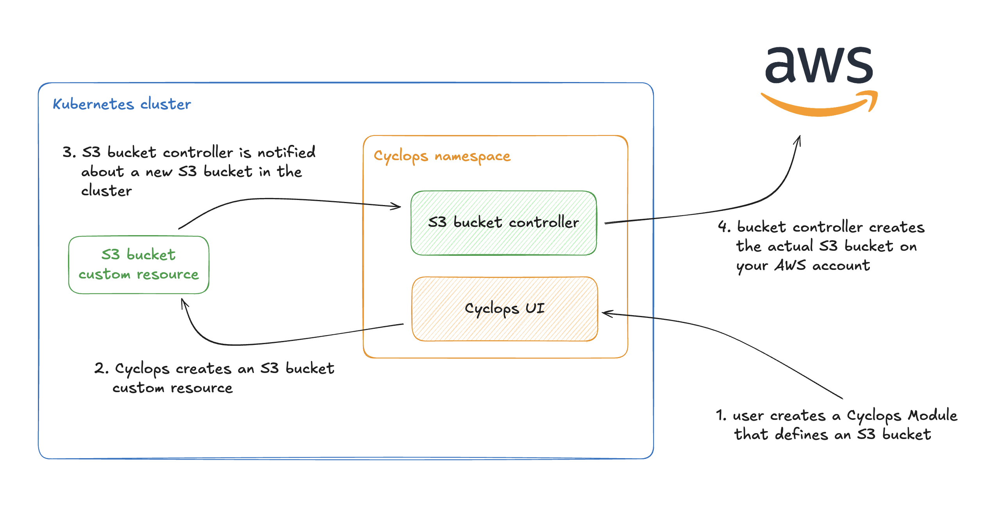
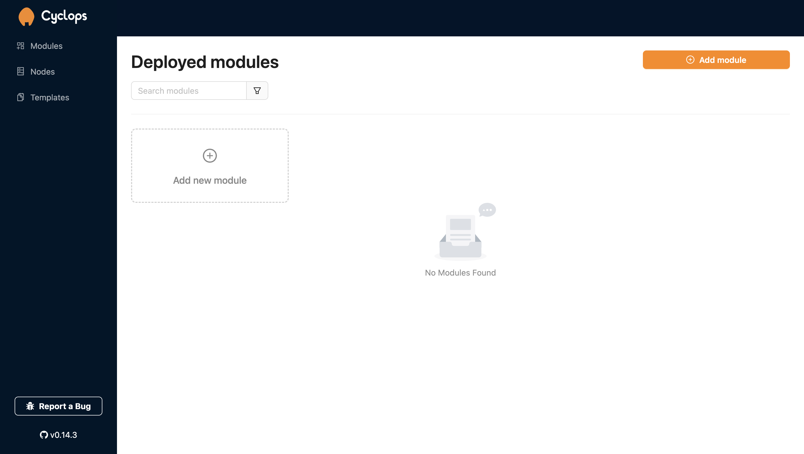
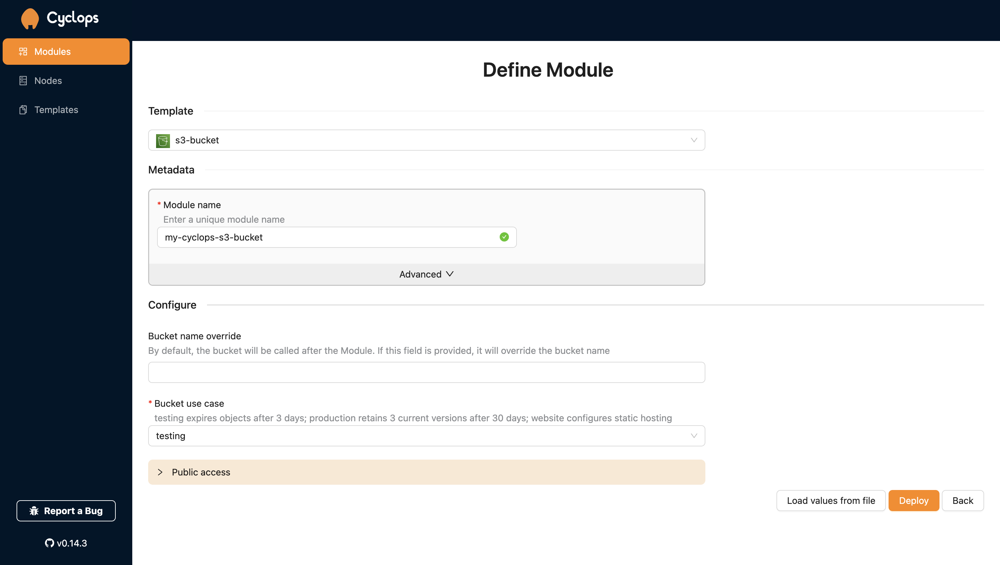
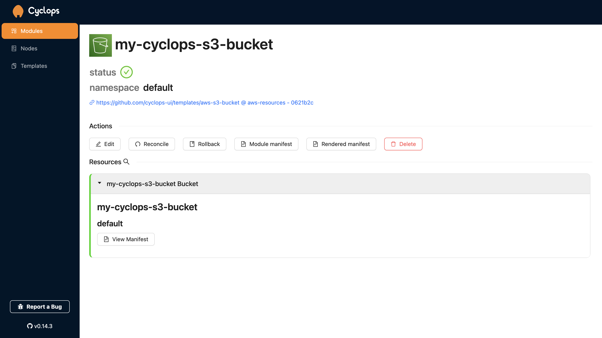
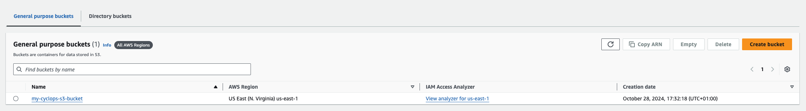
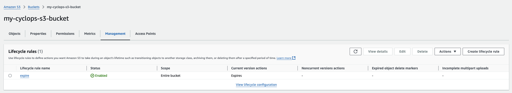
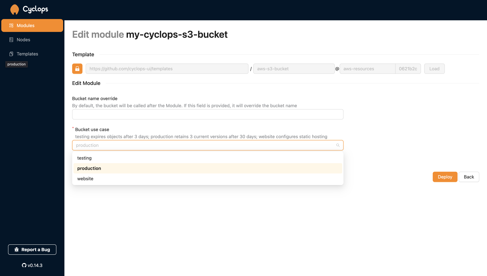
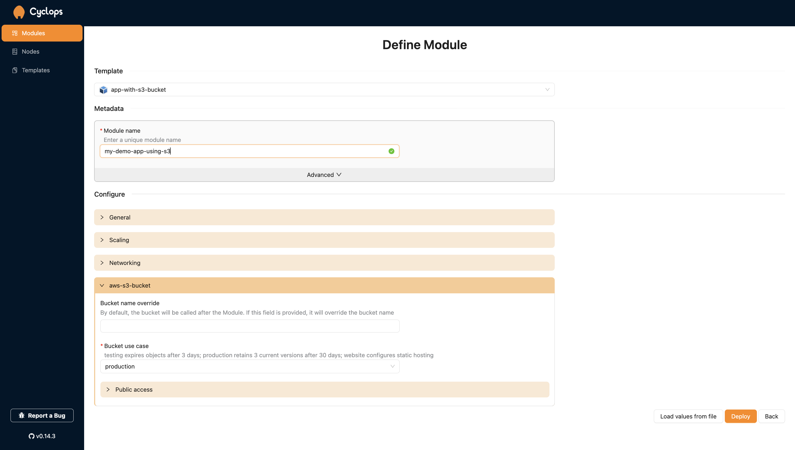

Whether you are a veteran or just started coding, chances are you stumbled upon Kubernetes. It's arguably the most popular platform for deploying applications as containers.

**But should we use Kubernetes as just a container orchestrator, or is there more to it?**

Kubernetes allows you to extend its mechanisms with your own custom resources and functionality. Its extensible API allows you to define resources outside of applications, such as **cloud resources** (an instance of MySQL in GCP or an S3 bucket in AWS).

This allows you to manage all of your system components through Kubernetes, from cloud resources to running applications. With Kubernetes, you can easily **build your very own Internal Developer Platform** that is tailored specifically for you and allows developers to manage and **provision everything they need to ship products.**

Through the blog, we will build exactly that - a friendly platform that will allow us to simply deploy our apps to K8s, as well as provision AWS resources. We will use the AWS S3 bucket operator to create buckets and **Cyclops to get a super simple Kubernetes UI**.

**Any software engineer can now select a couple of fields, and behind the scenes, it unravels into a complex cloud setup tailored for your organization that can be easily managed.**

### Support us 🙏

*We know that Kubernetes can be difficult. That is why we created Cyclops, a **truly** developer-oriented Kubernetes platform. Abstract the complexities of Kubernetes, and deploy and manage your applications through a customizable UI that you can fit to your needs.*

*We're developing Cyclops as an open-source project. If you're keen to give it a try, here's a quick start guide available on our [repository](https://github.com/cyclops-ui/cyclops). If you like what you see, consider showing your support by giving us a star ⭐*


## What is a Kubernetes Operator

Kubernetes operators allow you to extend K8s functionality with custom resources and logic. Operators naturally follow Kubernetes’ philosophy of a control loop - bringing the state of your resources towards what was defined.

You can divide a Kubernetes operator into two parts:

- **custom resources** - defined through Custom Resource Definitions (CRDs) that allow you to extend the Kubernetes API with new types and kinds. Using custom resources, we can define the desired state of our system.
- **controller** - will implement the mentioned *control loop* to make sure the defined state from the CRD is, in fact, brought to reality. Controllers listen to changes in custom resources and react to them to make sure the system achieves the desired state.

For example, Kubernetes `Deployments` are resources that define how to deploy our application, and the controller manager implements the control loop to create Replica Sets and Pods to ensure our app is running.

Without changing the Kubernetes codebase, you can leverage the mechanisms from your clusters, like the API and the database. We made a blog post on CRDs and whether Kubernetes is just a glorified database. It explains how you can make the command below a valid kubectl command - check it out [here](https://cyclops-ui.com/blog/2024/05/24/is-k8s-database)!

```bash
kubectl get apples

NAME          AGE
green-apple   6s
```

You are more than welcome to implement a Kubernetes operator yourself, but there are plenty of operators/controllers already out there you can just install into your cluster. There is a long list of well-known operators for different use cases you can check on https://operatorhub.io/

## AWS controllers for Kubernetes

There is a family of controllers that allow you to manage your AWS cloud resources like S3 buckets, databases, and applications. [**AWS Controllers for Kubernetes**](https://aws-controllers-k8s.github.io/community/) is a project that implements a collection of controllers that each manage one AWS service.

For example, one controller defines a Kubernetes custom resource for an AWS S3 bucket and makes sure all the S3 buckets are created. The same goes for other AWS services, which each have their own dedicated controller.

If we take the mentioned S3 bucket controller, we can define an S3 bucket in our Kubernetes cluster with the following YAML:

```yaml
apiVersion: s3.services.k8s.aws/v1alpha1
kind: Bucket
metadata:
  name: my-new-bucket
spec:
  name: my-new-bucket
  tagging:
    tagSet:
    - key: env
      value: prod
```

In the `spec`, we can add all of the config we need for our S3 buckets, like permissions, object lifecycle, and website hosting… but this time through Kubernetes resources.

Once you apply the manifest from above into a Kubernetes cluster with a configured S3 controller, the controller will create an S3 bucket in your AWS account with all the configuration defined in the YAML.

## Controllers with Cyclops

Provisioning cloud resources through Kubernetes objects is (in my opinion) an awesome concept. Now, your Kubernetes cluster is not only running containers but is also controlling all of your system’s components, like networking policies and databases.

Defining stuff in Kubernetes has benefits but also some downsides. Which cloud resources should you use, and how should you configure them? Which fields do you need to populate, and what values are valid? And once everything is configured… how do you keep it running smoothly?

These are all valid questions, and this is what we will use Cyclops for 🔥

[**Cyclops**](https://github.com/cyclops-ui/cyclops) allows you to hide all of the complexities of Kubernetes under a simple UI that anyone can customize to their specific needs. In the next chapter, we will combine an AWS controller for S3 buckets with Cyclops to get a simple UI that abstracts (*somewhat)* complex S3 bucket configuration.



## Install

Through the following section, you will install the S3 controller along with its `Bucket` Custom Resource Definition. You won't be deploying your buckets through kubectl like some savage; we will also install Cyclops, which comes with predefined templates for your Buckets.

And we will do all that with a **single command** 🔥

There are some prerequisites before we get to deploying:

- AWS account to deploy S3 buckets to
- AWS account credentials your S3 controller can use
  - You will need an [**Access key** and a **Secret access key**](https://docs.aws.amazon.com/IAM/latest/UserGuide/security-creds.html) that has permissions on the S3 bucket. You can use the full access S3 policy
- running Kubernetes cluster
  - Even though you will be creating AWS resources, your cluster does not need to run in AWS. If you don't have a cluster, you can spin up one with [minikube](https://minikube.sigs.k8s.io/docs/)
- `kubectl` and `helm` cli tools

If you have everything from the list above, install Cyclops and S3 bucket controller with a single command. Make sure you populate the region you want to deploy to and your access key and secret access key mentioned in the prerequisites.

```bash
helm install cyclops-aws oci://registry-1.docker.io/cyclopsui/cyclops-aws-s3 \
--version 0.3.0 \
--namespace cyclops \
--create-namespace \
--set s3-chart.aws.region=<aws region> \
--set aws.accessKeyId=<your access key> \
--set aws.secretAccessKey=<your secret access key>
```

You can check if all the pods we installed are up and running with

```bash
kubectl get pods -n cyclops
```

And you should get an output similar to this one:

```bash
NAME                                    READY   STATUS    RESTARTS   AGE
cyclops-aws-s3-chart-684cdd9b8c-cpfrz   1/1     Running   0          40s
cyclops-ctrl-5ddd9b8bc9-7b5pq           1/1     Running   0          40s
cyclops-ui-7d55d588cd-kdrgt             1/1     Running   0          40s
```

Once the pods are up, you can port forward your Cyclops instance to access with the following command:

```bash
kubectl port-forward svc/cyclops-ui 3000:3000 -n cyclops
```

And you can now access Cyclops on http://localhost:3000/



### Deploying an S3 bucket with Cyclops

To create a brand new S3 bucket, go to `Add module` in your Cyclops dashboard, and select the `s3-bucket` template.



**Cyclops templates are nothing more than Helm charts anybody can create** and import into Cyclops through the `templates` tab. You can find this template [here](https://github.com/cyclops-ui/templates/tree/efb4754f457ef5e3131bcb88e11a33373be184e7/aws-s3-bucket) and use it to create your own UI 😄

Here, you can configure your bucket:

- `Bucket name override` - by default, your AWS bucket will be called after the module, but this field allows you to name it differently from your module
- `Bucket use case` - select the use case for your bucket
  - `testing` - all bucket objects will expire after 3 days which makes it great for testing and automatically removing objects after you are done with testing
  - `production` - will only expire older versions of your objects after 30 days. Last 3 newer versions of objects will be retained.
  - `website` - enable static website hosting



Once you deploy the Module, you will see your shiny new S3 bucket custom resource in the Cyclops console. Also, you can check you AWS account to see a new bucket.



Since the bucket above was created with the `testing` type, the bucket you created has a lifecycle rule for expiring objects like the one below.



You can now go back to your Cyclops console and edit the module you used to create your S3 bucket. Change the Bucket use case to `production` and check your buckets lifecycle rules. You can see that the rule is now called `expire-prod` and if you check its configuration, you will find it defines a completely different lifecycle which you never had to care about and somebody did for you.



### Combining applications with Cloud resources

Since our cloud resources are defined the same way we would define an application running in Kubernetes, we can deploy them as a single unit!

Sure, some cloud resources (like VPCs or subnets) should not be deployed as part of an application, but if we are talking about storage or load balancers, it might be an awesome productivity boost for developers to ship their apps without thinking a lot about provisioning and infrastructure.

Let’s pretend we have an application that depends on an S3 bucket and you want to deploy and manage them together. The same way you created an S3 bucket earlier, you can now choose the `app-with-s3-bucket` template and configure your application and your S3 bucket in the same place.



This template is also available [here](https://github.com/cyclops-ui/templates/tree/efb4754f457ef5e3131bcb88e11a33373be184e7/app-template-s3-bucket).

You can now play around with your app and your bucket config as much as you want, but the important thing is that you can manage it from a single place. **Changes in your resources, whether they are cloud services or Kubernetes deployments, are now atomic, and you can ship your apps and their dependencies together** 🔥

## Custom cloud platform

Through the example above, you can see how flexible Kubernetes is. With Kubernetes and its countless operators, you can control any resource your system needs, whether it is a container or a cloud resource.

Using Cyclops with such a setup allows any engineer to have full power over their system at their fingertips with the right abstraction.

They can now ship whatever component they need in a couple of clicks while being sure what they are doing is not going to break anything - **what Platform engineering is all about.**

If you enjoyed this article, or got some ideas on how to implement something similar for yourself, remember to show us your support by starring our [repo](https://github.com/cyclops-ui/cyclops) 🌟 🧡
