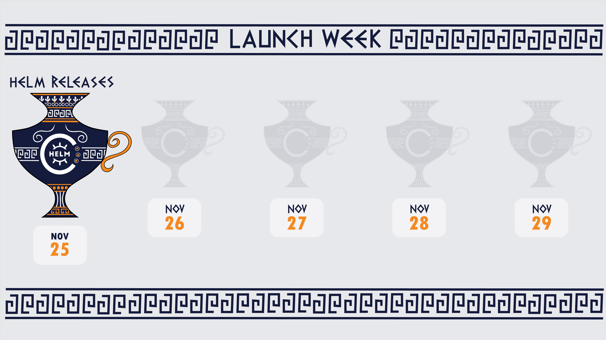

**Cyclops is having its very first launch week, starting on November 25th!**

For an entire week, we will be unveiling a feature a day - that's **five features** in total!

We don't want to spoil the surprise just yet, but if you're as **impatient** as we are, we invite you to join our **Discord session** that is happening on **Monday, November 25th, at 6 pm CET**! We will preview all of the features we plan to reveal throughout the week and host an Ask-Me-Anything session afterward.

To reserve your spot, visit the [event in our Discord](https://discord.gg/MvecUE9y?event=1308173306821742612) server and mark yourself as interested.

Come back here each day to see what we launch, or follow us on **[X](https://x.com/CyclopsUI) and [LinkedIn](https://www.linkedin.com/company/96014689/)** to keep up to date and follow the hashtag **#cyclopslaunchweek**

## #1 Helm Releases ⚡

With the release of this feature, **Cyclops will pick up on any installed Helm releases in your cluster** and showcase them in our **new tab - Helm Releases.**

Besides reviewing all of your installed Helm releases in a cluster, through this tab you can inspect them as well. You can **view all the resources** your Helm release is made up of, **edit the releases** through the UI, and **delete** them.

Although Cyclops Modules are a more powerful way of managing your applications in the cluster, the Helm releases manager offers a good starting point since it does not require you to change your current CI/CD pipelines or workflows. We also found them great for environments with short lifecycles - such as testing or staging clusters!

_**To be continued ...**_
