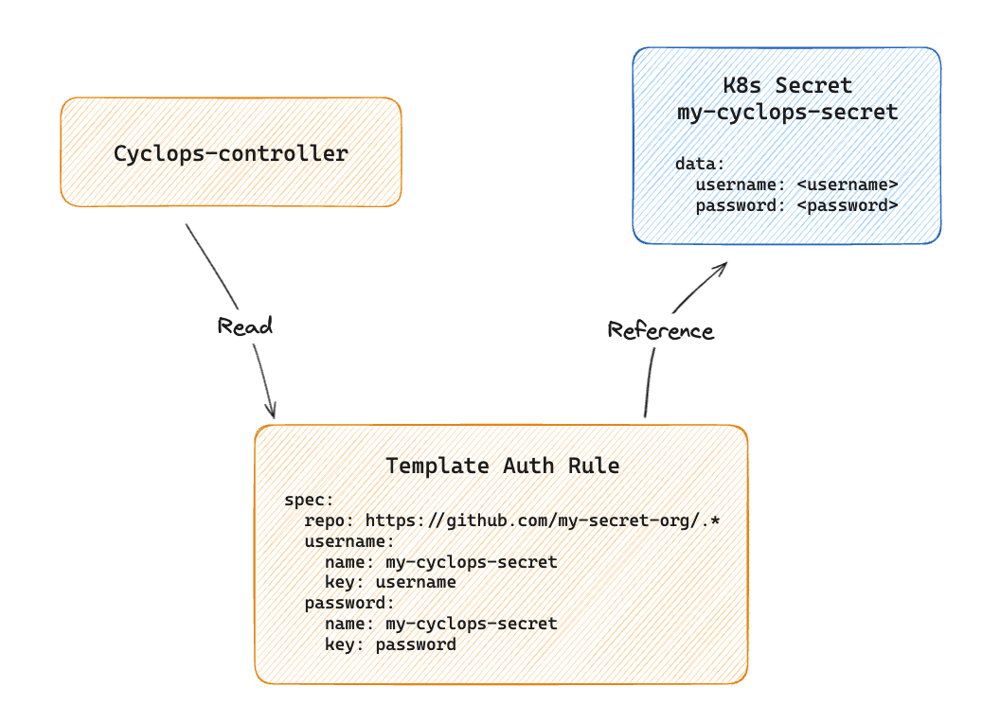

**Cyclops is having its very first launch week, starting on November 25th!**

For an entire week, we will be unveiling a feature a day - that's **five features** in total!

We don't want to spoil the surprise just yet, but if you're as **impatient** as we are, we invite you to join our **Discord session** that is happening on **Monday, November 25th, at 6 pm CET**! We will preview all of the features we plan to reveal throughout the week and host an Ask-Me-Anything session afterward.

To reserve your spot, visit the [event in our Discord](https://discord.gg/MvecUE9y?event=1308173306821742612) server and mark yourself as interested.


Come back here each day to see what we launch, or follow us on **[X](https://x.com/CyclopsUI) and [LinkedIn](https://www.linkedin.com/company/96014689/)** to keep up to date and follow the hashtag **#cyclopslaunchweek**

## #1 Helm Releases ⚡

With the release of this feature, **Cyclops will pick up on any installed Helm releases in your cluster** and showcase them in our **new tab - Helm Releases.**

Besides reviewing all of your installed Helm releases in a cluster, through this tab you can inspect them as well. You can **view all the resources** your Helm release is made up of, **edit the releases** through the UI, and **delete** them.


Although Cyclops Modules are a more powerful way of managing your applications in the cluster, the Helm releases manager offers a good starting point since it does not require you to change your current CI/CD pipelines or workflows. We also found them great for environments with short lifecycles - such as testing or staging clusters!

## #2 GitOps 🦑

We know this was a highly requested feature, and we are happy to announce that **Cyclops now supports a GitOps workflow!**

All applications within Cyclops are defined as **CRs** called **Modules**. Each time a Module is created, the **Cyclops controller** picks it up, creates other Kubernetes resources from it, and applies them to the cluster. Since Modules are CRDs, you can define them via the YAML manifest. Those manifests allow you to define everything you need for your application in a single place.

Since a **Module can be defined through a manifest**, it can be **stored on a** **git repo** and included in your **GitOps workflow**!

Through the Module manifest, you can also define which values you want to make editable through Cyclops and which values should be handled only with GitOps. For example, the image version should only be handled with GitOps, but you want to enable developers to scale the number of replicas through Cyclops.

**We created a guide** you can follow to get started, check it out [here](https://github.com/cyclops-ui/gitops-starter)!

## #3 Namespace Scoped Cyclops 🔬

We know this was a thorn in your side, but from now on, you can restrict Cyclops to a **single namespace** to **limit the permissions** needed for your Cyclops installation!

Firstly, we introduced **three** **new environment** variables `WATCH_NAMESPACE`, `MODULE_TARGET_NAMESPACE` and `WATCH_NAMESPACE_HELM`, which will help you configure your Cyclops instance to act only in specific namespaces.

```yaml
...
- name: cyclops-ctrl
  image: cyclopsui/cyclops-ctrl:v0.15.2
  ports:
    - containerPort: 8080
  env:
    - name: PORT
      value: "8080"
    - name: WATCH_NAMESPACE
      value: "my-namespace"
    - name: MODULE_TARGET_NAMESPACE
      value: "my-namespace"
    - name: WATCH_NAMESPACE_HELM
      value: "my-namespace"
...
```

Secondly, we created a Helm chart that utilizes these env variables to create **Roles** and **RoleBindings** **for Cyclops** to be scoped to a single namespace of your choosing. And, of course, we made a guide on how to use these env variables and how to easily get set up - check it out [here](https://cyclops-ui.com/docs/installation/namespace-scope)!

## #4 Private Repositories 🔐

Most companies do not store their configurations & Helm charts in open repositories, so this feature was a **MUST-have!** However, accessing private repositories requires authentication.

We did not want to bloat Cyclops with a database, so we introduced a **new custom resource** called `TemplateAuthRule`! This resource defines which templates you want to authorize and points Cyclops to the authorization data that is stored securely in **Kubernetes secrets**.



Of course, we created a **tutorial** on how to **enable Cyclops access to your private repos** [here](https://cyclops-ui.com/docs/templates/private_templates).

## #5 Streaming 🌊

If you've used Cyclops recently, you may have noticed a more **responsive** and **smoother** experience. This improvement comes from our latest enhancements: **streaming resource status updates** and **real-time app logs.**

You can now rest comfortably knowing that the resources are getting their status (health) updated **live** from the cluster!

```yaml
REACT_APP_ENABLE_STREAMING: true
```

Of course, if your bandwidth is not allowing you to keep an SSE connection open (or you just don’t care about having the state streamed to the UI), we introduced a **new environment variable** in cyclops-ui that allows you to disable this feature ⬆️

If you've used Cyclops recently, you may have noticed a more **responsive** and **smoother** experience. This improvement comes from our latest enhancements: **streaming resource status updates** and **real-time app logs.**

## Launch Week Wrap Up 🎁

This wraps up **Cyclops Launch Week**! We’re thrilled to have shared these five amazing features with you, each designed to make your Kubernetes experience more efficient, secure, and user-friendly.

Thank you for being a part of our journey! If you are interested in keeping up to date, be sure to join our [**Discord community**](https://discord.com/invite/8ErnK3qDb3) where we always share the latest news! 👾

Looking forward to our next launch week 🚀
