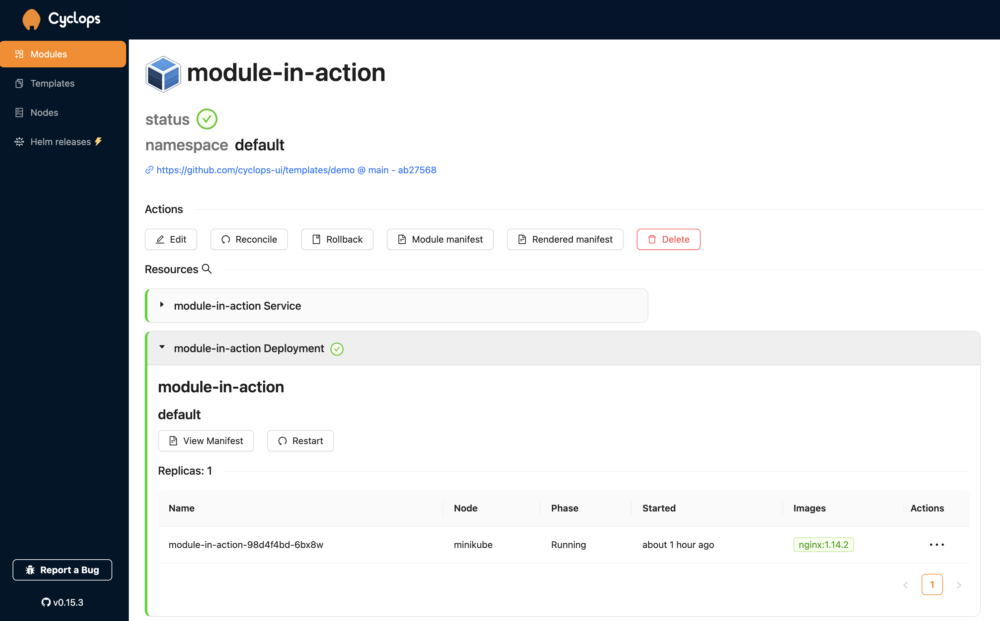
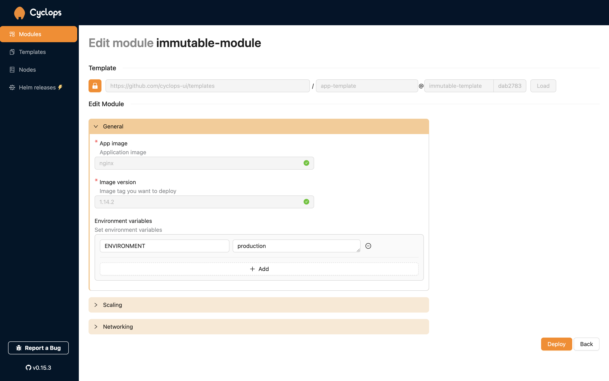

In the **DevOps** landscape, two paradigms have emerged: **GitOps** and **ClickOps**, each offering unique approaches to managing Kubernetes-based infrastructure. However, if you ask an experienced DevOps engineer, they might scoff at the idea of ClickOps as an alternative. While their reasoning may be valid, is ClickOps truly as unworthy as they might make it out to be?

In recent years, we have seen the rise of (Internal) **Developer Platforms**. An IDP can be anything from a couple of scripts to a complete GUI-based platform, but they all share the same goal of **enabling self-service for developers** when deploying applications and infrastructure. While some IDPs incorporate GitOps principles, this isn't always the case.

This post will explore these two popular methods for managing applications and infrastructure, their strengths, where they fall short, and how to **get the best of both worlds**.

***Click by Click, Commit by Commit…***

### Support us 🙏

*We know that Kubernetes can be difficult. That is why we created **Cyclops**, an open-source framework for building developer platforms on Kubernetes. Abstract the complexities of Kubernetes, and deploy and manage your applications through a customizable UI that you can fit to your needs.* 

*We're developing Cyclops as an open-source project. If you're keen to give it a try, here's a quick start guide available on our [repository](https://github.com/cyclops-ui/cyclops). If you like what you see, consider showing your support by giving us a star ⭐*

> ⭐ _**[Star Cyclops on GitHub](https://github.com/cyclops-ui/cyclops)**_ ⭐


## What is GitOps?

**GitOps** is a method in which the desired state of your application and infrastructure is stored in Git, and an automation tool ensures that those changes are applied to your Kubernetes cluster.

There are usually two approaches to GitOps: **the push** and **the pull** approach. The **push approach** relies on an external system that pushes the infrastructure code to the cluster, typically triggered by a pipeline or event. On the other hand, the **pull approach** involves a tool running within your cluster continuously pulling the infrastructure code from a Git repository and applying it to the cluster.

While GitOps is considered best practice amongst the DevOps community because of its **automatization** and **version control**, it depends on practitioners having a strong understanding of how to write infrastructure as code (be it YAML, Terraform, or others).

## What is ClickOps?

**ClickOps** usually relies on a user-friendly UI through which individuals can *click* through forms, fields, and checkboxes and provision and deploy their infrastructure and software. With its visual, interactive experience, ClickOps makes managing complex systems easier and more approachable, no matter your skill level.

Professional DevOps might be turned off by the lack of a single source of truth that describes your whole infrastructure (like code stored in Git), but ClickOps shines when it comes to **quick adjustments** and enabling **self-service** for less infra-oriented people (like most developers). It is a core component in any Internal Developer Platform (read more about IDPs [here](https://cyclops-ui.com/blog/2024/10/17/platform-engineering)).

## Getting the Best of Both Worlds

Both approaches offer various benefits but also have their shortfalls. GitOps offers version control but is more complicated for developers since it relies on infrastructure as code (IaC), which can quickly become complex. It is great for stable environments where changes should be documented.

ClickOps enables quick changes and an interface that makes it easier to interact with Kubernetes but requires manual input (the *clicks*) and does not have a single source of truth you can point to. It is perfect for short-lived environments that serve as a playground for testing.

At [**Cyclops**](https://github.com/cyclops-ui/cyclops), we are committed to creating a framework for building internal developer platforms. Understanding the challenges of both GitOps and ClickOps, we wanted our tool to handle both sides of the DevOps coin. 🪙

## GitOps & ClickOps with Cyclops

All applications in Cyclops are defined as **custom Kubernetes resources** called **Modules**. Each time a Module is created, the Cyclops controller picks it up, creates other Kubernetes resources from it, and applies them to the cluster. Because **Modules** **are CRDs**, you can **define them via a YAML** **manifest**. And since a Module can be defined through a manifest, it can be **stored on a Git repo** and included in your **GitOps** **workflow**!

Let’s take a look at an example of Module manifest:

```yaml
apiVersion: cyclops-ui.com/v1alpha1
kind: Module
metadata:
  name: module-in-action
  namespace: cyclops
spec:
  targetNamespace: default
  template:
    path: demo
    repo: https://github.com/cyclops-ui/templates
    sourceType: git
    version: main
  values:
    image: nginx
    name: demo-app
    replicas: 1
    service: true
    version: 1.14.2
```

Modules, even in their YAML format, offer a much simpler interface for developers to interact with. The `values` section is the only important thing for developers if they are using the GitOps approach, and is defined and customized by their DevOps.

From the code above, `template` is actually a reference to a Helm chart. The Helm chart is hidden from developers and offers DevOps engineers all the flexibility Helm usually does. Applying the above manifest, Cyclops knows it needs to create a deployment of `nginx` with 1 pod and a Kubernetes service.

Cyclops offers a **dashboard for developers** to visualize what their application is made of. Here, they can perform basic actions. To name a few: restarting their application, editing the configuration and viewing the logs of their app.



Because you can edit the configuration through the Cyclops UI, it allows for much quicker changes. However, this clashes with the GitOps philosophy. That is why we introduced **immutable fields.** When a field is classified as immutable (in the Helm chart), it can only be configured through the GitOps workflow.



The image above shows the edit screen of a module. Fields for **image and version cannot be updated through the UI** and should be **updated through the GitOps workflow**. But, not all configuration values are created equal. In the above module, **environment variables** are not specified as immutable and **can be changed through the UI** (a **ClickOps** **approach**).

## See it in Action!

If you want to see how a ClickOps and a GitOps workflow can supplement each other, check out [this tutorial](https://github.com/cyclops-ui/gitops-starter) we made to get you started.

This is something we recently released and is just one of the possible ways to pair GitOps and ClickOps. We would love to hear what you think about this setup, so feel free to share it in the comments or in our [Discord](https://discord.com/invite/8ErnK3qDb3). Any new idea is more then welcome!

This was part of our first-ever **Launch Week**. If you are interested in what else we uncovered, check out a short recap [here](https://cyclops-ui.com/blog/2024/11/22/launch-week-1) 👀
**#cyclopslaunchweek**

> ⭐ _**[Star Cyclops on GitHub](https://github.com/cyclops-ui/cyclops)**_ ⭐
