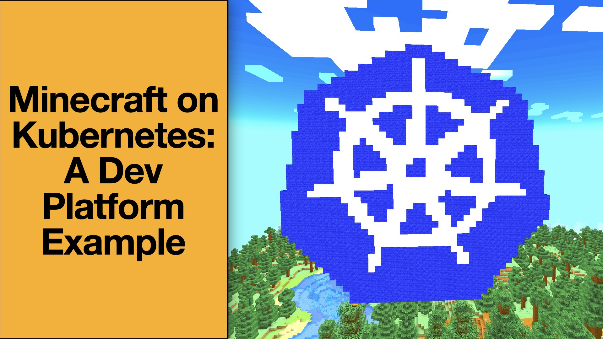
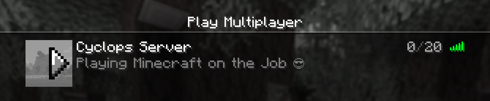
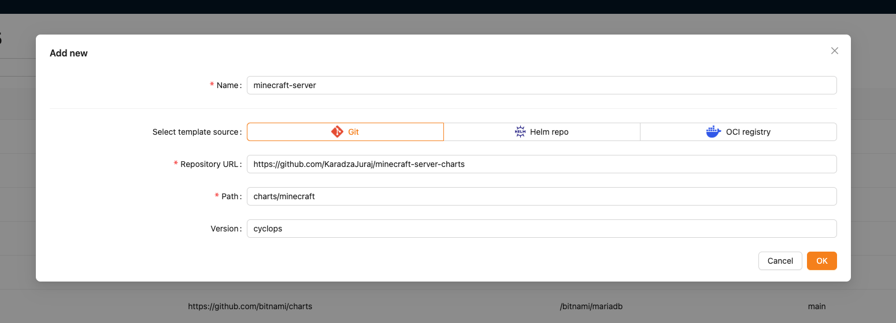
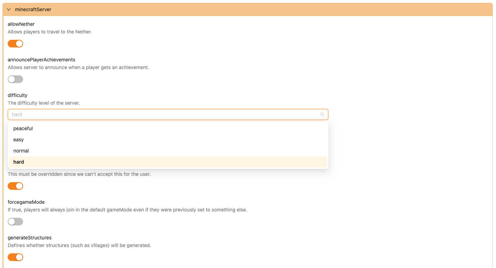
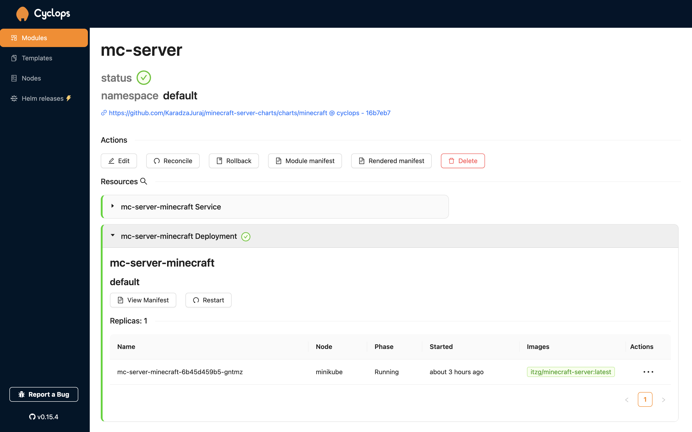
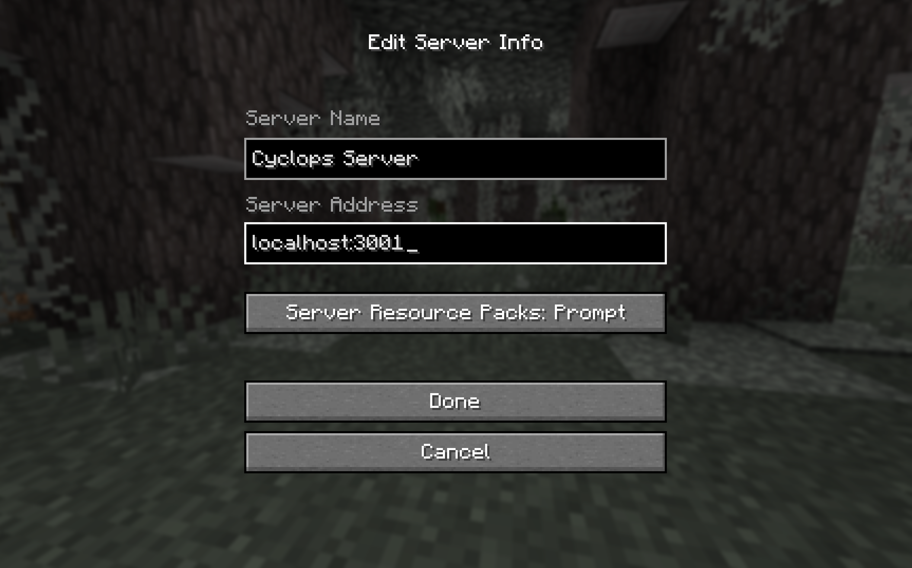

It’s been years since I last played Minecraft, but recently, I found myself itching to jump back in. But working in a startup means you don’t have much time for such activities. Naturally, I needed a *perfectly valid work excuse* to make it happen. While researching developer platforms, I stumbled across some Helm charts designed to deploy Minecraft servers. Jackpot!

But I was actually amazed at how *well*-*crafted* they were. With a bit of work, I knew I could use them to showcase the perfect example of what makes a developer platform truly shine.

In this post, I will walk you through how to **run a Minecraft server on** your **Kubernetes** **cluster**, **connect to the server**, and, in a fun way, explain the **qualities of good developer platforms**!

*Also, writing this blog post was a great excuse to play a bit of Minecraft at work, so there’s that… 🤷‍♂️*

### Support us 🙏

*We know that Kubernetes can be difficult. That is why we created Cyclops, an open-source framework for building developer platforms on Kubernetes. Abstract the complexities of Kubernetes, and deploy and manage your applications through a customizable UI that you can fit to your needs.* 

*We're developing Cyclops as an open-source project. If you're keen to give it a try, here's a quick start guide available on our [repository](https://github.com/cyclops-ui/cyclops). If you like what you see, consider showing your support by giving us a star ⭐*

> ⭐ [***Star Cyclops on GitHub***](https://github.com/cyclops-ui/cyclops) ⭐
>


## Minecraft on Kubernetes

To be able to follow this tutorial, you will need two things: a Kubernetes cluster and a Minecraft account. (Never thought these two would be requirements for a blog 😅). You can follow along without the Minecraft account, but then you’ll just be spinning up the server and won’t be able to actually play the game.

I used Minikube for my Kubernetes cluster, and it worked fine, you can check [here](https://minikube.sigs.k8s.io/docs/start/?arch=/macos/arm64/stable/binary+download) how to set it up for yourself.



### Minecraft Helm charts

Most of the hard work for this wasn’t done by me, that glory belongs to [Geoff Bourne](https://github.com/itzg). I’ve come across his [minecraft-server-charts](https://github.com/itzg/minecraft-server-charts) repository and just had to try it out.

While you can use the Helm charts Geoff created, which would work fine, I wanted to emphasize my point, so I tweaked the `values.schema.json` just a little bit - you can find my version [here](https://github.com/KaradzaJuraj/minecraft-server-charts/tree/cyclops).

### Cyclops

The next step is to set up Cyclops. **Cyclops allows you to import these Helm charts to instantly get a Developer Platform!**

Cyclops runs in your cluster; you can **set it up with** **two commands:**

```yaml
kubectl apply -f https://raw.githubusercontent.com/cyclops-ui/cyclops/v0.15.4/install/cyclops-install.yaml && 
kubectl apply -f https://raw.githubusercontent.com/cyclops-ui/cyclops/v0.15.4/install/demo-templates.yaml
```

After a couple of moments (once it’s up and running), use the following command to access it on [localhost:3000](http://localhost:3000) :

```yaml
kubectl port-forward svc/cyclops-ui 3000:3000 -n cyclops
```

Now that you have your Cyclops instance set up, import the Helm chart as a template in the `Templates` tab.



## Why is it a good Developer Platform?

After you import your template, go to the `Modules` tab and create a new module. The first step in creating a module is choosing a template. Pick the Minecraft template that you imported in the previous step.

**Cyclops will provide you with a simple UI** and a bunch of options for deploying your Minecraft server. These options were all defined in the Helm chart from before!

Now I haven’t played Minecraft in a long time, but everything is **abstracted and neatly described**. I can choose the settings of my server without having to research what these options represent and deploy my Minecraft server in a jiffy!



While I wouldn’t know how to set these things up by myself through the developer platform, it’s a piece of cake. You can imagine that instead of setting up Nether regions and generating structures, these could be feature flags for an application that can be toggled on or off.

Or instead of choosing the difficulty, you could choose the resource requirements of your apps, which can be along the lines of “small”, “medium” or “large”, without having to know how much CPU or Memory that actually is and without being able to misconfigure it.

But more things are happening behind the scenes than that are actually shown here.

Some things are not supposed to be edited by me but by someone who is more adept at Kubernetes. In that case, these options are left out of the UI. For example, you won’t find a `replicaCount` setting in the UI, but if you dig in the `values.yaml`, you can find this section:

```yaml
# ### WARNING ###
# Minecraft is not horizontally scalable, adjusting this
# will most likely break your setup.
# ### WARNING ###
replicaCount: 1
```

This is what I mean when I say that this is an example of a good developer platform. I’m allowed to specify the things that are important to me (like the difficulty and settings of my server), but someone who understands the infrastructure is still in control. That person creates a UI, creates validations and defines what is acceptable for me to mess around with.

Once you got the settings right (and accepted the Minecraft EULA by toggling it on), just click `Deploy` and Cyclops should take care of the rest.

Not only was I able to configure these options and deploy them, but I also have a nice visual representation of the result running in my cluster. Never once was there a mention of a “Deployment” or a “Service” (or “Secrets” for that matter), but these resources were created for me by using the template.

But that’s enough tech talk; let’s play some Minecraft!



## Final Step - Play!

Now all you need to do is wait for it to be deployed (you know it is ready when the Deployment turns green) and then expose the service:

```yaml
kubectl port-forward svc/<modul-name>-minecraft 3001:25565
```

Now start up your Minecraft and login into your account. Click *Multiplayer* and *Add Server.* Name the server what you want and put the Server Address to `localhost:3001`.

That’s it, you should be good to go!



## Tell your boss you are researching Dev Platforms

Cyclops, as an open-source framework for building dev platforms, is highly flexible; Minecraft is only a fun example of what I wanted to showcase today. Cyclops comes with a bunch of predefined templates, but you can import your own Helm charts to get a dynamically rendered UI. Try it out and let us know what you think!

If you have any whacky examples of **cool Helm charts like these**, **link them in the comments or share them with us and our community in our** [**Discord server**](https://discord.com/invite/8ErnK3qDb3) 👾

Here is your excuse to play Minecraft at work, now enjoy!

> ⭐ [***Star Cyclops on GitHub***](https://github.com/cyclops-ui/cyclops) ⭐
>