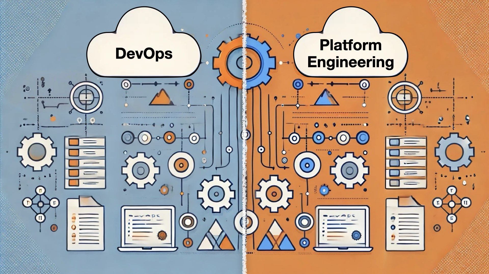
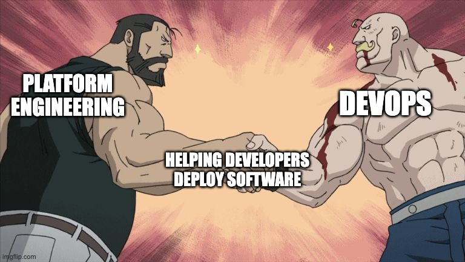

If you are confused about what DevOps or Platform Engineering even is, you are not alone. There is a lot of online discussion around this topic, and depending on who you ask, you might get different answers.

Part of the confusion comes from DevOps being often used as a catch-all term. Even Wikipedia is confused about what DevOps really is:

> *…academics and practitioners have not developed a universal definition for the term "DevOps."* ~ [*Wikipedia*](https://en.wikipedia.org/wiki/DevOps)
> 

But I'm here to tell you that there **is a difference** between these two. Let's start by defining them and then see how are they connected…

### Support us 🙏

*We know that Kubernetes can be difficult. That is why we created Cyclops, an open-source framework for building developer platforms on Kubernetes. Abstract the complexities of Kubernetes, and deploy and manage your applications through a customizable UI that you can fit to your needs.*

*We're developing Cyclops as an open-source project. If you're keen to give it a try, here's a quick start guide available on our [repository](https://github.com/cyclops-ui/cyclops). If you like what you see, consider showing your support by giving us a star ⭐*

> ⭐ [***Star Cyclops on GitHub***](https://github.com/cyclops-ui/cyclops) ⭐
>

## What is DevOps?

DevOps is not actually a job role, **it’s a philosophy**. The Dev in DevOps represents software development, such as building applications and features, and the Ops stands for operations, which usually represents pushing, running, and maintaining the software on your servers and infrastructure.

### DevOps as a Philosophy

Consider this: you have a developer team in charge of shipping out applications and features, and you have an operations team in charge of taking that software and running and maintaining it on your infrastructure.

When a bug reaches production, who’s at fault here? Development teams often blame operations for deployment failures, while operations blame developers for writing unstable code.

And these teams have different goals to keep up with. Devs want to ship as much code as fast as possible, while the Ops team prioritizes stability and reliability. This “siloed“ culture causes tension and inefficiency.

This was the reality before DevOps became mainstream (and in some cases, it still is). DevOps as a philosophy promotes a collaborative culture where developers and operations teams work closely together throughout the software development lifecycle. Instead of throwing software "*over the wall*", both teams share responsibility for building, deploying, and maintaining the software.

### DevOps as a Job Role

I know I said that DevOps is not actually a job role, but in reality, it has become one. While the original term might have meant restructuring organizations to bring the development and operations teams working more closely together, in today's world, it represents a job role akin to Ops.

A DevOps is basically someone who implements things such as automations and CI/CD processes, handles infrastructure, and monitors the metrics of applications. The role can have various responsibilities, but the focus is on enabling teams to build, test, deploy, and monitor their services (this is where the philosophy shines through).

> *In this role, you will collaborate with development, operations, and infrastructure teams to automate and streamline our processes, build and maintain tools for deployment, monitoring, and operations, and troubleshoot and resolve issues in our development and production environments.
~ a job listing for a DevOps engineer*
>

## What is Platform Engineering?

Platform engineering acts like an internal product team, but instead of serving external customers, its primary users are the company's own developers and internal teams.

The job of platform engineers is designing and building toolsets, infrastructure, and workflows that make it easier for developers to build, test, deploy, and manage software. The goal is to create a unified platform, often called an **Internal Developer Platform (IDP)**, which provides developers with self-service access to everything they need without depending on other teams, like operations or infra.

> *You will build platform tools and leverage innovative cloud technology to bring joy to your end users - < company's > developers. You are a builder that’s passionate about multiplying our engineering force through automation, cloud technologies, and productivity tools, which enhance the developer experience.
~ a job listing for a Platform engineer*
>

## How are they related?

**Platform engineering is not a replacement for DevOps**. The goal of DevOps is to improve software quality, speed of iteration, and delivery, which is usually achieved by adopting new tools and workflows. In that regard, Platform engineering is one of the ways to implement and manifest DevOps principles.

**The line** between the two is usually **drawn on the internal developer platform** (IDP). While DevOps engineers do build tools for developers (like bash scripts) and try to automate as much as possible, the goal isn’t centered around one specific product.

Platform engineering does have a **product at its core** - the developer platform, which removes as many obstacles as possible to make developers as autonomous and as fast-moving as possible.

## The new kid on the block

Platform engineering is a relatively new concept, with one of the most famous examples being [Backstage](https://backstage.io/). But, building an internal product (the IDP) is a very expensive endeavor for organizations. You won’t see many job listings for platform engineers in smaller companies (a DevOps position is more common here).

At Cyclops, we’re creating a framework for developer platforms that reduces the cost and time needed to build Internal Developer Platforms (IDPs). We want to bring all the benefits of IDPs to companies of any size.

If you enjoyed this article or found it helpful, [join our Discord server](https://discord.com/invite/8ErnK3qDb3), where we always let you know about the latest content, new developments, and news from our team!

> ⭐ [***Star Cyclops on GitHub***](https://github.com/cyclops-ui/cyclops) ⭐

*PS: Oh, and no shade to Wikipedia, I love them 🧡 ~ Juraj*
