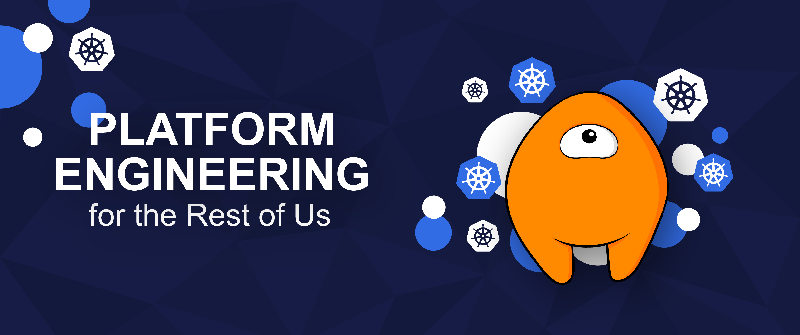

Platform engineering is possibly the biggest concept to take hold in infrastructure over the last 5+ years, and there’s a big reason why. For decades, application engineers have dealt with systems that have constantly thrown roadblocks and delays in their way. Platform engineers address this problem by building systems that enable self-service and provide useful abstractions that help those other engineers build and run their applications. As we know, enabling self-service helps both productivity and developer happiness.

However, building and maintaining a platform can be expensive, and not every organization has the budget for a dedicated platform team. For organizations with platform teams, there’s an ongoing tension between either building custom tools, using open source tools, or buying commercial solutions. Each of those options requires some kind of investment, but for many teams, building platforms largely composed of open source tools is a strong choice. The team doesn’t spend a lot on software licenses and isn’t stuck maintaining all the code.

In this post, we’ll look at [Cyclops](https://cyclops-ui.com/), an [open source tool](https://github.com/cyclops-ui/cyclops) for building developer platforms. Cyclops lets teams deploy and manage applications using Helm charts as templates.

## Prerequisites

The main requirement for this tutorial is a Kubernetes cluster. In this example, we’ll use [kind](https://kind.sigs.k8s.io/) to provision a cluster, but feel free to use a different method if you prefer. If you’re not already using kind, you can install it using the [instructions in the docs](https://kind.sigs.k8s.io/docs/user/quick-start/#installation). You also need a local Docker-compatible daemon to use kind, like Docker, Podman, or Colima.

You will also need kubectl. You can find instructions for installing kubectl in the [Kubernetes docs](https://kubernetes.io/docs/tasks/tools/#kubectl).

## Provision a cluster and install Cyclops

First, provision a cluster.

```bash
kind create cluster --name cyclops-demo
```

Your kube context should already be set to point to the kind cluster. You can test that you can connect by viewing the namespaces in the cluster.

```bash
kubectl get namespaces
```

Next, install Cyclops into your cluster with kubectl.

```bash
kubectl apply -f https://raw.githubusercontent.com/cyclops-ui/cyclops/v0.15.4/install/cyclops-install.yaml
```

As you’ll see from the output, Cyclops is composed of Kubernetes native objects.

```bash
customresourcedefinition.apiextensions.k8s.io/modules.cyclops-ui.com created
customresourcedefinition.apiextensions.k8s.io/templateauthrules.cyclops-ui.com created
customresourcedefinition.apiextensions.k8s.io/templatestores.cyclops-ui.com created
namespace/cyclops created
serviceaccount/cyclops-ctrl created
clusterrole.rbac.authorization.k8s.io/cyclops-ctrl created
clusterrolebinding.rbac.authorization.k8s.io/cyclops-ctrl created
deployment.apps/cyclops-ui created
service/cyclops-ui created
networkpolicy.networking.k8s.io/cyclops-ui created
deployment.apps/cyclops-ctrl created
service/cyclops-ctrl created
networkpolicy.networking.k8s.io/cyclops-ctrl created
```

There should now be two pods running in a new namespace called Cyclops. We can view them with:

```bash
kubectl get pods -n cyclops
```

You should see output like this:

```bash
NAME                            READY   STATUS    RESTARTS   AGE
cyclops-ctrl-7984df7589-wv4dw   1/1     Running   0          36s
cyclops-ui-64c4cdd7f7-fxnb7     1/1     Running   0          36s
```

The first pod handles the Cyclops API, manages the CRDs, and communicates with the Kubernetes API server. The second pod runs the Cyclops web UI.

Next, we will install a set of example templates that we will use to see how Cyclops works.

```bash
kubectl apply -f https://raw.githubusercontent.com/cyclops-ui/cyclops/v0.15.4/install/demo-templates.yaml
```

Finally, let’s connect to the Cyclops web UI. First, forward a port to it using kubectl.

```bash
kubectl port-forward svc/cyclops-ui 3000:3000 -n cyclops
```

Next, connect to the UI with your browser at http://localhost:3000/.

## Deploy Nginx with a generic app template

For the first portion of the demo, we’ll deploy Nginx using Cyclops.

Open a new terminal window/tab and create a namespace called nginx.

```bash
kubectl create namespace nginx
```

Now, go back to the Cyclops UI tab in your browser. Click *Add module* in the upper right corner of the Cyclops screen. Think of a module in Cyclops as an application and all of the other Kubernetes resources required to run it.

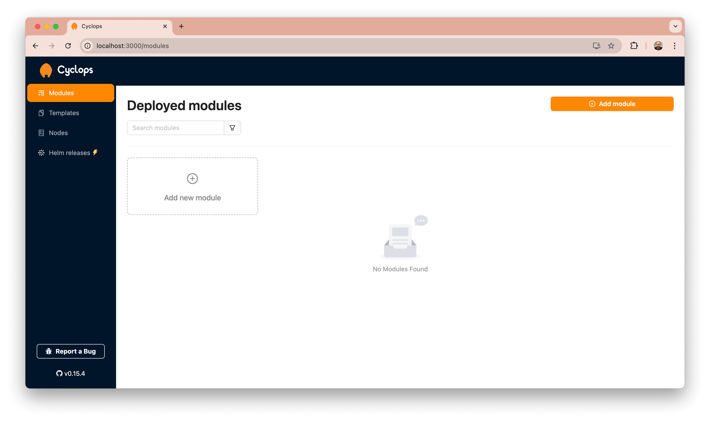

Next, we’ll select a template. Cyclops templates are Helm charts, and Cyclops can use charts from GitHub repositories, Helm chart repositories, or OCI repositories.

Select `app-template` from the *Template* pull-down list. This generic template creates a Kubernetes deployment and service for an application.

For the module name, enter `nginx`. Click on *Advanced*. Select the `nginx` namespace from the *Target namespace* pull-down menu.

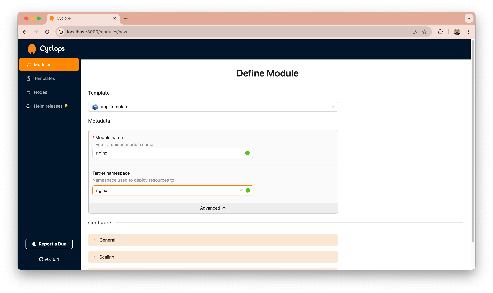

Click on *General*. You can see that some defaults have been populated, like the image name version. Leave them set to the defaults. Those values are being pulled from a values.yaml file [in the Helm chart](https://github.com/cyclops-ui/templates/blob/main/app-template/values.yaml).

You’ll see some other configurable options under *Scaling* and *Networking*. You can also leave those set to the defaults. Scroll down and hit the *Deploy* button in the bottom right of the window.

On the next screen, you’ll see more information about the module and its status as it’s deployed. There’s a link to the template it was deployed from and information about the Kubernetes resources that have been created.

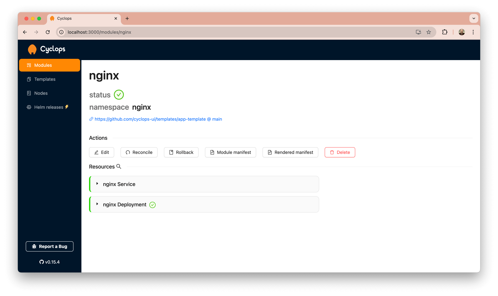

Click on *nginx Deployment* to see that one pod is running. We can confirm that info in the terminal by running this command:

```bash
kubectl get pods -n nginx
```

That output should match what you saw in Cyclops.

Go back to the Cyclops browser tab. Under *Actions*, you can see several buttons for making changes to a running module. *Edit* will let you change the configuration. *Reconcile* will re-create the resources. *Rollback* will revert to the previous version of the module if you have made changes. You can view the code for the module using the *Module manifest* button, and *Rendered manifes*t lets you view the Kubernetes YAML for the running resources.

Click *Edit*, and then change the number of replicas to 2 under *Scaling*. Then, hit the *Deploy* button.

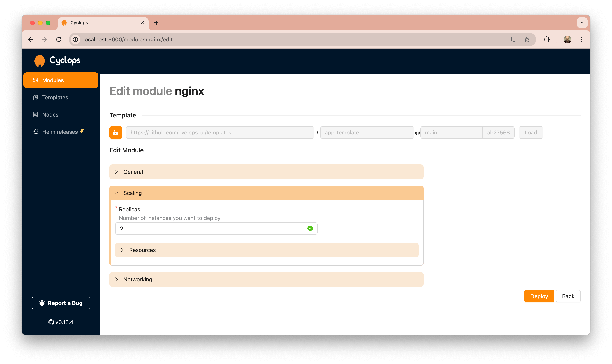

Once the status goes back to green, hit the *Rollback* button. You’ll see a list of the module's previous generations (versions). There should just be one. Click the Rollback button for that generation, and you’ll see a diff of the changes that were made.

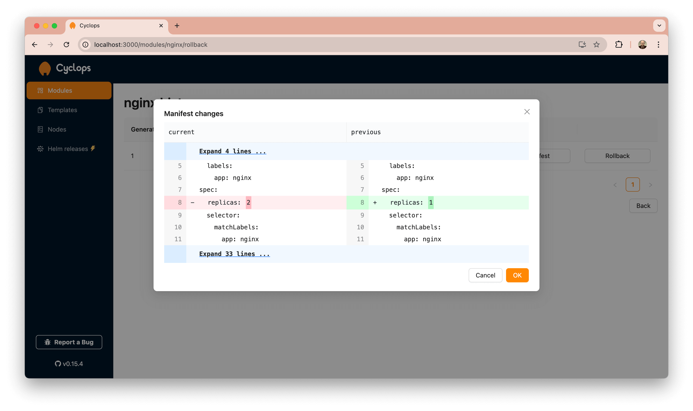

Click the *OK* button to perform the rollback.

Some teams won’t want to manage changes through the Cyclops UI, of course. You can instead use Cyclops with GitOps tools like Argo CD. There’s a GitHub repo with examples [here](https://github.com/cyclops-ui/gitops-starter).

Finally, let’s clean up. Click *Delete*, and type in the module name to confirm.

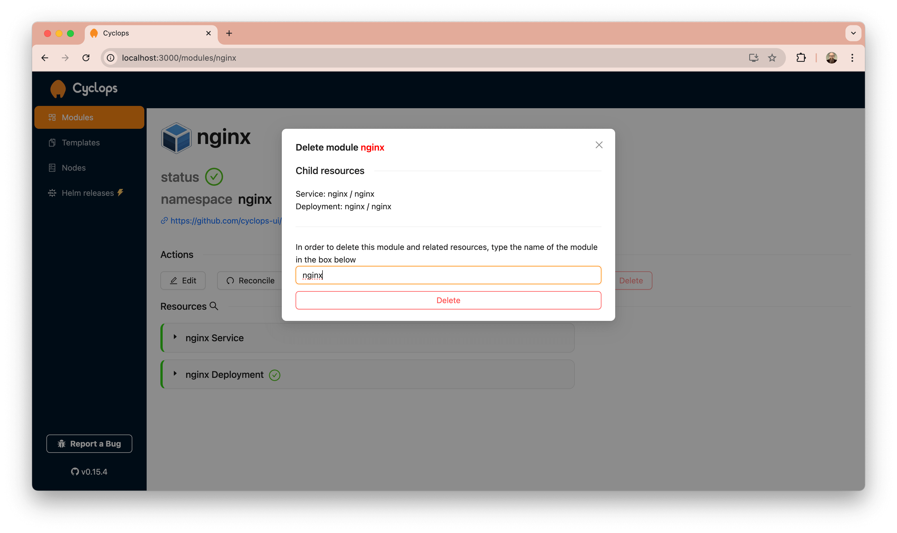

## Deploy Redis with Cyclops

We’ve seen how to deploy an app with a custom Helm chart, but Cyclops can also deploy applications using existing Helm charts. Let’s look at how that works by deploying Redis using the Bitnami chart, which is included with Cyclops.

At the terminal, create a namespace called `redis`.

```bash
kubectl create namespace redis
```

In the Cyclops browser tab, click *Templates* in the left nav bar. Type “redis” in the search box to see the info for the installed template. The source for it is the Bitnami GitHub repo, and it’s coming from the main branch.

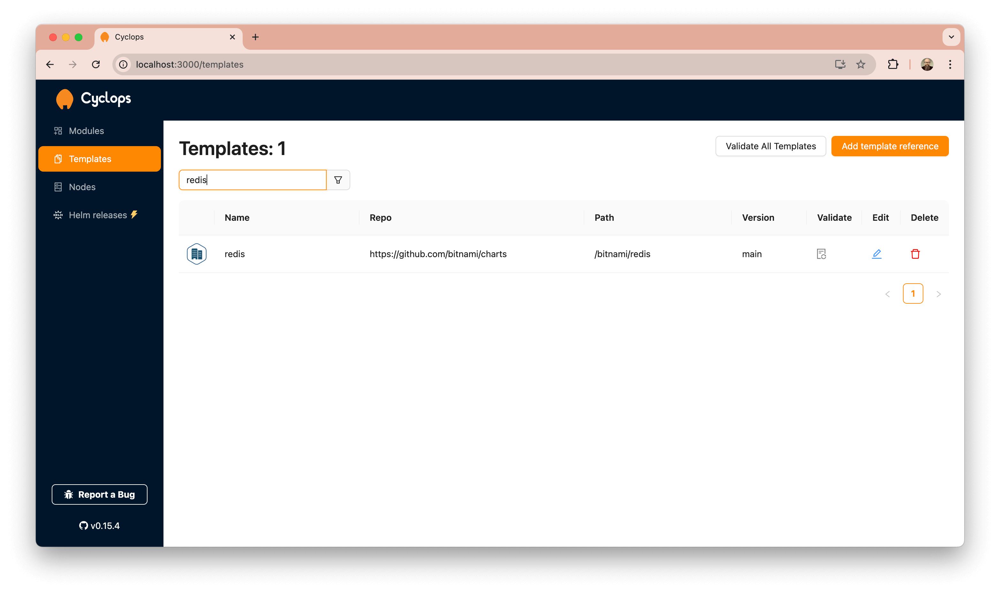

No, click on *Modules* in the left nav and then *Add module* again. Select `redis` from the module pulldown list, and type in “redis-cache” for the module name. Click on *Advanced* and select `redis` from the list of namespaces.

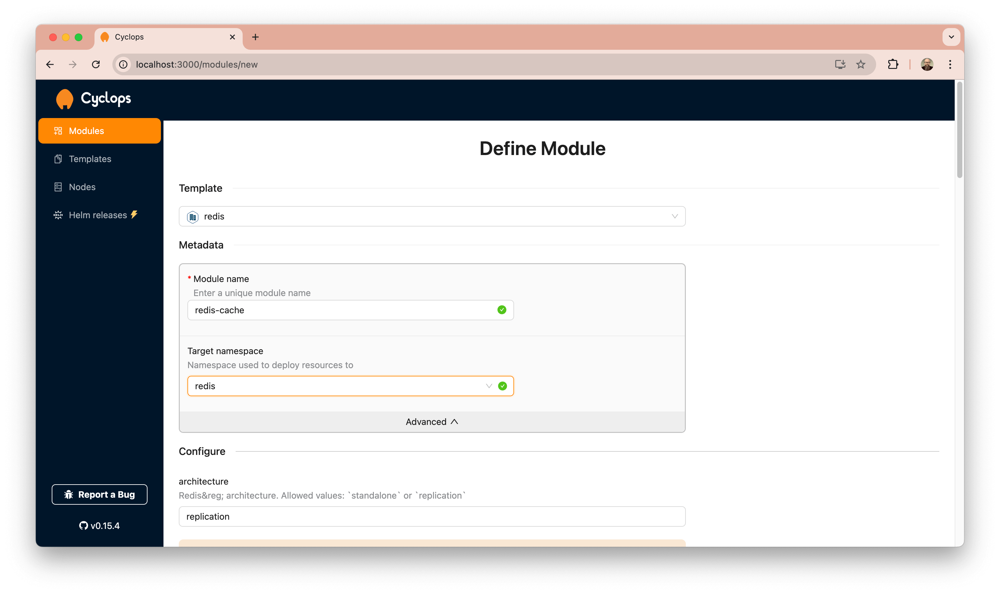

Scroll down. You will see many other options that can be customized for the Redis install. Feel free to expand and view any that interest you, but leave them set to the defaults. Then, click the *Deploy* button in the bottom right.

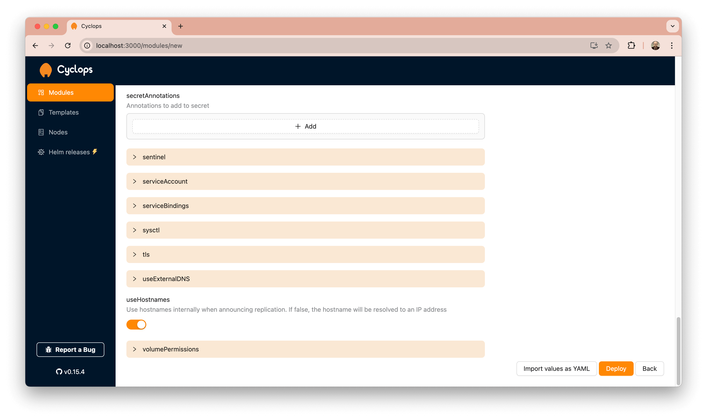

It may take a bit for Kubernetes to spin up all the resources, but eventually, they should all go green.

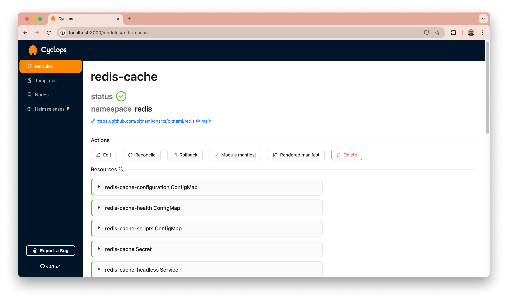

We can confirm the pods are running with this command:

```bash
kubectl get pods -n redis
```

You should see the primary/master node and three replicas like this:

```bash
NAME               READY   STATUS    RESTARTS   AGE
redis-master-0     1/1     Running   0          4m6s
redis-replicas-0   1/1     Running   0          2m21s
redis-replicas-1   1/1     Running   0          3m10s
redis-replicas-2   1/1     Running   0          2m46s
```

We can use any Helm chart with Cyclops like this to allow users to deploy the applications they need to run. In the case of a complex module like this one, you can set default values that are needed for your team or even create a custom Helm chart that exposes fewer options.

That’s it for the tutorial. To clean up, you can delete the kind cluster.

```bash
kind delete cluster -n cyclops-demo
```

## Conclusion

We’ve learned how to deploy applications with Cyclops using pre-existing Helm charts and custom ones, and we’ve seen how Cyclops allows teams to easily expose the abstractions they need for developers to deploy and manage their apps.

Whether you’re at an organization that’s not staffed for a dedicated platform team or your platform team would like an easy way to provide self-service for developers, Cyclops could be a great fit for your workflow.

## Learn more

- The [Cyclops docs](https://cyclops-ui.com/docs/about/) are a great place to start.
- Check out their [open-source repository](https://github.com/cyclops-ui/cyclops) and support them with a star.
- There’s a [community Discord](https://discord.com/invite/8ErnK3qDb3) if you’d like help or to give your feedback.
