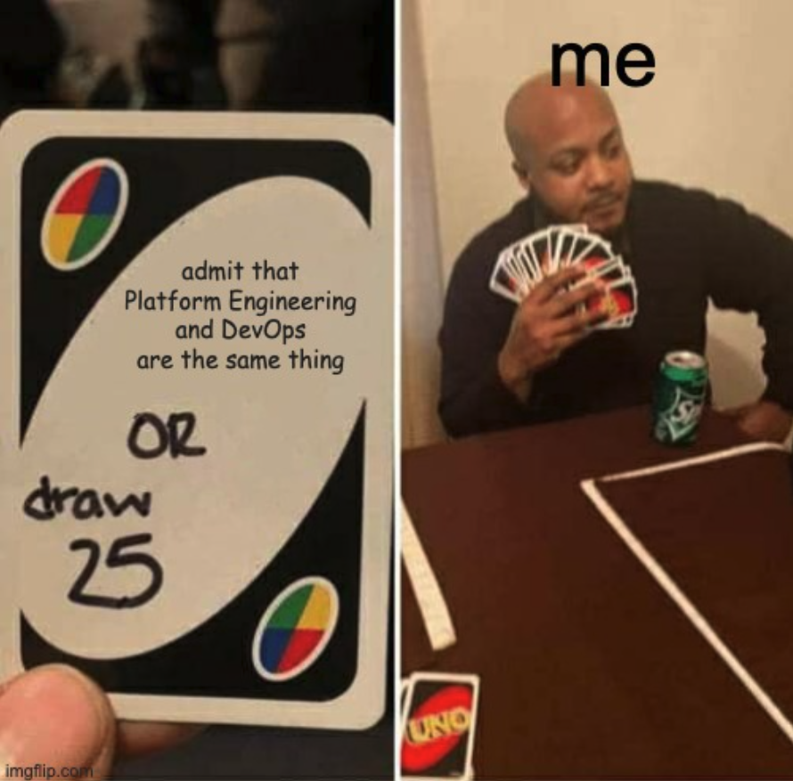

Before diving into internal developer platforms, it’s important to understand platform engineering first. Platform engineering evolved from DevOps and aims to address the growing complexity of modern software development.

However, while DevOps focuses on bridging the gap between development and operations, platform engineering takes it a step further. The goal of platform engineering is to establish a unified platform that enables developers to move as fast as possible with as much safety as possible.

But why did this trend emerge, and how does it differ from what is currently out there?

### Support us

*We know that Kubernetes can be difficult. That is why we created Cyclops, an open-source framework for building developer platforms on Kubernetes. Abstract the complexities of Kubernetes, and deploy and manage your applications through a customizable UI that you can fit to your needs.*

*We're developing Cyclops as an open-source project. If you're keen to give it a try, here's a quick start guide available on our [repository](https://github.com/cyclops-ui/cyclops). If you like what you see, consider showing your support by giving us a star ⭐*

> ⭐ [***Star Cyclops on GitHub***](https://github.com/cyclops-ui/cyclops) ⭐
>

### Why Developer Platforms

A lot of the motivation behind building internal developer platforms is centered around the idea of self-service.

When you think of DevOps, you envision automation, pipelines, monitoring, and other Ops-like functions. While most of these things are focused on enabling developers to move faster, in reality, the DevOps team can often feel like a bottleneck.

If you need to raise a ticket with the DevOps team whenever you want to create a new service, change something in the configuration, or have issues with a deployment, it will inevitably slow you down.

On the other hand, the DevOps team doesn’t always want to spend their time reviewing every minor change requested by developers. They’d rather focus on more productive work than act as a helpdesk for routine requests.

> *A system where every infrastructure and deployment change has to be reviewed and approved by the DevOps team is often called ticket ops*
>

## (Internal) Developer Platforms

A developer platform is a product built by the platform team to support application developers and the rest of the engineering organization. It connects all the tech and tools in a company into streamlined workflows, often called "golden paths," that reduce cognitive load and simplify self-service for developers.

Since these platforms are designed specifically for internal use within an organization, they're often called **Internal Developer Platforms.**

A developer platform can take many forms. From a documentation page and a couple of bash scripts all the way to fully fleshed-out self-service portals.

A platform's features and use cases should be driven by what developers actually need, whether it's provisioning infrastructure, spinning up environments on demand, or providing a central catalog of services.

At its core, a developer platform should act as a force multiplier, enabling teams to ship faster by removing friction and streamlining workflows.

> *Just to clarify the distinction between **developer portals** and **developer platforms**, a developer portal is simply the interface (typically a GUI) developers use to access the internal developer platform.*
>

## Building Internal Developer Platforms

There are a couple of important things to keep in mind when building an internal developer platform.

**The platform is a product**, and you should **treat it as such.** It should be designed around user needs and continuously improved, just like any other software product. Just in this case, the users are your own developers!

A good platform abstracts complexity, **reduces the cognitive load** for users, and makes it easier for product teams to focus on delivering value rather than dealing with infrastructure.

But in the end, it’s all centered around **self-service**. Developers should be able to request and provision resources independently and with confidence without relying on manual approvals.

A platform should support the above features and workflows, but just because it provides certain capabilities, it doesn’t mean the platform team has to build everything themselves. In many cases, a lot can be accomplished with the use of external tools (proprietary or open-source).

## Learn more ⬇️

At [**Cyclops**](https://github.com/cyclops-ui/cyclops), we’re creating an open-source framework for building internal developer platforms on Kubernetes. We make it easy for you to provide golden paths to your developers by allowing you to create custom UIs from your Helm charts.

If you are interested in learning more about platform engineering, I’m nudging you to check out [the CNCF Platforms White Paper](https://tag-app-delivery.cncf.io/whitepapers/platforms/), [the Internal Developer Platform Org](https://internaldeveloperplatform.org/), and [the Platform Engineering Org](https://platformengineering.org/). Hope you find these sources as useful as I did.

If you enjoyed this article or found it helpful, [join our Discord server](https://discord.com/invite/8ErnK3qDb3), where we always let you know about the latest content, new developments, and news from our team!

> ⭐ [***Star Cyclops on GitHub***](https://github.com/cyclops-ui/cyclops) ⭐
>