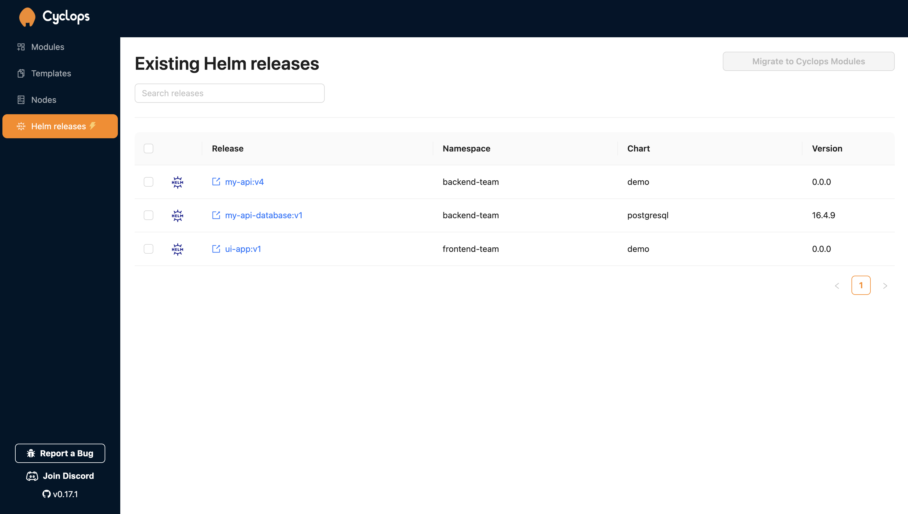
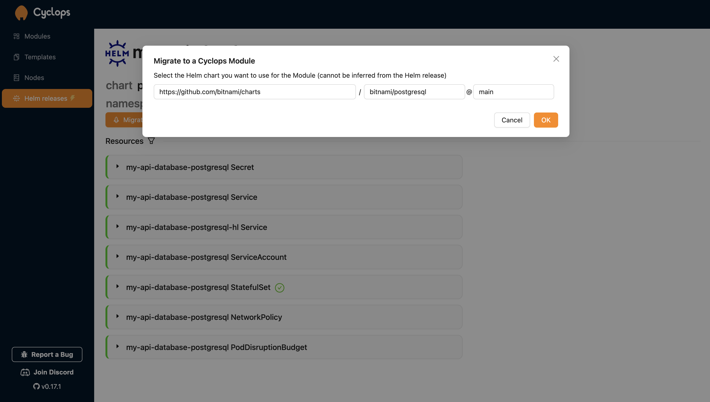

If you have been looking for a tool to deploy your applications into a Kubernetes cluster, you have definitely stumbled upon [Helm](https://helm.sh/). Its the most common Kubernetes configuration management tool out there.

Helm is a package manager for Kubernetes. This means you can group your deployments, services, ingresses, and all other Kubernetes resources into meaningful units. This means that a software vendor (for example, Grafana) can create a single Helm chart, and all users can simply install *a gazillion* of resources with a single command, knowing it’s going to work.

I think some parts of Helm are awesome, and some are often misused and introduce complications without much benefit.

If you have some running Helm releases in your Kubernetes cluster, this one is for you!

### Support us

*We know that Kubernetes can be difficult. That is why we created Cyclops, an open-source framework for building developer platforms on Kubernetes. Abstract the complexities of Kubernetes, and deploy and manage your applications through a customizable UI that you can fit to your needs.*

*We're developing Cyclops as an open-source project. If you're keen to give it a try, here's a quick start guide available on our [repository](https://github.com/cyclops-ui/cyclops). If you like what you see, consider showing your support by giving us a star ⭐*

> ⭐ [***Star Cyclops on GitHub***](https://github.com/cyclops-ui/cyclops) ⭐
>


# What is Helm?

An application deployed to a Kubernetes cluster is usually not just a Deployment but a list of other Kubernetes resources like Configmaps, Secrets, Ingress, and many others. Instead of manually creating all of them time and time again, you could create a *Helm chart* that would define all of these resources in a single place, and then you can reproduce them when needed.

A `Helm chart` is a single Helm package. Grafana has its own Helm chart which defines all the resources you need to run it, MySQL has its own chart, and so on.

If you want to run a MySQL in your cluster you can simply *install the chart* to your cluster and not think about specific resources. With that installation, you just created a `Helm release`. Releases track what has been installed in the cluster so you can check what Helm charts you installed later on.

In a Helm chart, Kubernetes resources are defined as templates that allow users to customize them without having to dive into each one. You can customize your releases using the values files that contain configuration, which would be injected into the resource templates to create Kubernetes manifests. And this is where the trouble with Helm begins.

## Cons

I love the way Helm implemented their package management, but there are some things I’m not the biggest fan of.


### YAML Configuration

Helm’s templating engine is great for abstracting and reusing configuration. But each time you encounter a new Helm chart, you will need to spend some time figuring out what you can and can’t configure.

`values.yaml` is usually a good place to start since there you can find the default configuration. But, not all configuration needs to be defined in `values.yaml`, and you will need to dig through the docs (if there even is any) or, God forbid, the Helm templates to see how things map between values and templates.

There is no type safety, and you could easily make a typo in your configuration, resulting in an outage.

### Configuration Persistence

When you install a Helm release, Helm will, by default, use values from the `values.yaml`. You can inject any values from a file or directly with the `--set` flag while running `helm install`, but that then begs the question of **what is actually deployed**. Each time you want to upgrade your Helm release, you need to know exactly what is currently deployed to not override something by accident.

For example, you and your colleague are working on the same application deployed as a Helm release. Your colleague wants to set the number of replicas to 5:

```shell
helm upgrade my-release <helm repo> --set replicas=5
```

After that, you want to bump the version of your application to `latest` with the following command:

```shell
helm upgrade my-release <helm repo> --set image.tag=latest
```

You deployed a new version, but without knowing it, **you have just overridden your colleague's changes** and you are back to a single replica. Unless you check for the currently deployed values, you can’t be sure if you are overriding something deployed by somebody else **(or even yourself a month ago).**

### Resource Overview

Once a release has been installed, you will likely want to check what resources have been deployed and whether they are running as expected. Helm solved it with the `helm status` command that can list all the resources.

This is more a personal preference, but I find it strange to list deployed resources with the `helm` cli and then dig deeper with `kubectl`. Ideally, I could check my resources from a single pane of glass.

# Managing Helm Releases with Cyclops

Cyclops natively supports Helm charts and their deployment. It addresses the problems listed above and provides you with a custom UI for all of your Helm charts.

Instead of configuring your Helm charts via YAML, Cyclops will generate a UI based specifically on the Helm chart values. Since you are configuring your app through a form, you can now see all of the fields you can configure and be sure the values you provided are validated.

Instead of relying on Helm releases, Cyclops implements its own **Custom Kubernetes Resources** called Modules, which reference Helm charts and keep all of your values persisted.

Since version `v0.17.0`, Cyclops allows you to migrate your existing Helm releases to Cyclops Modules in a non-invasive fashion. It will just create a new Module for your application and delete the release without deleting or redeploying your applications.


## Migrate to Cyclops

Cyclops can automatically pick up on all of your Helm releases currently running in the cluster and offers you the ability to migrate them to `Cyclops Modules`. A Cyclops Module is a custom Kubernetes resource that **references a Helm chart** and **contains all the values** used to configure that chart.

With such an approach, you don’t have to worry about what value files you need to use, how those overlap… Instead, everything is in a single place defined declaratively. If you want to change any of the values, feel free to do it via Module YAML, in the Cyclops UI, or any other way you want.

Let’s migrate those releases!

### Install Cyclops

First of all, you will need to install Cyclops into your running Kubernetes cluster. You can install Cyclops with the command below:

```shell
kubectl apply -f https://raw.githubusercontent.com/cyclops-ui/cyclops/v0.17.1/install/cyclops-install.yaml && kubectl apply -f https://raw.githubusercontent.com/cyclops-ui/cyclops/v0.17.1/install/demo-templates.yaml
```

To access the cyclops-ui you can just port-forward its service, but for production usage you can expose it via an ingress or a load balancer.

```shell
kubectl port-forward svc/cyclops-ui -n cyclops 3000:3000
```

You can now access Cyclops at http://localhost:3000/.

### Migrating Helm releases

For the sake of the tutorial, I installed three Helm charts. If you don’t have any Helm releases installed to try the migration, you can install the official PostgreSQL chart with the following command:

```shell
helm install my-api-database oci://registry-1.docker.io/bitnamicharts/postgresql
```

When you open Cyclops, you can navigate to `Helm releases` in the sidebar to list what is currently deployed in your cluster.



From there, you can select any of your Helm releases and check Kubernetes resources deployed with that specific release.


When you are ready to migrate your release and use Cyclops modules, click the `Migrate to Cyclops Module`, which will open a pop-up where you can input the Helm chart reference. In this case, it would be the Bitnami git repo and its [PostgreSQL chart](https://github.com/bitnami/charts/tree/main/bitnami/postgresql) on the `main` branch.

Chart reference can also be a Helm repository or an OCI Helm chart.



Once you confirm the chart reference, Cyclops will pull it to verify it, and if the reference is valid, redirect you to a page where you can tweak the configuration before migrating to a Cyclops module.

Don’t worry; Cyclops will retain the configuration you previously had for your Helm release; this step only allows you to change it if needed.


Once you are happy with your configuration, you can hit `Deploy`, and Cyclops will create a new Module with your template reference and all of the values you provided.

**All previously deployed resources will remain unchanged, and none will be destroyed in the process.** The only change that happened is that you now have a Module managing your resources.

With Cyclops, you now have a centralized place for your app configuration and can now view all of your resources and their status in a single place. Also, you and your colleagues are not stepping on each other's toes!

# Future work

We at Cyclops plan to expand beyond supporting Helm and want to make our Modules support any kind of configuration language. Let us know what you are using (Kustomize, KPT, Cue…), and we would be happy to support it next!

If you enjoyed this article or found it helpful, [join our Discord server](https://discord.com/invite/8ErnK3qDb3), where we always let you know about the latest content, new developments, and news from our team!

> ⭐ [***Star Cyclops on GitHub***](https://github.com/cyclops-ui/cyclops) ⭐
>