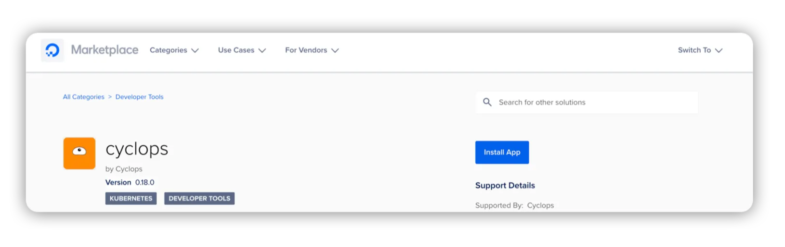
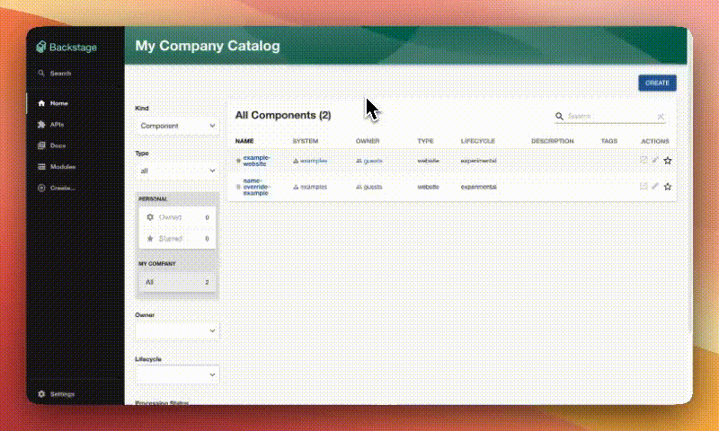
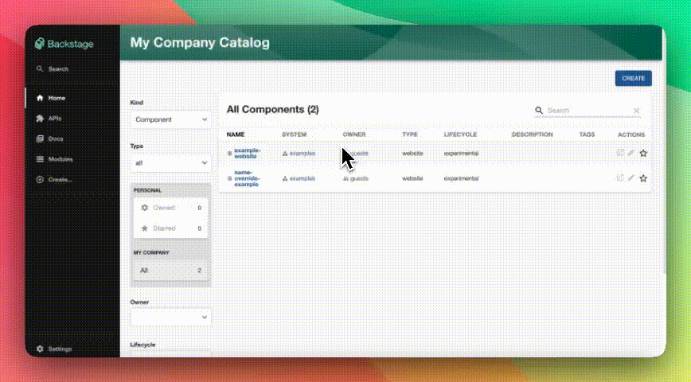

**Cyclops is having its second-ever Launch Week, starting on March 10th!**

Throughout the week, we’ll unveil a new feature of Cyclops every day - **five features in total!**

Features are not the only thing that we will be announcing. Behind the scenes, we have been making friends in the Kubernetes space...

Come back here each day to see what we launch, or follow us on [**X**](https://x.com/CyclopsUI) and [**LinkedIn**](https://www.linkedin.com/company/96014689/) to keep up to date and follow the hashtag **#cyclopslaunchweek2**

## #1 **Migrating Helm Releases to Modules**♻️

Cyclops already picks up on any installed **Helm releases in your cluster.** But when selecting a Helm release, you will notice a new button pop up in the top right corner!

With the release of this feature, you can easily **migrate your Helm releases to Cyclops’ modules!** (Yes, even in bulk!)

You will simply need to choose a template for your migration, and voila! Your applications will be migrated to Cyclops modules without even noticing. They won’t be redeployed and will continue running like nothing even happened.

But that is not the only news we bring! We are super happy to announce our newly established **partnership with Suse!** You can now find a familiar face in the **Rancher Marketplace** and install Cyclops in one click.

## #2 Pushing Modules to Git ⏫

You now have the flexibility to deploy a Module in two ways:

1. **Deploy directly to your Kubernetes cluster**
2. **Push the Module manifest to a Git repository**

Simply specify the repository and path where you want to store the configuration, then click `Deploy`. From there, tools like ArgoCD can take over and deploy the application. Once it's live, Cyclops will automatically detect it and display it in the UI.

When you edit a Module using this workflow, any changes will be pushed to the Git repository, keeping everything in sync.

Check out our [updated documentation](https://cyclops-ui.com/docs/installation/git-write) for more details.

We are also very excited to announce that now you can **find Cyclops on the** **DigitalOcean marketplace!** To celebrate, we have published a tutorial in collaboration with DigitalOcean on how you can easily create an internal developer platform on their Kubernetes clusters.

Check it [out](https://www.digitalocean.com/community/tutorials/build-developer-platform-kubernetes-cyclops)! 🌊

## #3 Backstage Plugin **🧩**

[**Backstage**](https://backstage.io/) is a framework for building developer portals built and **open-sourced by Spotify**.

Developer portals built with Backstage allow you to have a centralized catalog of all applications and services running in your system. All of the applications your developers are working on in a company are listed and organized in a single place.

Another benefit of Backstage is that it centralizes all the tools used for managing software into a single platform, so deployment processes, monitoring, alerting, and so on are all in a single app. This is achieved through Backstage's plugin architecture, **and Cyclops implements its own plugin**.

With the Cyclops plugin, you can view all of your deployed Cyclops applications and get the **full experience of Cyclops in your Backstage instance**.

Check our [docs](https://cyclops-ui.com/docs/backstage/modules-plugin) on how to set it up for yourself!

## #4 Backstage Plugin **🧩**

This launch week, we are releasing not one but two Backstage plugins.

Backstage has a concept of components that represent services and applications in your system so you keep track of your software. In order to allow you to map your components to applications in Cyclops, we released another plugin that is integrated into your component catalog.

Each of your Backstage components will now have an additional tab showing you your Cyclops application with all the **Kubernetes resources and allowing you to edit, roll back, or delete your application**.

With this plugin, your software catalog allows your developers to **deploy their applications and manage the whole lifecycle from a single pane of glass**.

