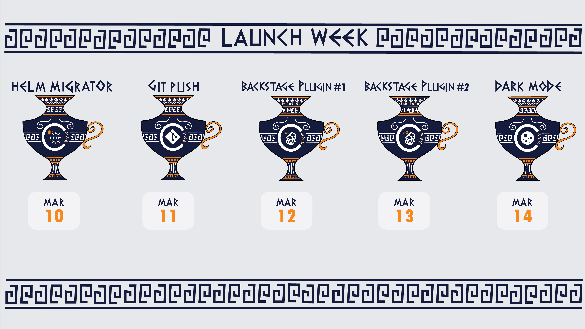
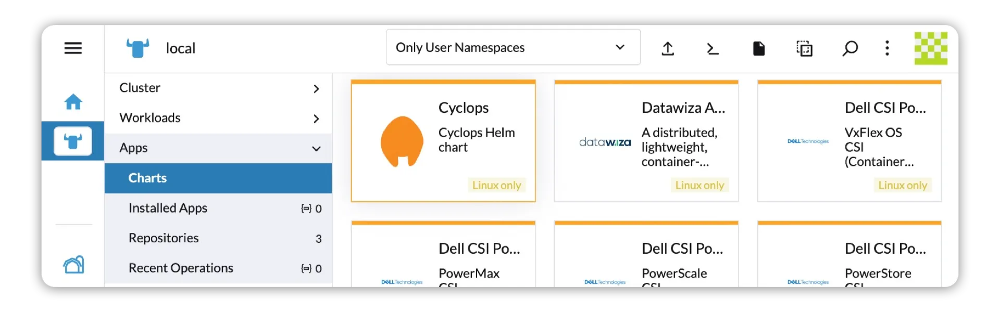

**Cyclops is having its second-ever Launch Week, starting on March 10th!**

Throughout the week, we’ll unveil a new feature of Cyclops every day - **five features in total!**

Features are not the only thing that we will be announcing. Behind the scenes, we have been making friends in the Kubernetes space...

Come back here each day to see what we launch, or follow us on [**X**](https://x.com/CyclopsUI) and [**LinkedIn**](https://www.linkedin.com/company/96014689/) to keep up to date and follow the hashtag **#cyclopslaunchweek2**

## #1 **Migrating Helm Releases to Modules**♻️

Cyclops already picks up on any installed **Helm releases in your cluster.** But when selecting a Helm release, you will notice a new button pop up in the top right corner!

With the release of this feature, you can easily **migrate your Helm releases to Cyclops’ modules!** (Yes, even in bulk!)

You will simply need to choose a template for your migration, and voila! Your applications will be migrated to Cyclops modules without even noticing. They won’t be redeployed and will continue running like nothing even happened.

But that is not the only news we bring! We are super happy to announce our newly established **partnership with Suse!** You can now find a familiar face in the **Rancher Marketplace** and install Cyclops in one click.

