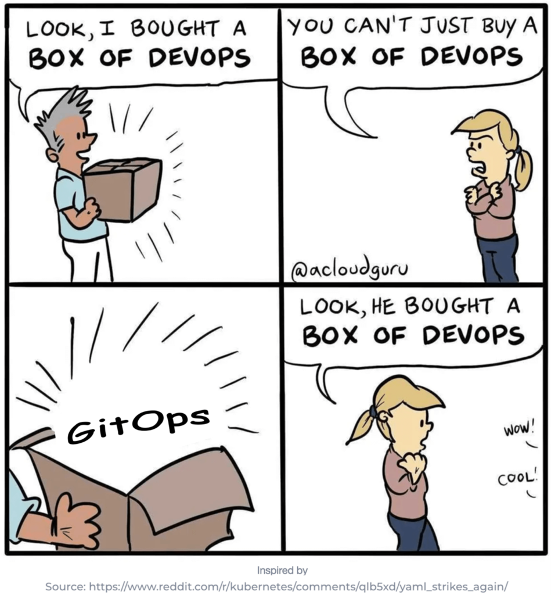
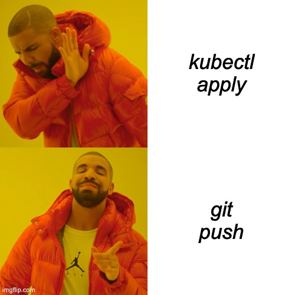
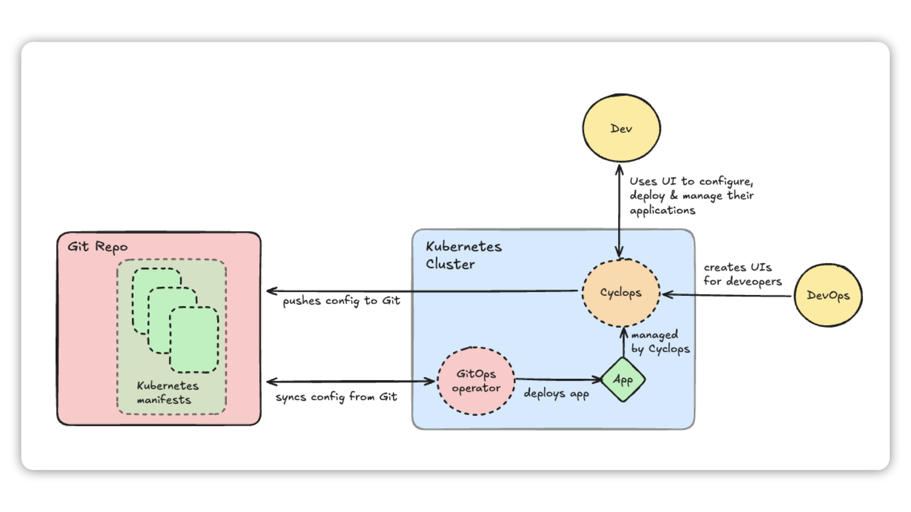

GitOps has changed how teams manage infrastructure and deployments, making everything more automated, predictable, and version-controlled. But a question popped up in our mind: **Can we make it better?**

We are in the business of building Internal Developer Platforms (learn more about them [here](https://cyclops-ui.com/blog/2025/02/13/what-are-dev-platforms)). One of the core values of IDPs is allowing developers to move as fast as possible with as much safety as possible. However, we realized that the traditional GitOps workflow was creating friction for developers.

In this post, I’ll give you a brief history lesson of GitOps - how it started, where we find it lacking, and what we did to push it further…

### *Support us* 🙏

*We know that Kubernetes can be difficult. That is why we created Cyclops, an open-source framework for building developer platforms on Kubernetes. Abstract the complexities of Kubernetes, and deploy and manage your applications through a customizable UI that you can fit to your needs.*

*We're developing Cyclops as an open-source project. If you're keen to give it a try, here's a quick start guide available on our [repository](https://github.com/cyclops-ui/cyclops). If you like what you see, consider showing your support by giving us a star ⭐*

> ⭐ [***Star Cyclops on GitHub***](https://github.com/cyclops-ui/cyclops) ⭐

## What is GitOps?

A prerequisite to GitOps was infrastructure as code. Instead of manually accessing machines that acted as your servers and then using CLI commands to start your applications on them, things like Kubernetes, Terraform, and others have evolved. They allowed you to define your **infrastructure as** **code**, which meant that you had a wanted state of your infrastructure written down - like Kubernetes manifests.

As infrastructure as code grew in popularity, so did the need to collaborate on this code. Slowly but surely, the common best practices used in regular code development were getting adopted in the infrastructure as code space as well.

This meant using git as a **single source of truth**.

Using the git version control to see **who** changed **what** and **when**.

Making **rollback** as easy as `git revert`.

Enabling **collaboration** through pull requests and code reviews.

**Automating** code **tests** and **deployment** of infrastructure as code.

And thus, GitOps was born. In short, your git repository represents the cluster state, and a GitOps operator is constantly working on keeping the cluster state in sync with the state defined in the git repo.

> *Fun fact: There are two methods of deploying with GitOps. The **push method** is where a tool outside the cluster pushes the code into the cluster, and the **pull method** is where a tool inside the cluster pulls the code into it.*

## How we took GitOps a step further

As I mentioned, a **prerequisite of GitOps is infrastructure as code**. In a typical setup, a company has a repository designated to store infrastructure as code - this can be **Terraform**, **Helm charts**, or even plain **Kubernetes manifests**. Whatever it is, it’s usually under the ownership of a DevOps team.

However, DevOps engineers aren’t the only ones that need to work with this configuration. While infra as code is great for many reasons, product developers aren’t thrilled about it. Product developers understand their applications, but expressing their need in a new coding language is hard (even if it is as “simple” as YAML).

And this often is the most painful part of GitOps. **Developers do not understand infrastructure as code** and rely on DevOps engineers to either create the code entirely or have a painful PR and review process. This is neither fun for the developers because they don’t understand what they are doing nor for the DevOps because they are playing help-desk for the developers.

But this is where we can take GitOps a step further…

### Cyclops

**Cyclops** is an **open-source** **tool** for building internal developer platforms on Kubernetes. It **enables** **DevOps engineers to create custom UIs** on top of Kubernetes and enable self-service for the rest of the developers. Basically, a DevOps engineer can import their Helm chart, and Cyclops will create a UI based on it.

From there, developers can use this UI to configure and deploy their applications. Instead of developers having to learn how Helm charts work (infra as code), they can fill out a couple of fields on the UI, have their input validated, and deploy it with a push of a button.

These fields are created by their DevOps engineers, who have the complete freedom to abstract as much (or as little) of Kubernetes and Helm as they want.

But the cool thing about it is that Cyclops can either deploy this configuration straight to the cluster or **push the configuration to a Git repository**.

From there, you can use some other GitOps operator to sync these changes back to the cluster, where Cyclops can then manage the application again. **Any changes done through Cyclops are pushed to git before being applied to the cluster!**

This approach allows you to combine all the benefits of GitOps with the smooth developer experience of a Developer Platform - allowing developers to be fast and independent.

## Learn more

**Cyclops** is entirely **open-source**, you can set it up with a single `kubectl` command, and it comes with a couple of predefined UIs to get you started. You can find a **quick start guide** **on our repository** and, while you are there, consider supporting us by starring our [repo](https://github.com/cyclops-ui/cyclops)! To replicate the image above, you can learn more about how to set Cyclops up with GitOps [here](https://cyclops-ui.com/docs/installation/git-write).

We are also excited to let you know that we are having our second-ever **launch week**! It will run through **10-14 of March** and end with a **Product Hunt launch**! If you are interested in keeping up, join our [**Discord**](https://discord.com/invite/8ErnK3qDb3) or follow us on [**LinkedIn**](https://www.linkedin.com/posts/petar-cvit_cyclopslaunchweek2-cyclopslaunchweek2-activity-7302683939666599938-Ulg1)**,** where we will reveal **a new feature each day** of the week! 🤘

> ⭐ [***Star Cyclops on GitHub***](https://github.com/cyclops-ui/cyclops) ⭐
