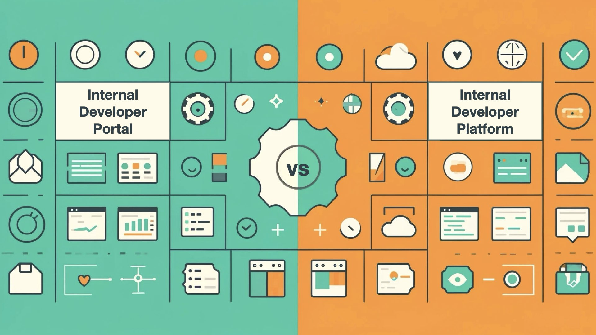
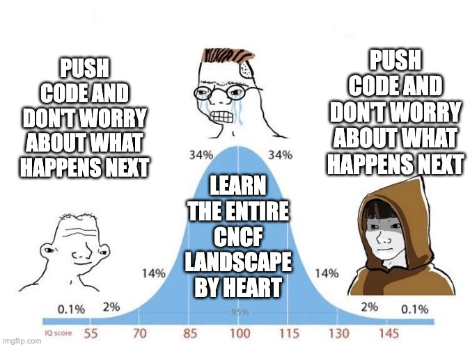
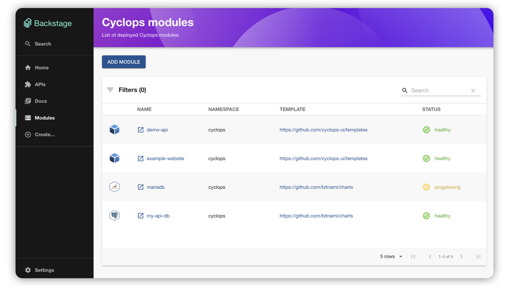

> *TL;DR: The Internal Developer Portal is the interface to the Internal Developer Platform. That's it. You can go now.*

When researching [**Platform Engineering**](https://cyclops-ui.com/blog/2024/10/17/platform-engineering), you'll inevitably come across the acronym **IDP**.

Depending on the source - whether it's a research paper, blog post, or any other piece of content - **IDP** can refer to either an "*Internal Developer Portal"* or an "*Internal Developer **Platform**."* While these terms are often used interchangeably, they actually describe two distinct things with different purposes and functionalities.

To clear up the confusion, I'll show you real-world examples of both an Internal Developer Portal and an Internal Developer Platform so you can see exactly how they differ in practice.

### *Support us* 🙏

*We know that Kubernetes can be difficult. That is why we created Cyclops, an open-source framework for building developer platforms on Kubernetes. Abstract the complexities of Kubernetes, and deploy and manage your applications through a customizable UI that you can fit to your needs.*

*We're developing Cyclops as an open-source project. If you're keen to give it a try, here's a quick start guide available on our [repository](https://github.com/cyclops-ui/cyclops). If you like what you see, consider showing your support by giving us a star ⭐*

> ⭐ [***Star Cyclops on GitHub***](https://github.com/cyclops-ui/cyclops) ⭐

## What are Internal Developer Platforms?

A developer platform is a product built by the platform team to support application developers and the broader engineering organization. Because these platforms are designed for internal use, they’re often referred to as **Internal Developer Platforms.**

An internal developer platform often refers to a multitude of tech and tools that are working together to form **golden paths** - predefined, opinionated workflows that guide developers toward best practices while abstracting complexity and reducing cognitive load.

The platform’s features and use cases should be shaped by what developers actually need, whether that’s provisioning infrastructure, spinning up environments on demand, or maintaining a centralized catalog of services.

At its core, a developer platform should be a force multiplier, helping teams ship faster by eliminating friction and optimizing workflows.

> 💎 In the past, I’ve used a **Minecraft Server** together with **Cyclops** to create an example of what a good **internal developer platform looks like**. Check it out [here](https://cyclops-ui.com/blog/2024/12/12/minecraft) 💎

## What are Internal Developer Portals?

An **Internal Developer Portal** is the **interface** to the **Internal Developer Platform**. If the platform is the backend, then the portal is the **front-end layer** that provides an intuitive way for developers to interact with the platforms capabilities.

The portal acts as a **single entry point** where developers can perform tasks. While an Internal Developer Platform does the “heavy lifting” in the background, the portal makes its capabilities **accessible** through a well-designed UI or API.

This distinction is crucial. Without a portal, an Internal Developer Platform is still usable, but it would likely require developers to interact with it through CLI commands, YAML files, or multiple disconnected tools. The portal removes this friction, making it easy for developers to navigate and use the platform.

> 🎭 Many teams build their own Internal Developer Portals tailored to their needs, but open-source solutions like [**Backstage**](https://backstage.io/) have gained traction as a foundation for building these interfaces. 🎭

## Backstage & Cyclops

If we are talking about **portals**, the most well-known is **Backstage**. It is an open-source framework for building internal developer portals originally developed by Spotify. It provides a centralized service catalog and helps you manage your documentation.

Backstage is called a **framework** because of its extensibility with its plugins feature. Plugins are a way for you to integrate your other tooling into the Backstage portal. There is a whole marketplace of plugins developed and maintained by companies that wanted to integrate with Backstage, but you can also create your own!

This plugin ecosystem, coupled with the Backstages portal, allows developers a single point of access to everything they need.

[**Cyclops**](https://github.com/cyclops-ui/cyclops), on the other hand, is designed specifically to manage applications on Kubernetes. Cyclops is an **open-source** tool for creating UIs on Kubernetes enabling self-service for developers. It allows developers to configure, deploy, and manage their applications.

Since **Cyclops** focuses on a specific layer of a developer platform, it can work well with other tools focused on different aspects. So, it made perfect sense for us to create a [**plugin for Backstage**](https://github.com/cyclops-ui/backstage-plugins)!

> For example, DevOps engineers use Helm to create reusable configuration templates, use Cyclops to provide intuitive UIs for developers and enable self-service deployment and management of their applications, use Prometheus and Grafana to monitor system health and trigger alerts, use Kubernetes as the orchestrator, and finally, wrap it all in the Backstage Portal to offer a unified developer experience.

## It’s not 🤜 🤛, it’s 🤝

So, internal developer portals are the interfaces to the internal developer platforms. They are often used interchangeably because they are part of the same system. By referencing one, you are referencing both of them.

Platforms and portals come in various shapes and sizes. The most well-known **framework for building developer portals** out there is **Backstage**, while **Cyclops** is a **framework for building developer platforms**. Since the release of the Cyclops plugin for Backstage, you can **combine the two**!

The release of the Cyclops plugin is part of our launch week here at Cyclops. We are revealing a new feature every day and will end the week with a [**Product Hunt launch on Friday** the 14th of March](https://www.producthunt.com/products/cyclops-2)!

If you find value in what we’re building, consider supporting us on **Product Hunt** when we launch! Your feedback means a lot to us 🧡

> 🚀 [***Support Cyclops on Product Hunt***](https://www.producthunt.com/products/cyclops-2) 🚀
