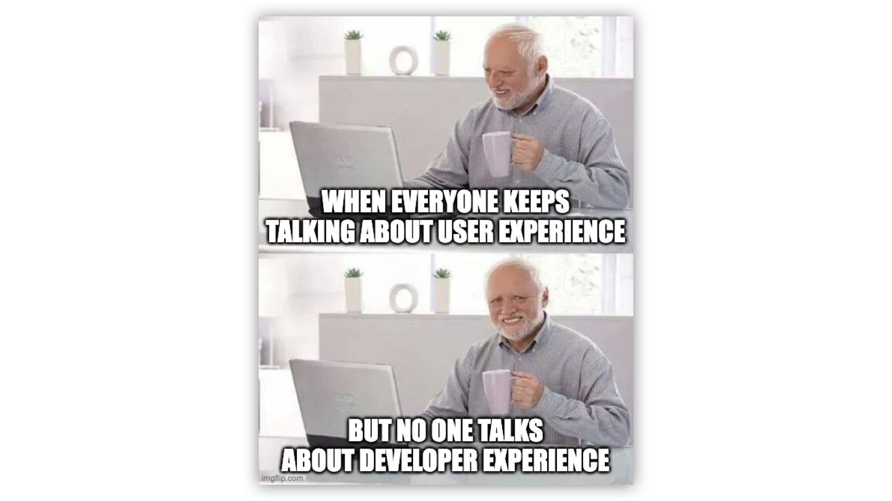

There’s been a quiet shift happening in engineering teams over the last few years. DevOps isn’t going away, but it *is* evolving. More and more companies are moving toward Platform Engineering, and honestly, it makes a lot of sense.

The goal is still the same: help developers ship faster and more reliably. But the approach is different. While DevOps emphasizes collaboration between devs and operations teams through shared responsibility, Platform Engineering seeks to build products that abstract the complexity away from developers. These products are often called [**Internal Developer Platforms**](https://cyclops-ui.com/blog/2025/02/13/what-are-dev-platforms).

Because internal developer platforms come in different shapes and sizes, it can be difficult to provide a clear answer to “Why do I need it?” Their value varies from organization to organization, but I believe the benefits could be grouped into two major categories: **developer experience** and **time to market**.

### *Support us* 🙏

*We know that Kubernetes can be difficult. That is why we created Cyclops, an open-source framework for building developer platforms on Kubernetes. Abstract the complexities of Kubernetes, and deploy and manage your applications through a customizable UI that you can fit to your needs.*

*We're developing Cyclops as an open-source project. If you're keen to give it a try, here's a quick start guide available on our [repository](https://github.com/cyclops-ui/cyclops). If you like what you see, consider showing your support by giving us a star ⭐*

> ⭐ [***Star Cyclops on GitHub***](https://github.com/cyclops-ui/cyclops) ⭐

## Developer Experience

**Developer experience is closely tied to productivity**. When developers have access to clearly defined golden paths, they don’t waste energy figuring out how to deploy something or what’s considered “the right way” to do things.

The **same goes for DevOps engineers**. Instead of acting as a “help desk” for developers every time something needs to be deployed (no matter how small the change may be), they can focus on more important and less repetitive tasks - improving stability, performance, and managing infrastructure costs.

Increasing the developer experience is not only important for productivity but it has also been discovered to boost **developer retention**! For example, when Spotify built its own internal developer platform (known as Backstage), they realized that their developers were [**5% more likely to stay at the company one year later**](https://backstage.spotify.com/discover/blog/how-spotify-measures-backstage-roi/). Having less fluctuation in developers shouldn’t be easily discarded!

> A recent [DORA study](https://dora.dev/research/2024/dora-report/) found a link between IDPs and **burnout**! One of the explanations is that organizations that struggle with developer burnout build IDPs to combat it.

## Time to Market

Simply put, time to market is the amount of time it takes to go **from** **having an idea** **to** actually **delivering a working product** **or feature** to users. Internal platforms dramatically accelerate time to market. The faster developers can ship, the faster the company can grow.

This is something companies of all sizes should aspire to. From startups that want to quickly introduce new features and test ideas on their users, to large enterprises that have rigid processes which slow them down. Having an IDP that provides golden paths for everyone makes the shipping process much smoother.

Faster shipping enables fast iteration, safer experimentation, and more frequent releases. This creates a feedback loop where **velocity drives more learning**, which leads to better features and better outcomes. In simpler terms, faster time to market means more revenue for the company.

> *… therefore, we win on engineering velocity above everything else.*
> 
> *There’s so much to ship. the more we ship, the more reasons people have to use us.*
> 
> *Even when we build the wrong thing or ship something that doesn’t work well, we learn the clearest lessons from something we shipped, not something we hypothesized about…*
> 
> *~ [James Hawkins](https://www.linkedin.com/posts/j-hawkins_choosing-trust-and-feedback-over-process-activity-7309584209394757632-lg9C) co-CEO of PostHog* 🦔

## Bonus Category?

There is a third possible category of benefits, which would be infrastructure cost management. But again, that depends on the type of platform you are building and how your current processes look like.

When it comes to implementing an IDP, you have two options: **buy one** off the shelf or **build it yourself**. Both come with benefits and drawbacks. Buying one can be faster, but you will eventually outgrow it. Building one is preferable, but it takes time and resources.

However, **building one doesn’t have to be from scratch**. In fact, most top-performing teams leverage a combination of open-source and vendor tools ([the data](https://humanitec.com/whitepapers/devops-benchmarking-study-2023)). You can use an open-source tool like [**Cyclops**](https://cyclops-ui.com/) to get you most of the way there! **Check out how we use your Helm charts to build internal developer platforms in a jiffy**!

> ⭐ [***Star Cyclops on GitHub***](https://github.com/cyclops-ui/cyclops) ⭐
