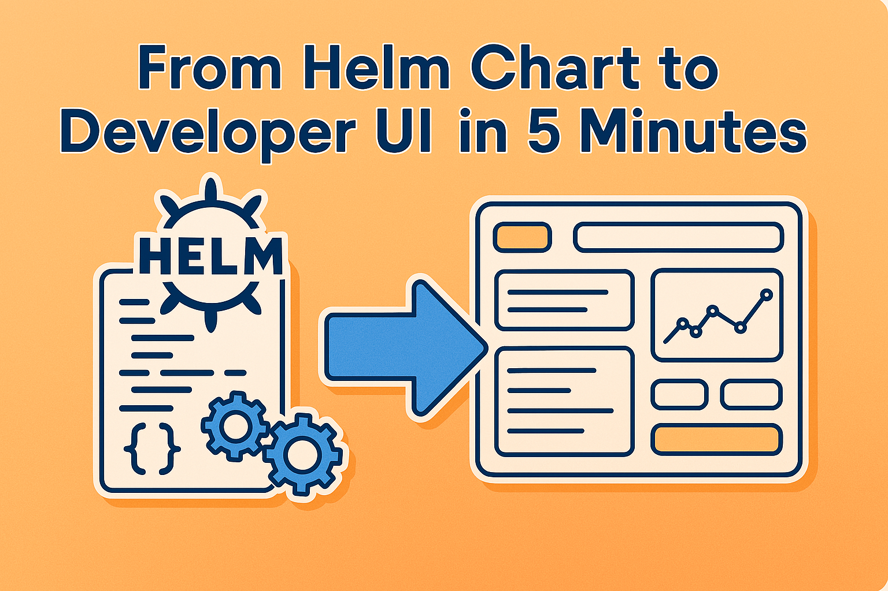
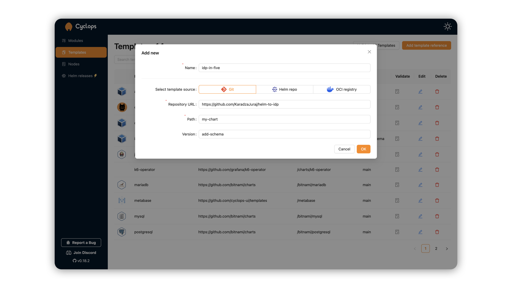
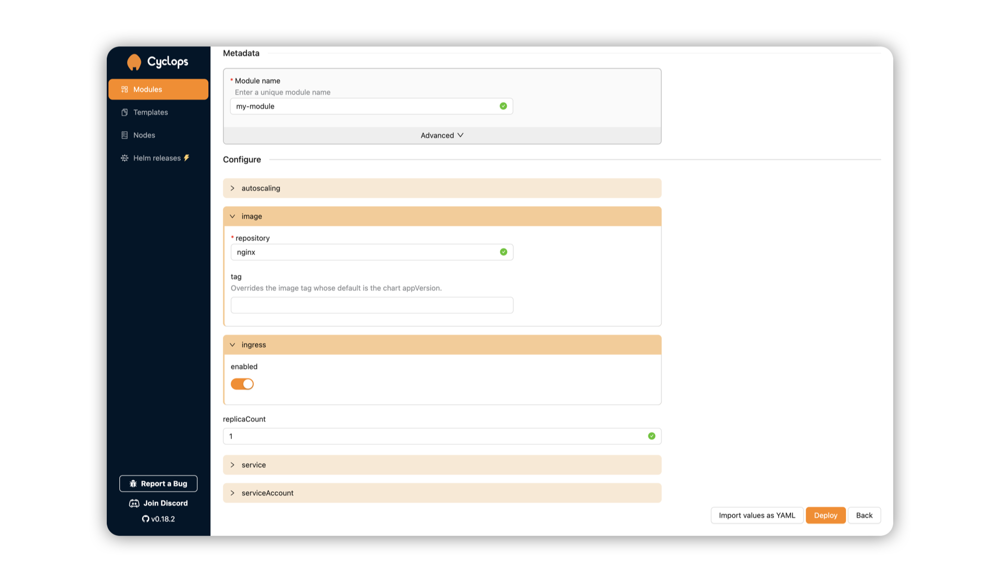
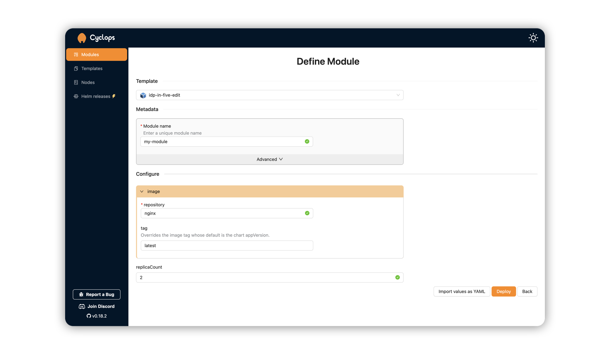
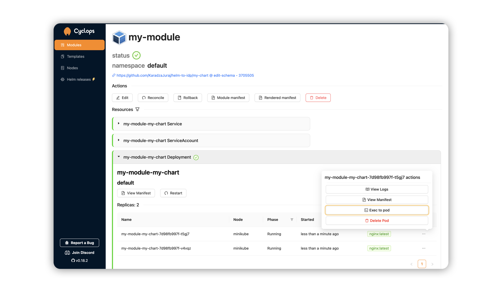

> *Helm is great…*
>
> *…until you give it to a developer.*

The fact is, Helm was made for people who understand Kubernetes. As a DevOps engineer, you can define complex deployments, manage environment-specific configs, and reuse logic with templating. Beautiful.

But for most developers, Helm charts are just confusing. Helm assumes a certain level of Kubernetes fluency that many developers simply don’t have. And that’s okay. They should be focused on building and shipping products, not worry about the underlying infrastructure.

This, however, causes friction since developers become overly reliant on DevOps engineers for every small change and deployment.

Helm **is** great, just not as a user interface.

But let’s fix that! In this post, I’ll show you how to turn *any* Helm chart into a simple UI that your devs (or even non-tech folks) can actually use. It won’t take longer than 5 minutes.

Ready, set, go ⏳

## #1 Cyclops 👁️

[**Cyclops**](https://github.com/cyclops-ui/cyclops) is an **open-source tool** that allows you to build internal developer platforms from your Helm charts. Basically, **you import a Helm chart**, and **Cyclops spits out a UI** based on it.

From there, developers can use this UI to configure, deploy and manage their applications running in a Kubernetes cluster.

The setup is straightforward and just consists of two commands to get you started. You can find it on our webpage or the repository, but I’m also putting it here for easy access:

```bash
kubectl apply -f https://raw.githubusercontent.com/cyclops-ui/cyclops/v0.18.2/install/cyclops-install.yaml && 
kubectl apply -f https://raw.githubusercontent.com/cyclops-ui/cyclops/v0.18.2/install/demo-templates.yaml
```

To access the cyclops-ui you can just port-forward its service, but for production usage you can expose it via an ingress or a load balancer.

```bash
kubectl port-forward svc/cyclops-ui -n cyclops 3000:3000
```

You can now access Cyclops at http://localhost:3000/.

> *While you are at our repo, consider supporting us with a star!*
>
> ⭐  [***Star Cyclops on GitHub***](https://github.com/cyclops-ui/cyclops) ⭐

## #2 Grab your Helm chart 🗃️

You probably have some Helm charts lying around; they will do just fine. If not, [**you can use mine**](https://github.com/KaradzaJuraj/helm-to-idp)! I created a chart using the `helm create` command and haven’t made any changes to it **yet**.

Let’s take a moment and get a closer look at the chart. It consists of 5 resources: a deployment, a service, a service account, an ingress, and a horizontal pod autoscaler. The HPA and ingress are disabled by default, but you can turn them on in the `values.yaml`.

The values file is pretty small here, but, even though this is just the “default” Helm chart, it is enough to turn away most developers.

```bash
my-chart/
├── Chart.yaml                   # Metadata about the chart (name, version, etc.)
├── values.yaml                  # Default configuration values
├── **values.schema.json**           # Generated from the values.yaml
├── templates/               
│   ├── deployment.yaml
│   ├── hpa.yaml                 # Off in default values
│   ├── serviceaccount.yaml.  
│   ├── service.yaml
│   ├── ingress.yaml             # Off in default values 
└── .helmignore              
```

I will be using and playing around with this chart, but you can do the same with any of your existing charts.

I’m going to **add one more thing to the chart** - [**a schema file**](https://helm.sh/docs/topics/charts/#schema-files). While my Helm chart did not come with a schema file, your chart may already have it (you can see it in the structure above as the `values.schema.json`). I [**autogenerated mine**](https://cyclops-ui.com/docs/templates/#generating-helm-chart-schema) and removed the excess lines I didn’t need. You can see the final version [here](https://github.com/KaradzaJuraj/helm-to-idp/blob/add-schema/my-chart/values.schema.json).

## #3 Magic 🧚

Now comes the fun part.

If you have Cyclops set up, open it up in your browser. You will be greeted by the empty Modules screen, but we should first go to the **Templates tab.**

Out of the box, Cyclops comes with a bunch of templates to help you get started, but let’s add our own so that we can play around with it.

Click the `Add template reference` button and input the fields so it points to your Helm chart.

> ⚠️ *If you are using a Helm chart that is stored in a private repository, you can find here* [*how to enable access*](https://cyclops-ui.com/docs/templates/private_templates) ⚠️
>



After you have added your chart, go back to the **modules tab**. It is still an empty screen, but let’s use our new template to deploy a module!

The first step of deploying a module is choosing a template. In the dropdown, find the template that you imported and click on it. Remember the **`value.schema.json` from before**? That’s precisely what Cyclops uses to render the UIs.



As you can see, the fields here correlate with the fields defined in the `value.schema.json`. Changing the schema in the Helm chart, for example [removing a couple of fields like here](https://github.com/KaradzaJuraj/helm-to-idp/blob/edited-schema/my-chart/values.schema.json), will result in a different UI as well.



Cyclops is not just a pretty UI for your Helm charts, though. Once you fill in the form your template renders, you can deploy it as a module! Cyclops can either deploy it directly to your cluster or, if you are more of a GitOps enjoyer, [push the configuration to git](https://cyclops-ui.com/docs/installation/git-write). The end goal is the same: you will have deployed your Helm chart to the cluster using the values provided in the UI.



From here, a developer can easily access everything they might need: restarting their applications, accessing their logs, checking their status, editing the configuration, and much more…

## You’re a Platform Engineer, Harry 🧙‍♂️

While the Helm chart might have been a turn-off for most developers, a simple UI will be far better received. By abstracting away the complexity of Kubernetes and surfacing only the relevant configuration options through a UI, you’ve enabled a safer, faster, and more autonomous workflow for developers.

No more back-and-forth with DevOps for routine changes. No more context-switching to learn Helm. Instead, developers get a streamlined, focused experience that lets them ship their code with confidence. This is the core idea behind **Platform Engineering**: providing a standardized, self-service infrastructure that empowers development teams.

If you want to learn more about platform engineering and building internal developer platforms, join our [Discord community](https://discord.com/invite/8ErnK3qDb3) and come talk to us!

> ⭐ [***Star Cyclops on GitHub***](https://github.com/cyclops-ui/cyclops) ⭐
