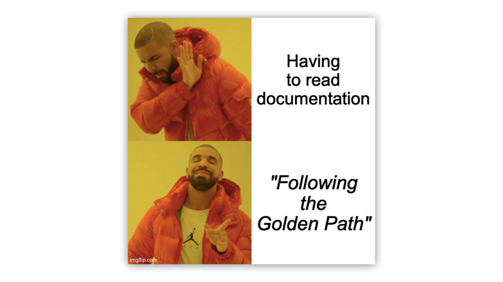

In many companies, the “right way” to do things - like deploying a new service - is often unclear and undocumented. Instead of a clear process, developers end up asking around, getting bounced from teammate to teammate, until they find someone who *might* know the answer. That someone, usually a DevOps or platform engineer, is frustrated because it’s the third time this week they’ve answered the same question. At scale, this quickly falls apart.

Netflix uses the term *Paved Road*, and Spotify uses *Golden Path*, but in the end, they are the same thing. It is an opinionated guide - a set of tools and tutorials that guide you from idea to production. It helps developers follow the organization’s best practices for building, deploying, securing, and maintaining software.

Today, golden paths have become the cornerstone of [platform engineering](https://cyclops-ui.com/blog/2024/10/17/platform-engineering). In this blog post, we will explore what a good golden path looks like and show an example of it in the wild!

### Support us 🙏

*We know that Kubernetes can be difficult. That is why we created Cyclops, an open-source framework for building developer platforms on Kubernetes. Abstract the complexities of Kubernetes, and deploy and manage your applications through a customizable UI that you can fit to your needs.*

*We're developing Cyclops as an open-source project. If you're keen to give it a try, here's a quick start guide available on our [repository](https://github.com/cyclops-ui/cyclops). If you like what you see, consider showing your support by giving us a star ⭐*

> ⭐ [***Star Cyclops on GitHub***](https://github.com/cyclops-ui/cyclops) ⭐

## Why Golden Paths?

Golden paths reduce the mental overhead that developers face. In today’s world, spinning up a new service often means touching infrastructure, figuring out how to set up monitoring, dealing with security concerns, and getting through compliance hoops.

And picking the right tools for the job is also not remotely easy. A golden path walks you through all that and allows the developer to focus on shipping things rather than figuring out how all the tools and processes work together.

For developers, this translates into a faster, happier experience. Less time wasted on boilerplate and tribal knowledge. Fewer mistakes. More focus on building features.

And for organizations trying to scale their DevOps efforts across many teams, golden paths provide a way to extend DevOps capabilities without creating bottlenecks. Everyone moves faster, more safely, and more independently.

> *The term “Golden Path” was originally coined by Spotify, but it has its roots in the science fiction novel - [Dune](https://en.wikipedia.org/wiki/Dune_(novel)), where it represents the only future in which humanity avoids extinction* 😬
>

## What does a good Golden Path look like?

No two Golden Paths are identical. Still, most of them are built around a shared set of guiding principles.

The goal is to reduce the cognitive load for developers (or whoever else the target audience may be). By abstracting unnecessary complexity and offering getting-started documentation, developers can focus on solving problems rather than wrestling with setup.

A well-designed Golden Path serves a specific purpose. Instead of presenting developers with a buffet of choices, it offers a **single, clear, and opinionated way** to get something done that reflects the best practices of the organization.

It is important that they are fully **self-serviceable**. Golden Paths should be discoverable and usable by anyone in the organization without needing to file tickets or wait for someone to provision resources manually.

And finally, golden paths should be optional. However, **if you make** **best practices the most convenient option**, **developers will follow them**.

## Golden Paths and Internal Developer Platforms

Golden paths are tutorials. Internal developer platforms are golden paths made manifest.

Netflix has a [great example](https://netflixtechblog.com/the-show-must-go-on-securing-netflix-studios-at-scale-19b801c86479) of this. Their teams have to go through a checkbox of security best practices when building services. However, they built their own platform (called Wall-E), which allowed developers to bootstrap new services easily with the best security practices already integrated.

Their platform, Wall-E, didn’t just tell developers what to do - it *did it for them*. It made following security best practices the default, not a checklist. A good developer platform bakes the Golden Path into the developer workflow.

When it comes to implementing an IDP, you have two options: **buy one** off the shelf or **build it yourself** (like Netflix did). Both come with benefits and drawbacks. Buying one can be faster, but you will eventually outgrow it. Building one is preferable, but it takes time and resources.

However, **building one doesn’t have to be from scratch**. In fact, most top-performing teams leverage a combination of open-source and vendor tools ([the data](https://humanitec.com/whitepapers/devops-benchmarking-study-2023)). You can use an open-source tool like [**Cyclops**](https://cyclops-ui.com/) to get you most of the way there! **Check out how we use your Helm charts to build internal developer platforms in a jiffy**!

> ⭐ [***Star Cyclops on GitHub***](https://github.com/cyclops-ui/cyclops) ⭐
>