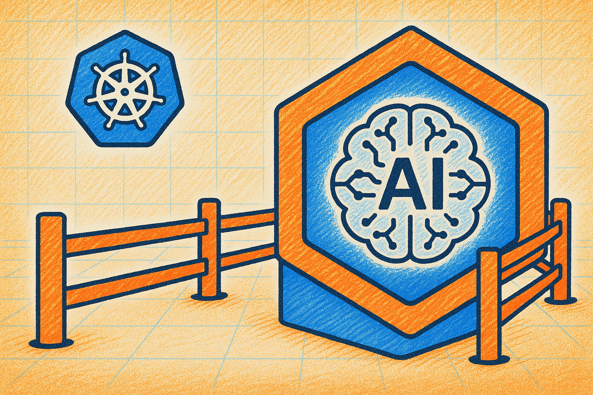
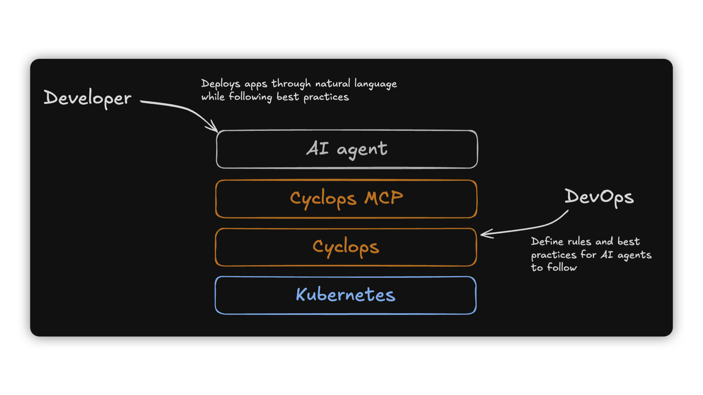
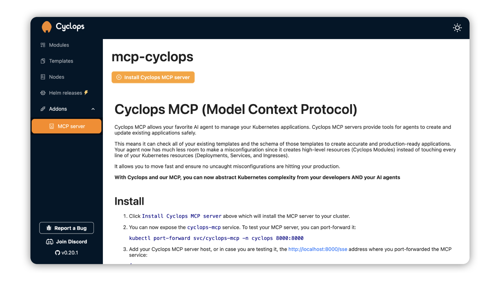

There’s been a ton of hype around AI and developer workflows, but when it comes to Kubernetes, not much has really happened yet - and for good reason. You want your infrastructure to be **stable**, and vibe coding isn’t exactly known for stability.

Imagine your config being rewritten every time you deploy. Even a tiny change like adding an env variable could snowball into a broken system. Or worse: you wake up to a massive AWS bill because your LLM decided you *really* needed a few extra nodes while all you were trying to do was bump a Docker image version.

But what if you could put **guardrails** in place to prevent all that?

Today, **we are launching** our very own [**MCP server for Cyclops**](https://github.com/cyclops-ui/mcp-cyclops), and in this post, I’ll show you how you can enable your devs to **safely** deploy their code to Kubernetes by chatting with an LLM! ***Vibe deploying?*** 👉👉

### Support us 🙏

*We know that Kubernetes can be difficult. That is why we created Cyclops, an open-source framework for building developer platforms on Kubernetes. Build golden paths from your existing configuration and enable safe self-service for your developers and AI agents!*

*We're developing Cyclops and Cyclops MCP as open-source projects. If you're keen to give it a try, here's a quick start guide available on our* [*repository*](https://github.com/cyclops-ui/mcp-cyclops)*. If you like what you see, consider showing your support by giving us a star ⭐*

> ⭐ [***Star Cyclops MCP on GitHub***](https://github.com/cyclops-ui/mcp-cyclops) ⭐
>


## What is an MCP server?

By the end of last year, Anthropic launched the open-sourced Model Context Protocol (MCP) as a way for AI agents to interact with third-party services and APIs. The main goal of the MCP is to standardize how AI agents interact with your data and services.

With an MCP server, your AI agents can safely act on your behalf**.** Instead of guessing which API endpoints to call or listing possible commands for a CLI that might or might not work, they now **know** what they can use.

Also, with an MCP server, your agents are aware of the state of the tools you are using. Meaning that it can now know what Grafana dashboards it can use, what repos you have stored on GitHub, or what tags are available for a Docker image. Just data, no hallucinations, and made-up contexts.

For each of your models and AI agents, you can configure which MCP servers they should connect to to take action on your behalf. For each of the vendors I mentioned above (Grafana, GitHub, and Docker), there is a corresponding MCP server that translates agent requests into real actions on said providers.

Since Cyclops is all about making developers' lives easier, we implemented our own MCP server that you can install into your Kubernetes cluster and **deploy your applications using natural language.**



## Cyclops MCP

> [***Check Cyclops MCP on GitHub***](https://github.com/cyclops-ui/mcp-cyclops)
> 

Cyclops itself is a tool to abstract your Kubernetes configuration behind a customizable and simple UI. Under the hood, all Cyclops applications can be defined as Kubernetes objects. To define an application, Cyclops introduces a Kubernetes [CustomResourceDefinition](https://kubernetes.io/docs/tasks/extend-kubernetes/custom-resources/custom-resource-definitions/) called Module.

When a developer creates an application through Cyclops' UI, the Cyclops backend will create an instance of a Module. Cyclops MCP exposes `tools` for managing Modules and templates from which to create Modules.

Cyclops MCP is not cutting the DevOps out of the equation - the DevOps engineer is responsible for creating templates and making sure applications are following best practices. Through templates, DevOps engineers will define which low-level K8s resources will be created and what configuration developers and AI agents should follow when deploying an application.

You can now ask your AI agent to deploy your app using natural language. It translates your request into a configuration that meets the DevOps engineer's schema, ensuring best practices and production readiness.

### Prerequisites

Prerequisites to try out Cyclops MCP are to have a running Kubernetes cluster, [`kubectl`](https://kubernetes.io/docs/tasks/tools/#kubectl) installed, and Cyclops installed in your cluster. If you don’t have a running cluster, you can create one with [Minikube](https://minikube.sigs.k8s.io/docs/start).

To install Cyclops in your cluster, run the commands below:

```bash
kubectl apply -f https://raw.githubusercontent.com/cyclops-ui/cyclops/v0.20.1/install/cyclops-install.yaml && kubectl apply -f https://raw.githubusercontent.com/cyclops-ui/cyclops/v0.20.1/install/demo-templates.yaml
```

It will create a new namespace called `cyclops` and deploy everything you need for your Cyclops instance to run.

Now all that is left is to expose the Cyclops server outside the cluster:

```bash
kubectl port-forward svc/cyclops-ui 3000:3000 -n cyclops
```

You can now access Cyclops in your browser on [http://localhost:3000](http://localhost:3000/).

### Install Cyclops MCP

1. If you are running Cyclops `v0.20.1` or above, you can install the Cyclops MCP by going to the sidebar `"Addon"`> `"MCP server"`. You can now click `"Install Cyclops MCP server"`, and your Cyclops MCP server will be up and running in a few seconds.

    

    Alternatively, if you are running a Cyclops version before `v0.20.1`, the Cyclops MCP can be installed with the following command:

    ```bash
    kubectl apply -f https://raw.githubusercontent.com/cyclops-ui/mcp-cyclops/refs/heads/main/install/mcp-server.yaml
    ```

2. Now that your MCP server is up and running, all that's left is exposing it outside of your cluster and connecting your AI agent to it.

    To expose the MCP server on localhost, you can simply port-forward it with the following command:

    ```bash
    kubectl port-forward -n cyclops svc/cyclops-mcp 8000:8000
    ```

    Your server is now available on `localhost:8000`.

3. To connect it to an AI agent, you will just have to provide the Cyclops MCP server in its configuration. For example, to add it to Cursor, you can add it with the following JSON:

    ```bash
    {
      "mcpServers": {
        "mcp-cyclops": {
          "url": "http://localhost:8000/sse"
        }
      }
    }
    ```

4. You can now start a fresh conversation with your AI companion. Below is an example of how we used it with cursor. You can always see all of the deployed applications in Cyclops and edit them from the UI as well.

<iframe
  width="100%"
  height="500"
  src="https://www.youtube.com/embed/g9FtMX2rSQk"
  title="YouTube video"
  frameborder="0"
  allow="accelerometer; autoplay; clipboard-write; encrypted-media; gyroscope; picture-in-picture"
  allowfullscreen
></iframe>

## Kubernetes MCP

Before wrapping up, there is one question we have to get straight: “Is there a Kubernetes MCP server I can use to talk to my cluster directly?” - **There is!**

However, there is a big caveat here. With implementations of Kubernetes MCP, you will let your AI agents deploy lower-level resources like Deployments, Services, Ingresses, and so on. Each company (or even Kubernetes cluster) will have its specifics on what tech to use and how one should deploy their application.

When you tell your agent to “Expose my application outside of the cluster.”, it can do it in a variety of ways. The AI agent could just spawn new Ingresses, but that might not be the way it exposed another application a week ago, leading to inconsistency in the cluster.

The agent will not follow best practices while deploying an application, which could lead to misconfiguration, production outages, or security breaches.

Kubernetes is complex, and how it’s set up varies from cluster to cluster - because of that, AI agents can’t always give you the right configuration for your case.

## Final thoughts

We believe that AI is finding its place in the developer workflow, but there should be levels of abstractions and validations to enable it and make it as safe as possible. This is our first step in this direction.

We built this **open-source**; feel free to try it out and let us know what you think! [Join our Discord](https://discord.com/invite/8ErnK3qDb3) and help shape the discussion around AI and Kubernetes 🙌

> ⭐ [***Star Cyclops MCP on GitHub***](https://github.com/cyclops-ui/mcp-cyclops) ⭐
>