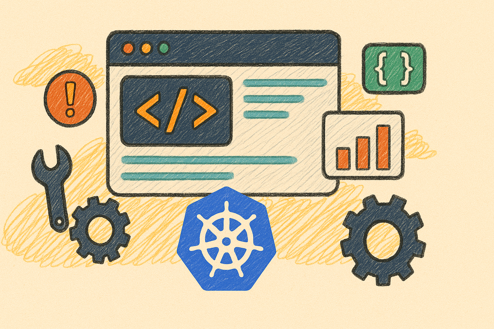
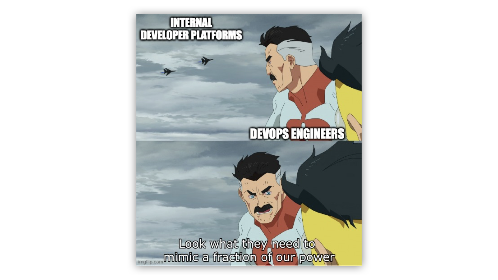
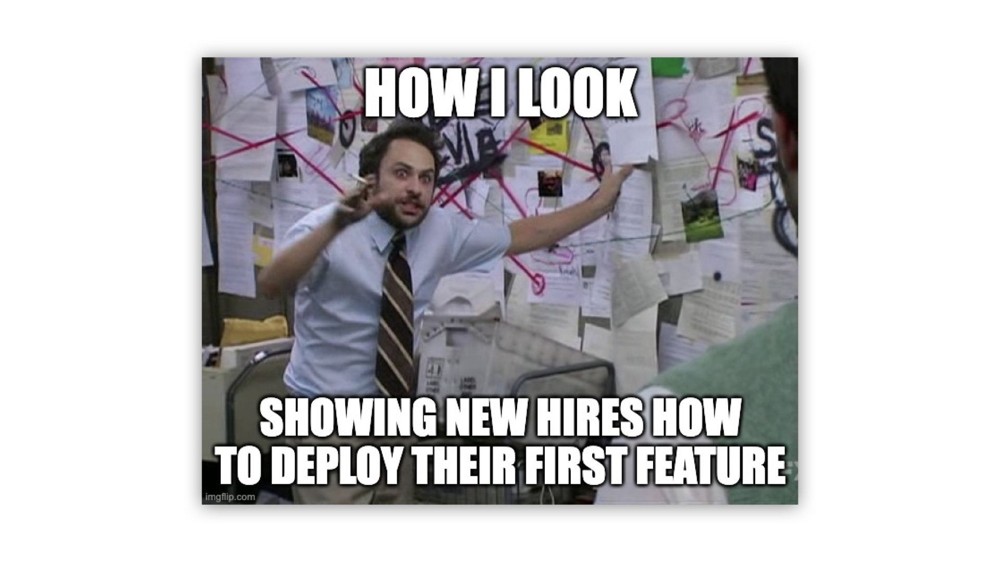
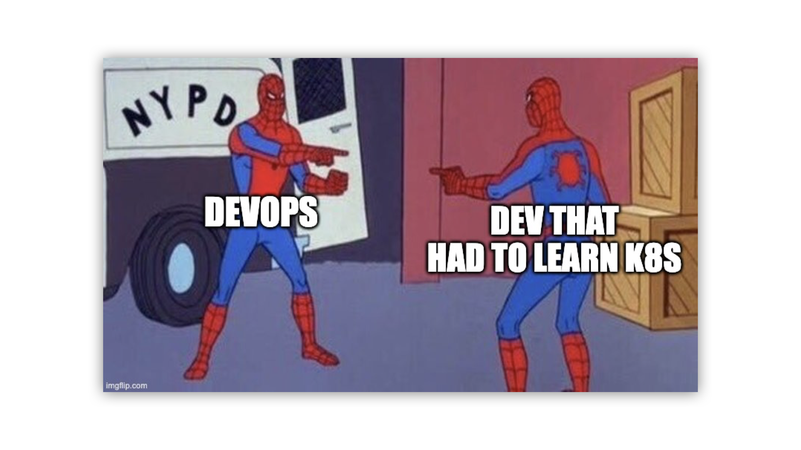

Helping developers ship software quickly and safely is one of the most rewarding parts of building a great engineering culture. But as teams grow, systems evolve, and responsibilities shift, things can start to get… a little chaotic.

Deployments get more complicated. Onboarding gets slower. Support requests start piling up. It’s not anyone’s fault - it’s just a sign that you are ready for the next step.

More and more teams are turning to [Internal Developer Platforms (IDPs)](https://cyclops-ui.com/blog/2025/02/13/what-are-dev-platforms) to help developers self-serve and keep their momentum.

But how do you know when it's time to invest in one?

We put together a lighthearted guide - told through memes - to help you spot the signs early. If you recognize a few of these, you're not broken, you're just “mature” enough for a better way to build and ship.

### Support us 🙏

*We know that Kubernetes can be difficult. That is why we created Cyclops, an open-source framework for building developer platforms on Kubernetes. Abstract the complexities of Kubernetes, and deploy and manage your applications through a customizable UI that you can fit to your needs.*

*We're developing Cyclops as an open-source project. If you're keen to give it a try, here's a quick start guide available on our [repository](https://github.com/cyclops-ui/cyclops). If you like what you see, consider showing your support by giving us a star ⭐*

> ⭐ [***Star Cyclops on GitHub***](https://github.com/cyclops-ui/cyclops) ⭐
>

### 🚩 Sign #1: Developers constantly ping DevOps asking for “just a quick hand”

No matter how much you automate, someone always needs "just one little thing."

Maybe it’s a config tweak. Maybe it’s a manual deployment. Maybe it’s an “emergency” that's really just a Friday afternoon feature rollout.

Every interruption might feel small, but together, they pull DevOps engineers away from bigger projects.

An IDP puts the power in developers' hands, letting them handle common workflows themselves - without hijacking your sprint.

### 🚩 Sign #2: Onboarding a new engineer takes a *long* time

Getting new developers onboarded to your system is never easy. It’s always a struggle to get accustomed to a new codebase, but having to learn all the processes, steps and rules to running that codebase is a job in itself.

Having all of that offloaded to an IDP, where new developers can run their codebase with a couple of button clicks is a **huge** timesaver. Also, it is [shown to reduce developer churn](https://backstage.spotify.com/discover/blog/how-spotify-measures-backstage-roi/)!

### 🚩 Sign #3: **You find yourself praying before every deployment**

Shipping code should feel boring - in a good way.

The metrics that [DORA](https://dora.dev/) looks for when determining the maturity of DevOps within an organization is **how often** new code is **pushed to production** and **how fast it takes to get there**. An IDP allows developers to ship faster, more often, and with confidence - less tickets, less gatekeeping, and less stress.

### 🚩 Sign #4: Your 'deployment guide' is a 47-step *outdated* Google Doc

Sure, at one point the documentation was beautiful.

Then the system evolved, the workflows changed, and suddenly your "official deployment guide" is two releases behind and filled with half-truths.

An IDP turns that messy checklist into a clear, consistent workflow that actually matches reality.

### 🚩 Sign #5: Developers have PTSD from editing IaC

Infrastructure as Code is powerful - but usually, it’s not exactly beginner-friendly. While DevOps engineers might be comfortable digging into it, most developers just want to deploy their service and move on.

A good internal developer platform hides that complexity behind intuitive interfaces - whether it’s a UI, CLI, or API. Developers get a clear, guided path to configure their services, while DevOps keeps the power and flexibility under the hood.

### 🚩 Sign #6: **Your developers are better at Kubernetes than your DevOps team… accidentally**

It’s great when developers are curious and eager to learn but if they’re forced to become Kubernetes experts, it’s a sign of friction.  Sure, it's a good skill to have - but it also means your system is asking too much.

With a developer platform, you can give them easy-to-use tools that abstract the complexity, speed up deployments, and let them stay focused on what they do best: building great products.

## 🛡️ If these hit a little too close to home...

You’re not alone - and you’re not stuck.

**Cyclops** helps you build an **internal developer platform** in a jiffy on top of your existing tech stack. Customizable for DevOps, intuitive for developers.

[Learn more about **Cyclops**](https://github.com/cyclops-ui/cyclops) and give your team the platform they deserve.

Or at least give your DevOps engineers their weekends back.

> ⭐ [***Star Cyclops on GitHub***](https://github.com/cyclops-ui/cyclops) ⭐
>