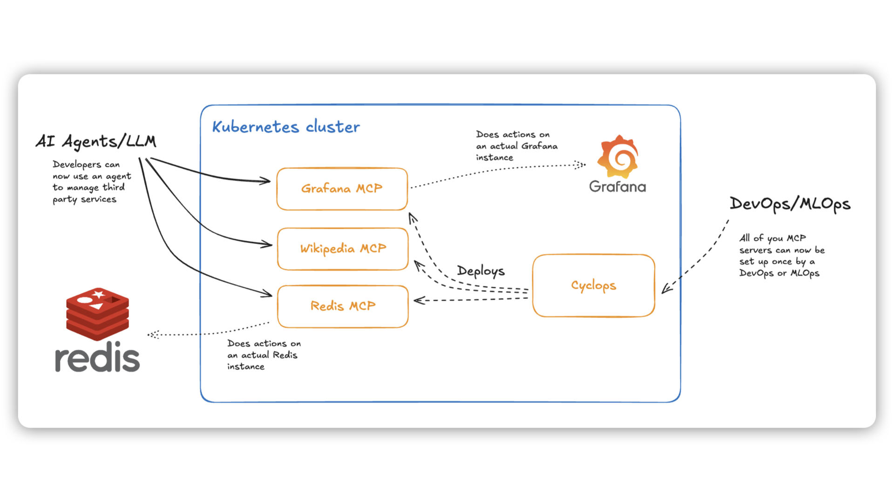

For the past couple of months, the concept of MCP has been booming. MCP (Model Context Protocol) was developed and released by the end of 2024 by Anthropic. It allows AI agents and LLMs to interact with third-party APIs in order to work with real data and allows them to make actions on your behalf.

In the case of a Redis MCP, as you will see further in the blog, it means that you can search through your database using natural language.

Now, to utilize MCP and allow it to interact with other APIs, you will need an MCP server that exposes tools for your agents to use.

The big question is how to run your MCP servers without making life harder for your developers. Having everyone set up their own local server is tedious and invites all kinds of inconsistencies. Centralizing it as a shared service keeps things simple, secure, and lets your team focus on building, not babysitting servers.

Through the blog, we will cover how you can run MCP servers on Kubernetes. With such a setup, you can use them for different use cases and allow your developers to connect to them without a hassle.

### Support us 🙏

*We know that Kubernetes can be difficult. That is why we created Cyclops, an open-source framework for building developer platforms on Kubernetes. Abstract the complexities of Kubernetes, and deploy and manage your applications through a customizable UI that you can fit to your needs.*

*We're developing Cyclops as an open-source project. If you're keen to give it a try, here's a quick start guide available on our [repository](https://github.com/cyclops-ui/cyclops). If you like what you see, consider showing your support by giving us a star ⭐*

> ⭐ [***Star Cyclops on GitHub***](https://github.com/cyclops-ui/cyclops) ⭐
>


## Anatomy of an MCP server

MCP servers support two types of transport, or “how an AI agent communicates with the server” - `stdin` and `SSE`.

Stdin servers are run as a binary, and the agent creates requests to the server through the standard input and receives the responses through the standard output. This works well locally, but in a company setup, having every developer run a server can get messy.

On the other hand, the servers with SSE (Server-Sent Events) transport communicate via HTTP. Agents subscribe to the server on the SSE endpoint to receive responses, and then initiate requests via POST requests.

With the SSE transport, the MCP server is centralized in a controlled environment and exposed as a shared service. This not only improves the developer experience by eliminating the need for individual setup but also **reduces configuration inconsistencies** and **minimizes the risk of introducing security vulnerabilities** from locally managed instances.

## MCP servers architecture setup

We created a setup on how you can deploy your favorite MCP servers to your Kubernetes cluster. After you are done deploying your MCPs, you will have a centralized place where you can easily manage them inside the cluster or deploy new ones. 

With Cyclops, we created a custom template that allows you to easily deploy MCP servers through a UI - even deploying a custom MCP server from a Docker image.



In the image above is the architecture suggested earlier.

A dedicated engineering team owning MCP servers can run and manage them through the Cyclops UI. The team can configure the MCP servers to communicate with existing third-party applications like Grafana and Redis.

From there, all the other engineers can simply connect their Cursor to the exposed MCP server and allow it to make actions on their behalf.

Below are the exact setups on how to try this out yourself! Let us know what you think!

## Run MCP servers on Kubernetes

To run your MCP servers, there are a couple of prerequisites:

- a running Kubernetes cluster
    - If you don’t have a running cluster, you can create one with [minikube](https://minikube.sigs.k8s.io/docs/start).
- [`kubectl`](https://kubernetes.io/docs/tasks/tools/#kubectl) installed
- AI agent - we used Cursor in the tutorial

You can now install Cyclops into your Kubernetes cluster with the following command (comes with the UI for deploying MCP servers):

```bash
kubectl apply -f https://raw.githubusercontent.com/cyclops-ui/cyclops/v0.20.3/install/cyclops-install.yaml && kubectl apply -f https://raw.githubusercontent.com/cyclops-ui/cyclops/v0.20.3/install/demo-templates.yaml
```

It will create a new namespace called `cyclops` and deploy everything you need for your Cyclops instance to run.

Now all that is left is to expose the Cyclops server outside the cluster:

```bash
kubectl port-forward svc/cyclops-ui 3000:3000 -n cyclops
```

You can now access Cyclops in your browser on [http://localhost:3000](http://localhost:3000/).

## Redis MCP Example

Now that your Cyclops is up, we can run a Redis instance inside our cluster along a Redis MCP connected to that instance.

To run a Redis instance, go to Cyclops and click “Add module”. You can now select from a bunch of templates, from which you can choose the Redis template.


You can now set authentication for your instance (will be used for connecting an MCP server to your instance):


I set my password to `my-secret-password` - we will need it later when connecting our Redis MCP to it. I can now hit `Deploy` to run my Redis instance.

You will now be redirected to the Module details page showing your Redis coming to life. Once your Redis instance is ready, you can create an MCP server and connect it to manage your instance.


To run an MCP server, go to the `Add Module` screen and select the `mcp-server` template. In the `Configure` section, there will be a dropdown determining what kind of MCP server you need, which in this case is `redis`.

To authenticate the MCP server to the Redis instance we just deployed, we need to pass it the host and the password:

- `REDIS_HOST` - host of your instance. Your instance should be accessible on `{module name}-redis-master.{namespace}`. The instance we deployed is called `cache` and is running in the `default` namespace - hence `cache-redis-master.default`
- `REDIS_PORT` - default port is `6379` which we didn’t change
- `REDIS_PWD` - set in the auth previously. In our case, `my-secret-password`. For production use cases, you can use the secret references below in the UI.


Once your MCP server is up and running you need to expose it outside of your cluster. Fort testing, you can do it by port-forwarding it. You can do that by running the following command:

```bash
kubectl port-forward -n default svc/redis-mcp 8000:8000
```

If you named your MCP module differently, replace `redis-mcp` with the name of your Module.

You can now configure Cursor to connect to your MCP server in the JSON configuration:

```json
{
  "mcpServers": {
    "redis": {
      "url": "http://localhost:8000/sse"
    }
  }
}
```

You can now ask Cursor about the state of your Redis database and data inside it.

### Other MCP servers

With the template you just used, you can easily deploy a [Wikipedia MCP server](https://github.com/Rudra-ravi/wikipedia-mcp), a [Grafana MCP server](https://github.com/grafana/mcp-grafana), or something custom by selecting `custom` in the service dropdown and defining the Docker image in the `Custom Docker image override` section.

## Final thoughts

We believe that AI is finding its place in the developer workflow, but there should be levels of abstractions and validations to enable it and make it as safe as possible. This is our first step in this direction.

We built this **open-source**; feel free to try it out and let us know what you think! [Join our Discord](https://discord.com/invite/8ErnK3qDb3) and help shape the discussion around AI and Kubernetes 🙌

> ⭐ [***Star Cyclops on GitHub***](https://github.com/cyclops-ui/cyclops) ⭐
>