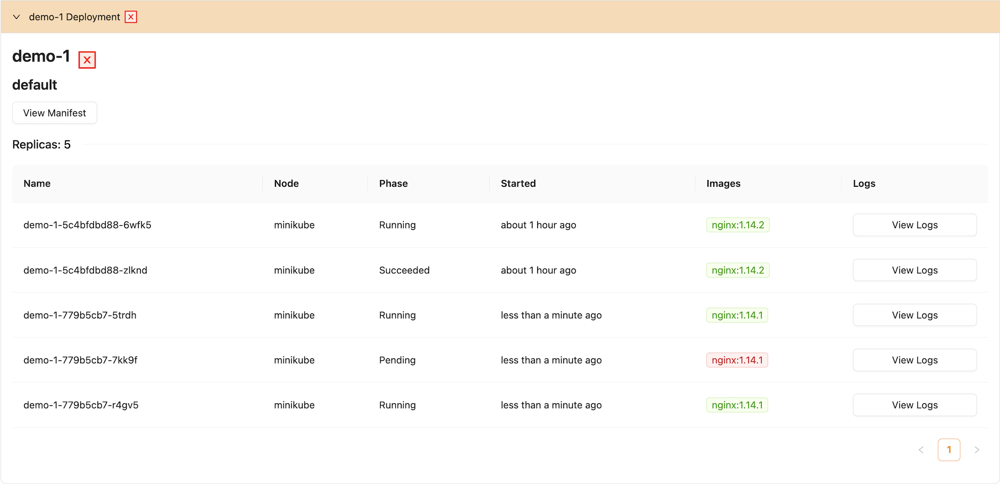
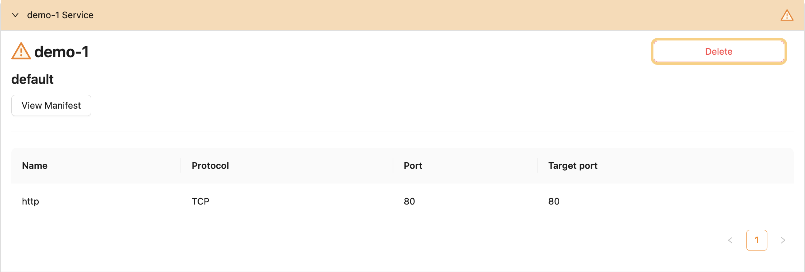

# Edit Module

Let's edit the values of our module and see what happens! The first step is to click on the _Edit_ button.

## Replicas || Version

Try changing the number of replicas or the version of the image (`1.14.2` -> `1.14.1`) to see how the pods are changing.

In the image above, we can see that we have some pods running on version `1.14.2` that are waiting to be replaced by pods of version `1.14.1`. In the end, only the `1.14.1` pods will be up and running.

## Service Toggled Off

When toggling off a module's service, the service won't be automatically deleted. Instead, there will be a warning sign that indicates that the template no longer supports the service, and you can delete it manually if necessary.

Now, you can delete the service by clicking the _Delete_ button.

## Potential Problems

### Naming

If an error pops up referencing [the Kubernetes naming
convention](https://kubernetes.io/docs/concepts/overview/working-with-objects/names/), try conforming to the following rules:

1. [x] contain no more than 63 characters
2. [x] contain only **lowercase** alphanumeric characters or '-'
3. [x] start with an alphanumeric character
4. [x] end with an alphanumeric character
