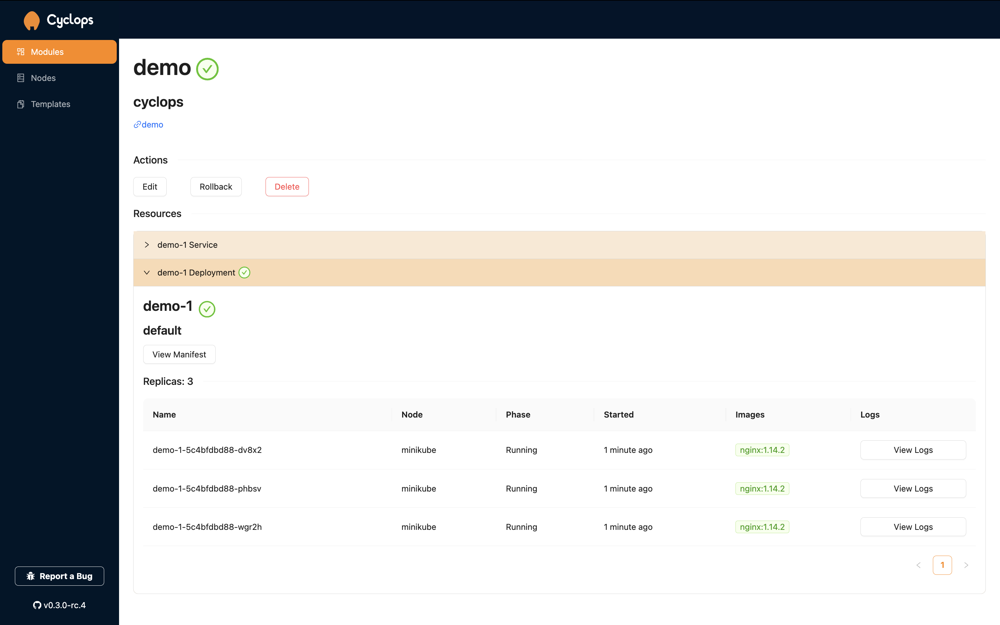
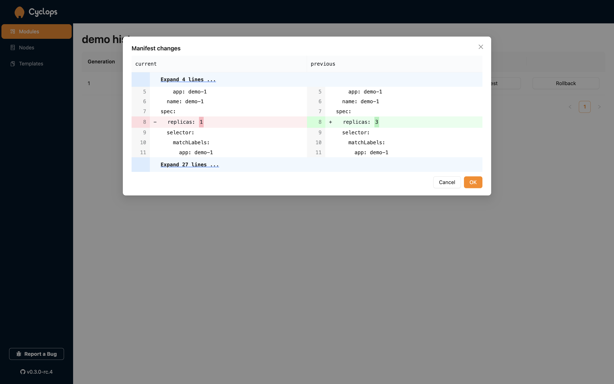
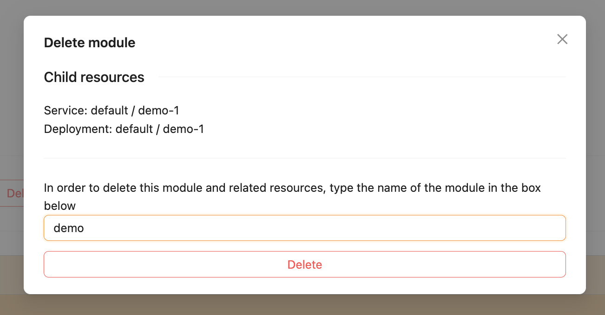
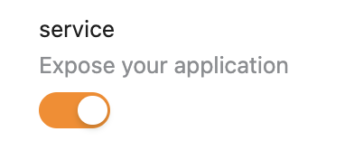
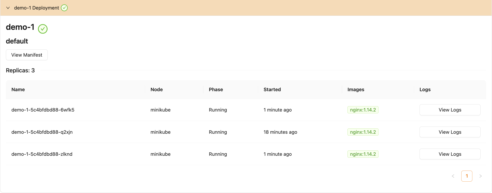

# The Module Screen

After you have created your first module, it is time to take a look at the Cyclops dashboard. The first thing we can see in the top left corner is the name of our module (`demo`), the namespace (`cyclops`) where the module inhabits in the cluster and the link that points towards the GitHub repository where the template is located.

## Actions

Here, we have listed the actions available for the current module.

### Edit

The _Edit_ button takes you to a new screen where you can edit the data we provided when creating the module. Let's leave it at that for now, and we will go more in-depth in the next [chapter](edit_module).

### Rollback

The _Rollback_ button lets you see the history of changes that you made to your module. Since we haven't made any changes, this screen should be empty.

However, every time you edit your module, you can find the trail of changes here. _Manifest_ will show you how the previous version looked, and _Rollback_ will show the difference between the current version and the version you want to roll back to. By clicking _OK_, your module will be reverted to the previous state.

### Delete

The _Delete_ button lets you delete the current module. When clicked, a popup window will appear, showing all the resources you are about to delete. If you wish to proceed with deleting your module, you are required to write the module name in the box. If correctly written, the _delete_ button will turn red and can be clicked.

This action deletes the module and all its associated resources from the cluster!

## Resources

The module's resources are displayed here. These resources include _Deployments_ and/or _Services_ (other resources are still in development!). The _Services_ tab is only visible when toggled in the configuration.

### Deployment

Here are your deployments. Depending on the number of replicas you wanted, there should be an equal amount of pods.

[//]: # 'TO-DO: remove "...in the current version of Cyclops..."'

The topmost element we can see is the deployment's name, which in our case is `demo-1`. Right under, we can see the namespace where our deployment is located. In the current version of Cyclops, all of your deployments and services are put in the `default` namespace. Right under the namespace stands a button _View Manifest_. This button creates a popup that allows you to see the configuration file Cyclops created after you filled in the values for the template.

The Pods are displayed one under another. You can see their name, node, phase, lifetime, image and logs. _View Logs_ is another popup window that displays the last 100 logs of the pod. If you are still interested in the logs feature, learn more about it in the [Logs tutorial](logs). For now, let's provide a short explanation for of the columns in the Deployment section:

1. `Name` shows the full name of the pod
2. `Node` shows the node in which the pod is running
3. `Phase` shows the pod's current phase. This can be _Running_, if it's up or _Pending_, if it's trying to start up
4. `Started` shows how long is the pod already running for
5. `Images` shows which Docker images the pod is using
6. `Logs` shows the last 100 logs for each of the pod's containers

### Service

Here is your service. In Kubernetes, a Service exposes a network application running as one or more Pods in your cluster. Here, we can also see the name of our service, `demo-1`, the namespace it inhabits, `default`, and the manifest. Underneath it, it shows the service's port and where it is pointing (the port of the pods).
