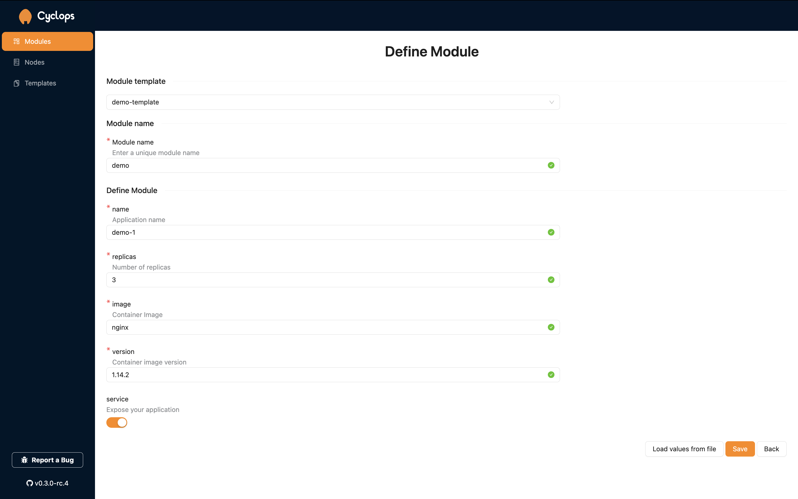

# New Module

Now that your Cyclops instance is deployed locally, you can deploy an application into the cluster through Cyclops.


## Add a New Module

When you start up Cyclops, the first screen shown to you is the _Modules_ screen. This screen should be empty at the moment. What we want to do next is click on the _Add module_ button in the top right corner.

## Define Your Module

Now, we want to define our new module. Every Cyclops instance comes with a couple of predefined templates, which we included. From the dropdown under _Module template_, you can choose which predefined templates you want to use. For the sake of this tutorial, we will use `demo-template`.

If you want to learn more about templates and how to create your own, check out the [Templates section](../../templates/templates.md)!



If you play around with different templates, you will find that Cyclops is highly customizable. Depending on the template used, this screen will be different.

Now, all left to do is fill the form with values and click _Save_!

Here is an example of values you could use:

```yaml
Module name: demo
name: demo-1
replicas: 3
image: nginx
version: 1.14.2
service: true
```

## Module Overview

Once you have deployed your application, you will be taken to a new page to find the overview of all the resources your new module uses.


If you have tried out Cyclops with the suggested template and values, you can open your deployed application by exposing it to the outside world and visiting it.
Expose it with the following command:

```bash
kubectl port-forward svc/demo-1 8888:80
```

If this step was successful, you could try visiting [http://localhost:8888](http://localhost:8888), and you should see the Nginx hello message.


This was just a simple example. There are more templates for you to explore, and you could try creating your own.

## Potential Problems

### Naming

If an error pops up referencing [the Kubernetes naming
convention](https://kubernetes.io/docs/concepts/overview/working-with-objects/names/), try conforming to the following rules:

1. [x] contain no more than 63 characters
2. [x] contain only **lowercase** alphanumeric characters or '-'
3. [x] start with an alphanumeric character
4. [x] end with an alphanumeric character

### Error Loading Template

If you are using your own template, be sure that you connected it correctly.

This usually means that you didn't input the right `url + path + version`. When connecting the template to Cyclops, you need to copy the URL from the GitHub repository that leads to the template. The URL must lead to a directory that holds a `template` folder.

In our example, we filled the form with the values below:

```yaml
repository: https://github.com/cyclops-ui/templates
path: demo
version: main
```

Try connecting it again in the `Templates` tab.

:::warning
**Private repositories are not yet supported!**

This is currently a high priority on our roadmap, and you should expect support for private repositories sooner rather than later.
:::
