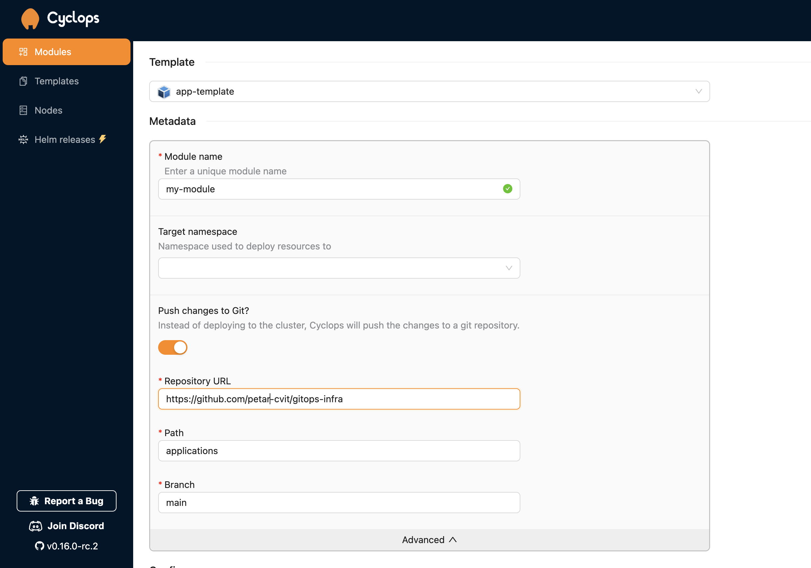
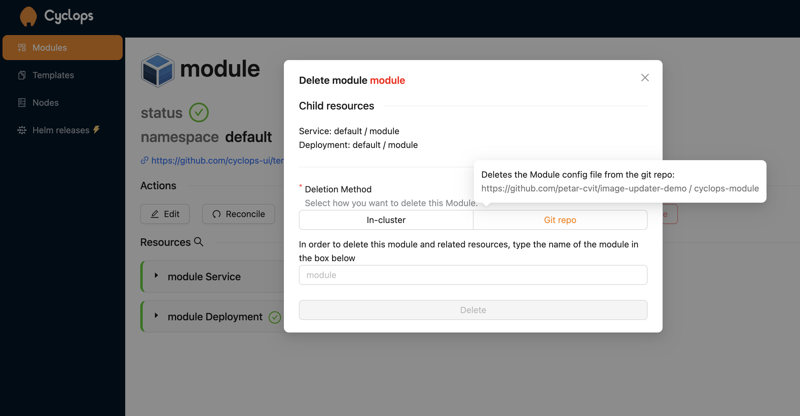

# Push Modules to Git
    
:::info
Available from version **v0.17.0**
:::

By default, Cyclops applies your configuration directly to the cluster. However, you also have the option to push it to a Git repository instead. Before using this GitOps workflow, you'll need to grant Cyclops access to the repository.

## Injecting credentials

Before deploying a module, you need to configure credentials for your git repos so changes can be pushed to a remote repo. For GitHub, you will need to create a token (can be fine-grained just for a single repo) that has `read and write` access to `contents`.

You can use that token to create a secret in your cluster with the following command:

```
kubectl create secret generic my-cyclops-secret \
    -n cyclops \
    --from-literal=username=<github-username> \
    --from-literal=password=<github-token>
```

Once that is created, you can apply the following resource, which maps credentials to a specific repo. You can [read more about it here](https://cyclops-ui.com/docs/templates/private_templates)

```
apiVersion: cyclops-ui.com/v1alpha1
kind: TemplateAuthRule
metadata:
  name: private-repo-rule
  namespace: cyclops            # has to be in cyclops namespace
spec:
  repo: <git-repo>           # git repo you want to push configuration to
  password:
    name: my-cyclops-secret     # name of the previously created secret
    key: password
  username:
    name: my-cyclops-secret     # name of the previously created secret
    key: username
```

The `<git-repo>` is the repo to which you want Cyclops to push the configuration to. In the example image below it would be [https://github.com/petar-cvit/gitops-infra](https://github.com/petar-cvit/gitops-infra/blob/brand-new-cyc-branch/my-apps/applications/api.yaml/testing-again.yaml).

## Deploying a module via GitOps

When creating a new module, in the advanced section, you can toggle the `Push changes to Git?` and you will be able to see fields to specify which repo you want to commit your Module configuration.

For the configuration in the image below, Cyclops will commit your Module as yaml to the repository https://github.com/petar-cvit/gitops-infra on branch `main`, and create a file `applications/my-module.yaml`. The name of the file of your Module is constructed as `{path}/{module name}.yaml`. If you want to create a file in the root of your repo, you can set the path to “.”



From your git repository, you can sync Modules into the cluster with other tools. With such a setup, you still get a custom UI for your apps, but you also get all the benefits of the GitOps approach.

## Deleting Modules

When deleting modules, you have the option to delete the module from the cluster or delete them in the git repository and let other tools take care of its removal. This option is visible only if the module has the configuration for writing back to git.


