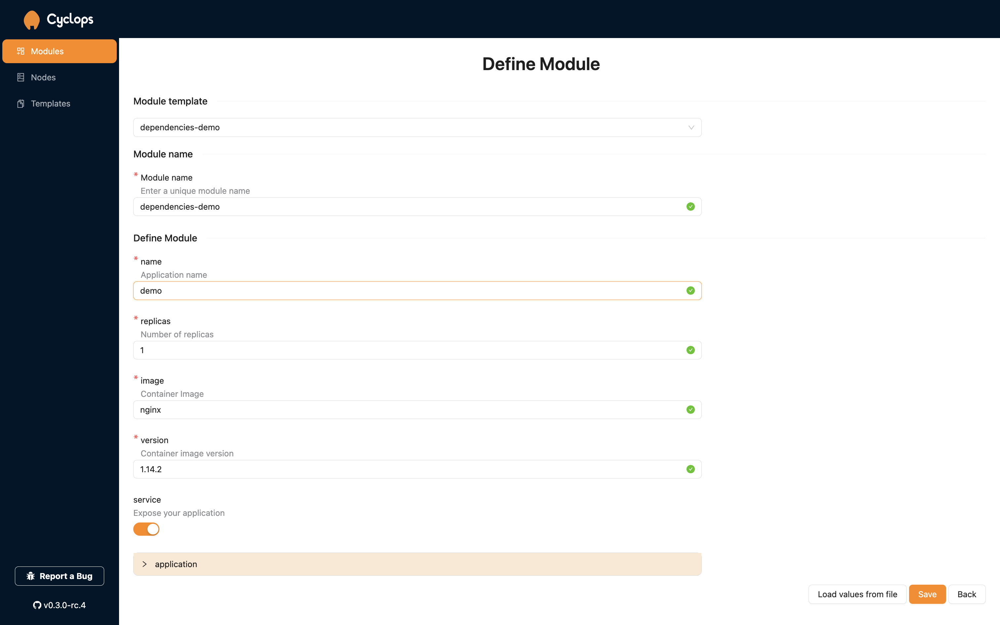
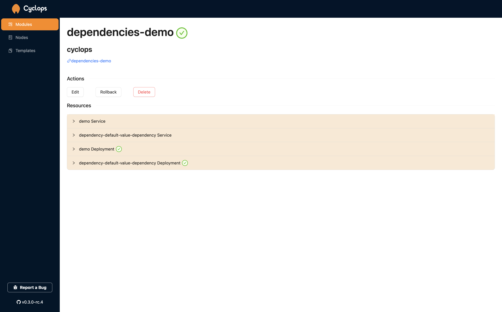

# Helm chart dependencies

This part will go over how Cyclops implements Helm chart dependencies. You can find out more about chart dependencies on [Helm docs](https://helm.sh/docs/helm/helm_dependency/).

Dependencies allow us to reference another Helm chart and use it in the context of our application without having to configure multiple K8s resources separately.

For instance, you might want to deploy an application that uses Redis as its cache storage, but you don't want to add all of those resources for a Redis deployment into your template. You can simply add an existing Redis Helm chart as a dependency to your chart and get your Redis up and running without the hassle of copy-pasting resources.

Since Helm supports dependencies, it makes sense that Cyclops also supports them. You can reference dependencies in the `Chart.yaml` of your root template if you want to use dependencies. Refer to Helm docs for more info on how to do it, but here is an [example](https://github.com/cyclops-ui/templates/blob/main/dependencies-demo/Chart.yaml) of how to do it.

```yaml
apiVersion: v1
name: application
version: 0.0.0
dependencies:
  - name: application
    version: "0.3.0"
    repository: "https://petar-cvit.github.io"
```

Cyclops will render a new object in your UI for each dependency you specify. This object will be named after the dependency, and its fields will be rendered based on its JSON schema. It does that recursively for all dependencies.

## Demo time ⚒️

In our templates repository you can find the [demo-dependencies template](https://github.com/cyclops-ui/templates/tree/main/dependencies-demo). This template will give you an idea of how to create dependencies of your own and we will use this template for this demo.

First, go to the _Templates_ tab and add this template to your templates store.

```yaml
Name: demo-dependencies
Repository URL: https://github.com/cyclops-ui/templates
Path: dependencies-demo
```

Once you added this template to your collection, go to the _Modules_ tab and click _Add Module_. Choose your new template `demo-dependencies`. You should get a screen similar to the one in the picture below. All the fields from the template have been rendered as expected and alongside them on an additional object -- `application`.



It is called `application` since it is the name of the dependency we pulled. All the nested fields inside it are rendered based on dependency schema, so be aware that your dependencies must also have a schema defined. It is also automatically populated with default fields from the dependent charts `values.yaml`.

Here is the link to the GitHub repo where the dependency chart is stored [https://github.com/petar-cvit/petar-cvit.github.io/tree/gh-pages](https://github.com/petar-cvit/petar-cvit.github.io/tree/gh-pages)

Once you input all the fields and hit the `save` button, all resources from your root template and all its dependencies get deployed and shown on your Module detail page.



:::info

Version `v0.0.8-alpha` does not support `alias` and `import-values`.

At the moment, when you reference a dependency, it is automatically included in your chart. `condition` and `tags` properties are not yet supported.

:::
