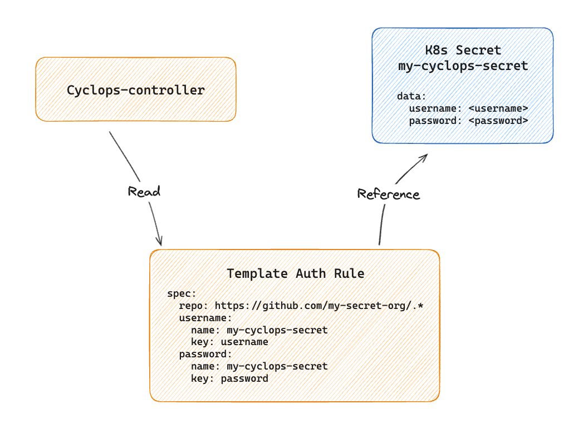

# Private templates

You might want to store your templates in a private repository and load them into Cyclops, but you must authorize Cyclops to be able to pull the template.

## About

Cyclops has a `CRD (Custom Resource Definition)` that allows you to define authorization for specific repositories. You can set different authorization data for different templates. The CRD defines which templates you want to authorize and points Cyclops to the authorization data needed for those templates.

Each time the Cyclops controller fetches a template, it retrieves **TemplateAuthRule (TAR)** custom resources from the cluster and checks if the template host matches any of the TemplateAuthRules. If it does, it will fetch the Kubernetes secrets TemplateAuthRule references and apply username and password to authenticate.



In the image above, Cyclops controller fetches all TARs and matches the template host to `spec.repo`. If it matches, it will fetch the username and password from the referenced secret. In this case, both username and password reference the same secret `my-cyclops-secret` (`spec.username.name` and `spec.password.name`).

To fetch the username secret value, the Cyclops controller will fetch the referenced secret and use the key provided in `spec.username.key` to get the value from the fetched secret. The same goes for the password.

TemplateAuthRules (TARs) do not store secrets directly, so you can still integrate your cluster with the [External Secret Operator](https://external-secrets.io/) or other secrets management solutions.

You can add new TARs and secrets without restarting your Cyclops controller; the Cyclops controller fetches TARs in runtime.

## Example

Through an example, we will authenticate a Cyclops instance to fetch a private template. Before we start, you can try to create a template reference to the private template. Create a template reference by going to **Templates** in the sidebar and clicking **Add template reference**.

<p align="center" width="100%">

</p>

You will need to set the name for the private template as well as the repository, path, and version of your template. You will see an error like the one below.

<p align="center" width="100%">

</p>

To authenticate Cyclops to fetch your private template, you must create a GitHub token. You can follow these [steps](https://docs.github.com/en/authentication/keeping-your-account-and-data-secure/managing-your-personal-access-tokens#creating-a-personal-access-token-classic). Make sure to add `repo` access to the token.

Once you have generated your GitHub token, create a secret in your Kubernetes cluster with your username and GH token.

```shell
kubectl create secret generic my-cyclops-secret \
    -n cyclops \
    --from-literal=username=<github-username> \
    --from-literal=password=<github-token>
```

You will also need a TemplateAuthRule that will reference the newly created secret. You can create a file with its configuration and apply it to the cluster.

Create the file:
```yaml
# template_auth_rule.yaml

apiVersion: cyclops-ui.com/v1alpha1
kind: TemplateAuthRule
metadata:
  name: private-repo-rule
  namespace: cyclops            # has to be in cyclops namespace
spec:
  repo: <github-repo>           # your private repo
  password:
    name: my-cyclops-secret     # name of the previously created secret
    key: password
  username:
    name: my-cyclops-secret     # name of the previously created secret
    key: username
```

Apply to the cluster:
```shell
kubectl apply -f template_auth_rule.yaml
```

You should see the output below
```shell
templateauthrule.cyclops-ui.com/private-repo-rule created
```

You can now add the same template reference that failed before, and it should now be added so you can use it when creating Modules. You can create a module by going to: <br/>
**Modules** (in the sidebar) **>** **Add module** **>** select the `private` template in **Module template**
