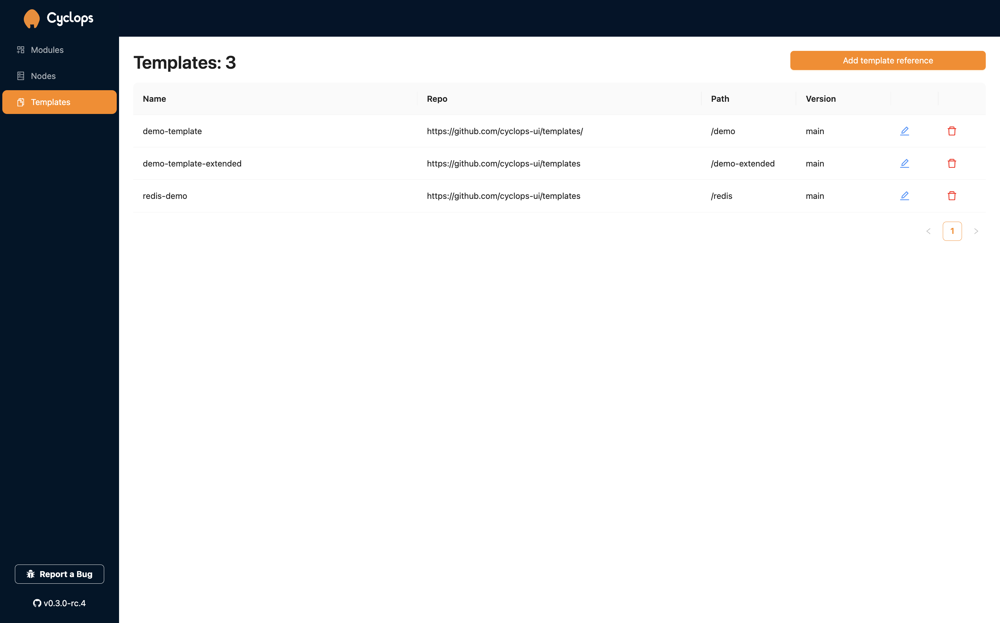

# Template Storage

Version `v0.3.0` introduced a new tab to the sidebar: _Templates_. Here, you can find your "storage" of templates. Each entry references a Helm chart located in either a GitHub, Helm, or Oci repository.

Each instance of Cyclops has a couple of templates to get you started. You can see how these charts look in our open [templates repository](https://github.com/cyclops-ui/templates).



## Adding New Templates

If you want to add your own templates, click the _Add template reference_. A modal will appear asking you for a pointer to your template.

Here are some things to watch out for when connecting your templates.
Let's take this repository for example:

```
-repository/
    - demo/
        - templates/
        - Chart.yaml
        - values.schema.json
        - values.yaml
```

If we wanted to connect the demo template:

- `Name` must follow the [Kubernetes naming convention](https://kubernetes.io/docs/concepts/overview/working-with-objects/names/#dns-label-names)
- `Repository URL` must lead to `repository/`
- `Path` must be `demo`
- `Version` can be left empty / branch name / tag / commit hash

Once you store a reference to your template, the next time you try to create a new module, it will be shown in the dropdown when selecting templates.

### Naming

Cyclops does not have storage of its own. It uses our CRD and the ETCD database of Kubernetes to store your template references. That is why the name of your templates has to adhere to the [Kubernetes naming convention](https://kubernetes.io/docs/concepts/overview/working-with-objects/names/#dns-label-names) because it is a Kubernetes resource.
Follow these rules when naming your templates:

1. [x] contain no more than 63 characters
2. [x] contain only **lowercase** alphanumeric characters or '-'
3. [x] start with an alphanumeric character
4. [x] end with an alphanumeric character

## Editing Template References

You can edit yout template references by clicking on the blue pencil icon on your template. Everything except the name of the template is editable.

## Deleting Template References

If you find yourself with unwanted templates, you can easily delete them by clicking on the red trash can icon. A modal will open asking you to input the name of the template. Once written, the _delete_ button will be enabled.
